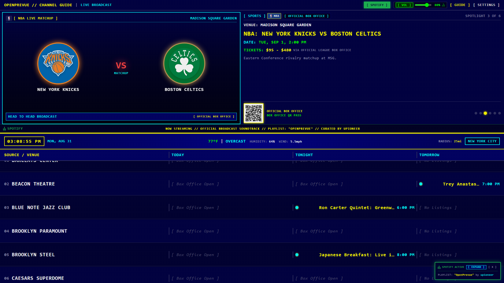
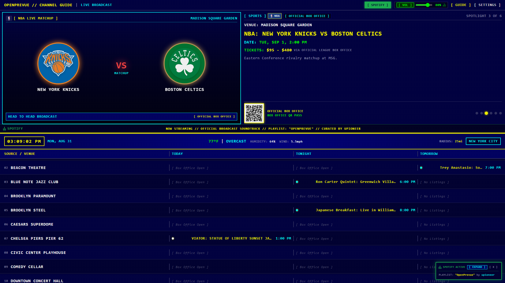
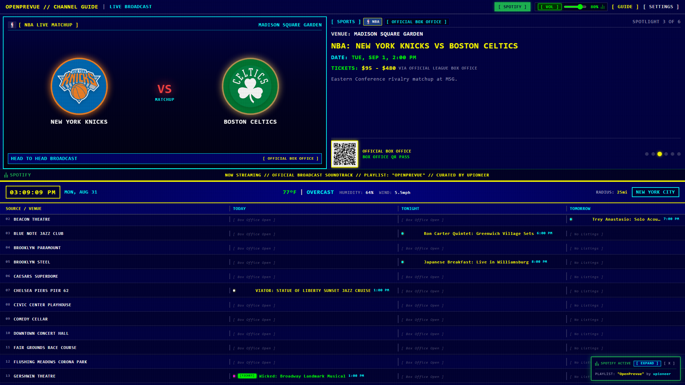
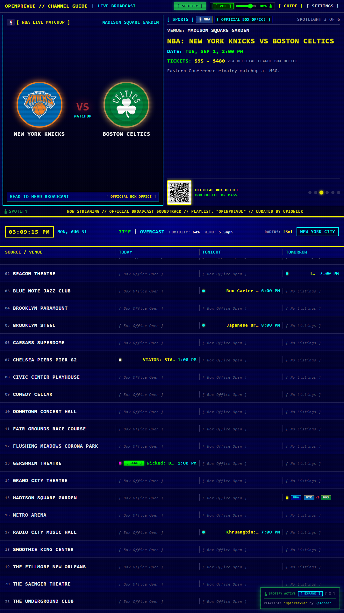
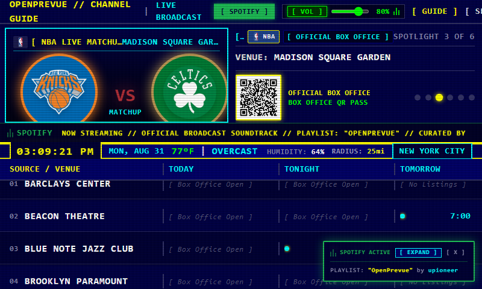
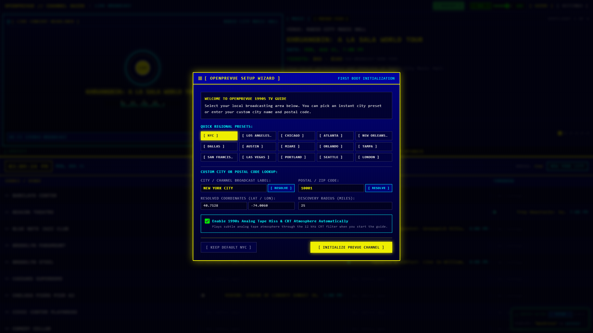
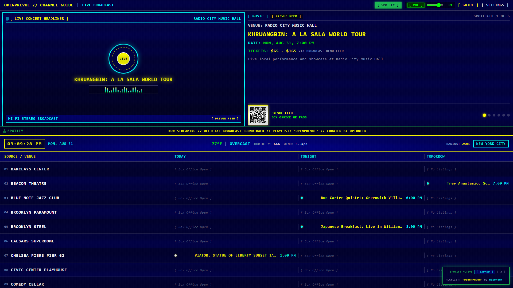

# Release v0.17.0: TripAdvisor & Viator Ingestion Suite, 1-Click Web Link Ingest, Telegram Mobile Sync, Dynamic Category Broadcast Visuals, Top Header Volume Slider & Sporting Matchup Hero Showcase

## Overview
Release v0.17.0 introduces the complete TripAdvisor and Viator multi-source ingestion suite, featuring zero-key public Trip and Wishlist URL scraping, a native Viator Partner API adapter, and 1-click instant web link scraping available from both the web UI and the Telegram bot. In addition, the Spotlight preview pane receives dynamic genre-specific broadcast presentation cards (Concerts, Broadway Theater, Stand-up Comedy, and Community Experiences) rendered in authentic Prevue Navy, Cyan, and Gold palettes with real-time vintage equalizer spectrum animations, an integrated top header volume slider and mute combo, cleaned marquee typography, and updated hero documentation capturing live sporting events.

---

## Visual Showcase

### Standard 16:9 Landscape Dashboard (NBA Sporting Matchup Spotlight)

### Classic TV Mode (4 Rows True-to-Scale 1990s Broadcast)

### Balanced Mode (7 Rows Default Layout)

### Dense Mode (12 Rows High Information Density)

### Vertical 9:16 Portrait Kiosk Display

### Small Touchscreen & Raspberry Pi 7" Display

### First-Boot Regional Setup Wizard

### Settings Control Center & Ingestion Configuration

---

## Key Deliverables

### 1. TripAdvisor & Viator Multi-Source Ingestion Suite (`travel_wishlist.py`, `viator.py`, `registry.py`, `ingestion.py`, `seeder.py`, `SettingsView.vue`)
* **Public TripAdvisor & Viator Wishlist Scraping:** Built `TravelWishlistProvider` to ingest shared public TripAdvisor Trip URLs and Viator Wishlist pages without requiring developer API keys. Automatically parses Schema.org JSON-LD structured data (`TouristTrip`, `TouristAttraction`, `Event`) with OpenGraph metadata fallbacks (`og:title`, `og:image`, `og:description`).
* **Native Viator Partner API Adapter:** Implemented `ViatorPartnerProvider` for users with a Viator Partner / Exp-API key. Directly queries the Viator Partner API to discover top-rated local tours, tastings, and activities matching the configured GPS coordinates and search radius.
* **Settings Management & Manual Sync:** Added dedicated inputs in Settings Tab 5 for TripAdvisor/Viator wishlist URLs and Settings Tab 8 for the Viator Exp-API key, with full persistence in the SQLite datastore.

### 2. 1-Click Instant Web Link Ingestion & Telegram Mobile Ingestion (`events.py`, `handlers.py`, `bot.py`, `formatters.py`, `SettingsView.vue`, `client.ts`)
* **1-Click Web Link Ingest Box:** Added an instant URL scraping dropzone in Settings Tab 5 and backend endpoint `POST /api/v1/events/ingest-url`. Paste any event, tour, or ticket link from TripAdvisor, Viator, Ticketmaster, Eventbrite, or venue sites to parse and add it to your channel guide immediately.
* **Telegram Bot Mobile Share (`/add <url>`):** Added `/add <url>` command and automatic URL detection to the Telegram bot worker. Users can share event links directly from their mobile browser or travel app into their paired Telegram bot to populate the live display.

### 3. Dynamic Category Broadcast Visuals (`SpotlightPane.vue`)
* **Concerts & Live Music:** Features a rotating vinyl record badge with artist initials, glowing Prevue Gold typography, and an animated 18-band vintage phosphor green and yellow real-time equalizer spectrum visualizer.
* **Broadway & Theater:** Golden marquee halo with vector drama masks and golden production title typography.
* **Stand-up Comedy:** High-contrast studio microphone vector emblem with soundwave pulse rings and club recording tags.
* **Community & Travel:** Emerald green experience compass vector emblem with city landmark coordinates and admission tags.
* **Authentic 1990s CRT Palette:** Toned down modern oversaturated neon/purple hues in favor of authentic Prevue Deep Navy Blue (`#000044`), Cyan (`#00FFFF`), Prevue Gold (`#FFFF00`), and Phosphor Green (`#00FF00`).

### 4. Header Bar Master Volume Slider & UI/UX Cleanup (`HeaderBar.vue`, `DividerRibbon.vue`, `SpotlightPane.vue`, `SpotifyPlayerModal.vue`)
* **Master Volume Slider & Mute Combo:** Relocated interactive volume range slider, mute toggle, and digital percentage readout to `HeaderBar.vue` with real-time audio synthesizer integration.
* **Streamlined Middle Ribbon:** Cleaned `DividerRibbon.vue` to focus exclusively on digital clock, calendar date, live Open-Meteo telemetry, radius, and metro label.
* **Removed Redundant Buttons & Jargon:** Removed duplicate `[ PLAY SPOTIFY ]` buttons and technical jargon ("Spotify Headend", "12 kHz DSP filter") across the marquee ticker and modal windows.
* **Official League & Provider Branding:** Integrated official vector league logos (NBA, NFL, MLB, NHL, MLS, EPL, F1, NASCAR, UFC) and provider brand badges across matchup cards and QR passes.

---

## Verification & Test Results
* **Test Suite:** 70 / 70 unit tests passing (`pytest -v`).
* **Frontend Compilation:** `vue-tsc && vite build` built cleanly with zero type errors.
* **Automated Screenshots:** Full set of high-resolution responsive Playwright captures generated in `project_details/changelog/v0.17.0/`.
