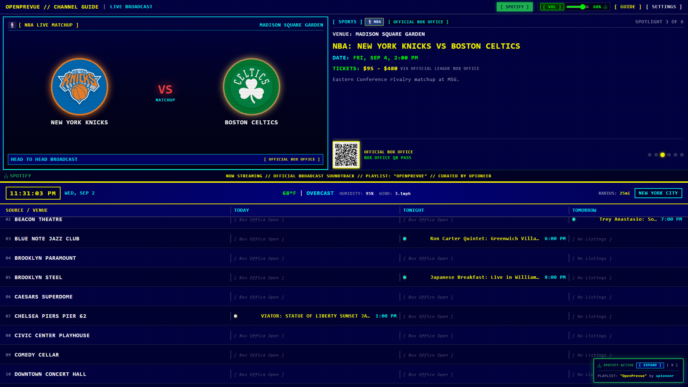
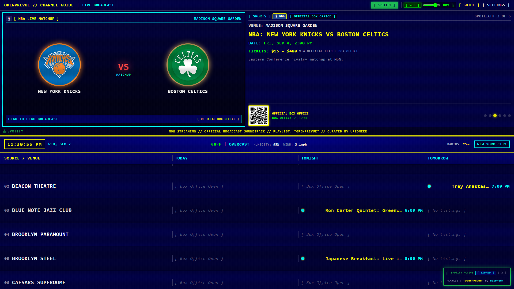
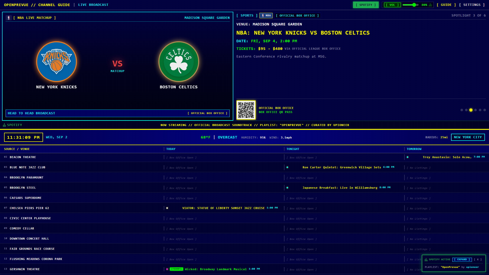
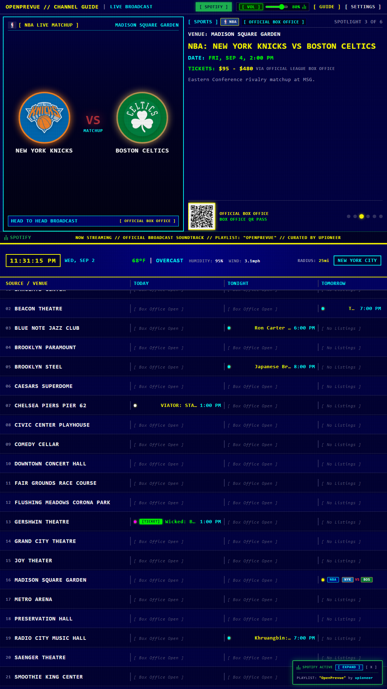
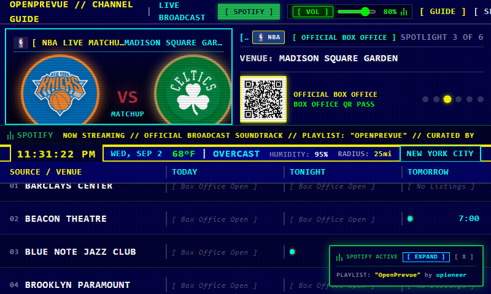
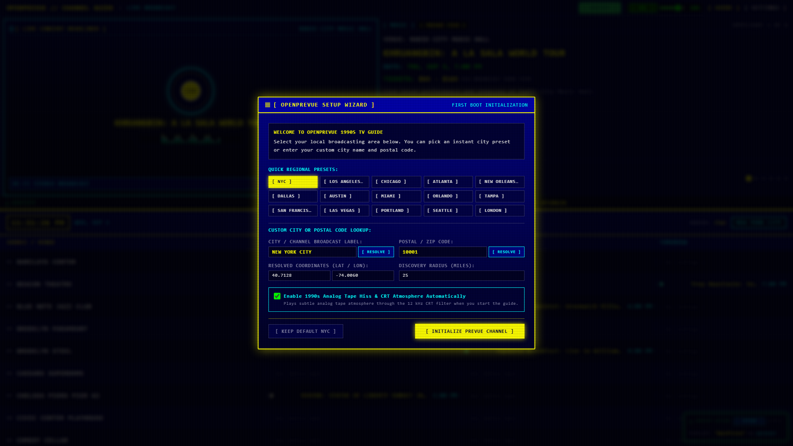
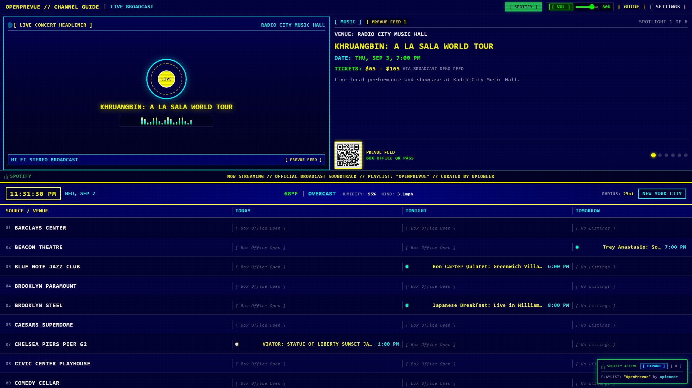

# Release v0.18.0: RFC 5545 iCalendar Feeds, Home Assistant Smart Home Integration, Kiosk Screen Wake Lock & Background Audio Stream Selector

## Overview
Release v0.18.0 introduces outbound calendar subscriptions, deep Home Assistant smart home integration, hardware kiosk display power management, and a background audio stream selector with the user's curated retro Spotify playlist preserved as the permanent default for all new instances.

## What is New in v0.18.0

### 1. Outbound RFC 5545 iCalendar Feeds and Mobile Passes
* **Live Subscription Feeds:** Generates dynamic, standard RFC 5545 `.ics` calendar feeds (`GET /api/v1/calendar/feed.ics`) compatible with Apple Calendar, Google Calendar, Outlook, and mobile calendar clients.
* **Committed Tickets Feed:** Filter `filter=committed` exports events where `has_ticket = 1`, complete with 2-hour departure notification alarms (`VALARM`).
* **Spotlight & Metro Feeds:** Filters `filter=featured` and `filter=all` provide feeds of headline attractions and full community schedules.
* **Single Event .ICS Exporter:** Endpoint `GET /api/v1/calendar/events/{event_id}.ics` enables 1-click import of individual listings directly from any device.
* **1-Click Subscription Actions:** Added direct `webcal://`, Google Calendar, and `.ics` download buttons directly into the Settings Control Center.

### 2. Home Assistant Smart Home Integration
* **REST Sensor Endpoint:** Endpoint `GET /api/v1/integrations/homeassistant/sensors` reports live telemetry including today's event count, current spotlight item, active EAS safety alerts, and current weather.
* **Instant YAML Snippet Generator:** Generates copy-paste ready `configuration.yaml` templates with detected base URLs to register entities into Home Assistant in seconds.
* **MQTT Auto-Discovery Configuration:** Added broker settings in the Settings Control Center (`ha_mqtt_enabled`, `ha_mqtt_broker`, `ha_mqtt_port`, `ha_mqtt_topic_prefix`) for MQTT discovery.

### 3. Kiosk Screen Wake Lock and Hardware Display Power Management
* **Web Screen Wake Lock API:** Implemented `ScreenWakeLockService` (`frontend/src/services/wakeLock.ts`) to keep wall displays, tablets, and smart TVs awake with automatic reacquisition when returning from background tabs.
* **Hardware CEC and Pi Display Triggers:** Endpoint `POST /api/v1/integrations/display/power` allows commanding physical TV power state (`vcgencmd display_power` / CEC) with real-time WebSocket screen status broadcasts.
* **Scheduled Display Sleep:** Configurable nightly sleep schedules in the Settings Control Center.

### 4. Background Audio Stream Source Selector with Curated Spotify Default
* **Permanent Curated Spotify Default:** `"OpenPrevue" by upioneer` (`https://open.spotify.com/playlist/3jiPmIT4RugR8TPhli5Obk`) remains the permanent hardcoded default for all unconfigured instances.
* **Background Audio Stream Options:** Dropdown selector in Settings Tab 3 with live radio options:
  * `Spotify Playlist (Curated Retro Muzak)` (Default)
  * `1990s WeatherScan Smooth Jazz` (Live Stream)
  * `SomaFM Groove Salad` (Ambient Downtempo)
  * `SomaFM Drone Zone` (Atmospheric Ambient)
  * `Nightwave Plaza` (Retro Vaporwave & Synth)
  * `Custom Icecast / MP3 Stream URL`
  * `Turnkey Retro Synthesizer Chimes` (Offline)
  * `Mute / Disabled`
* **Direct Audio Streaming:** Live HTML5 audio stream player embedded in Settings and integrated with the Web Audio DSP filter pipeline.

## Visual Verification and Scale Showcase

### 16:9 Hero Dashboard

### Presentation Density Modes

### Responsive Form Factors

### Control Center and Modals

## Verification and Testing
* **Backend Test Suite:** All 80 unit tests passed (100% success rate).
* **Frontend Build:** `vue-tsc` typecheck and `vite build` completed with 0 errors.
* **Automated Screenshots:** Full set of high-resolution responsive Playwright captures generated in `project_details/changelog/v0.18.0/`.
