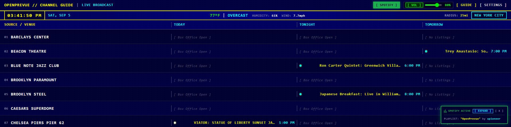
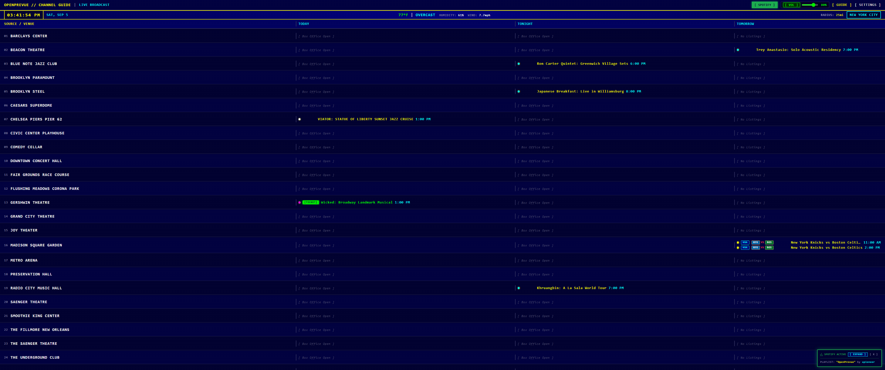
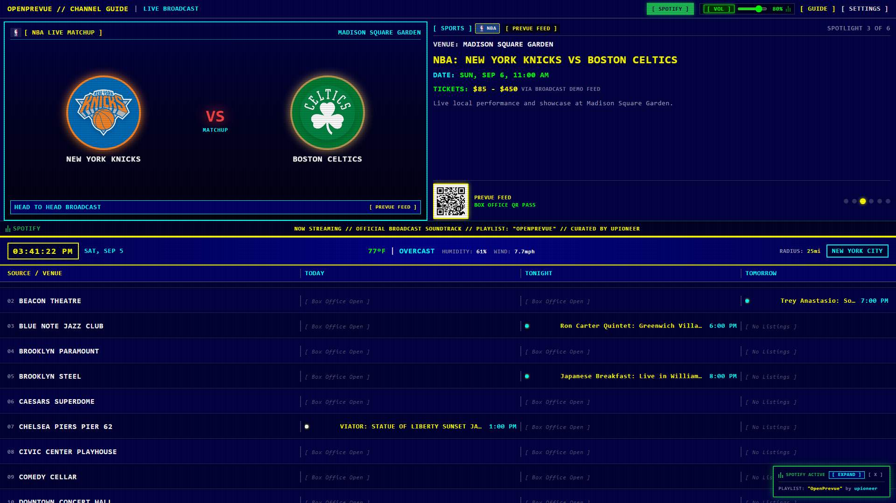
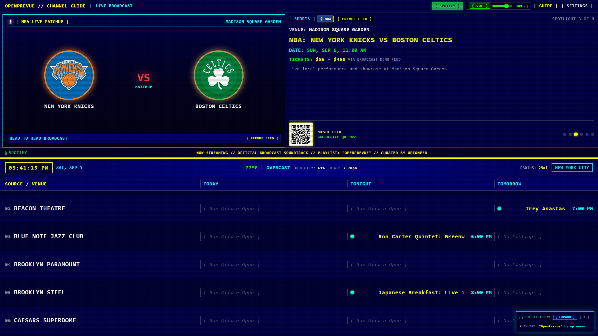
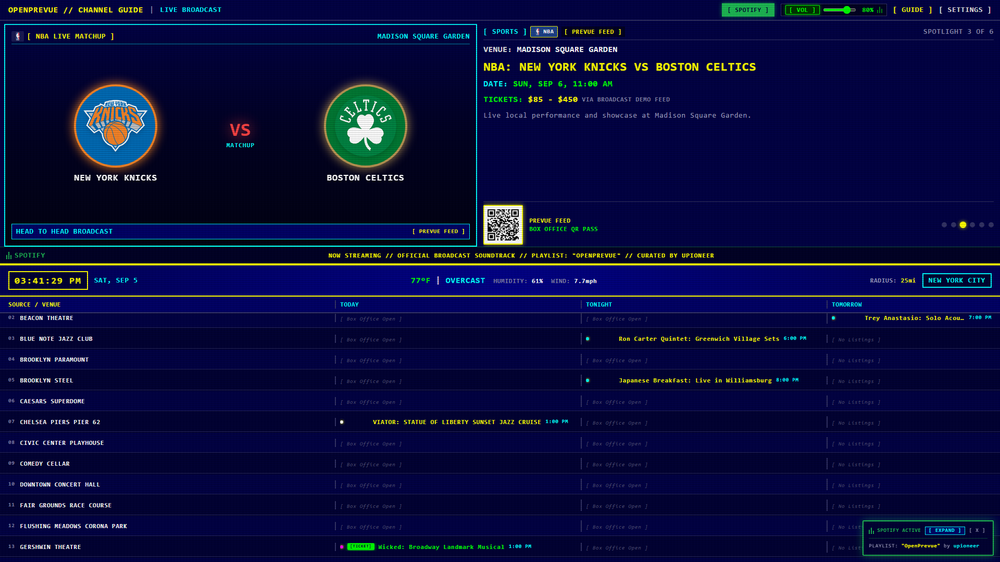
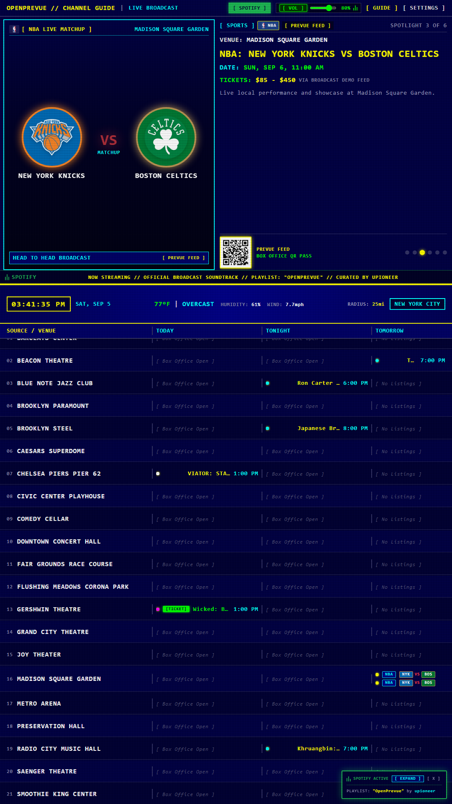
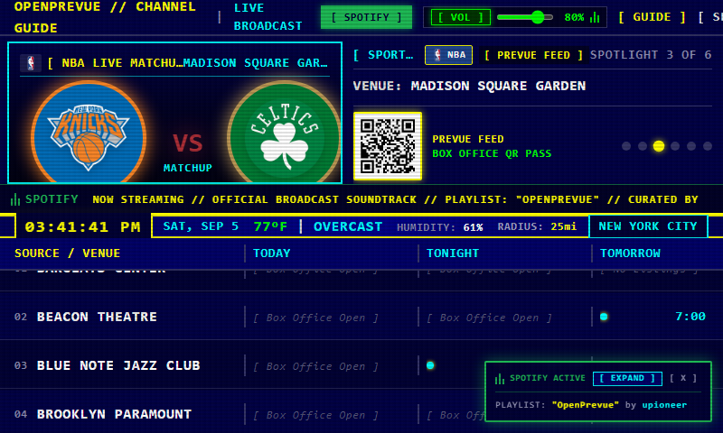
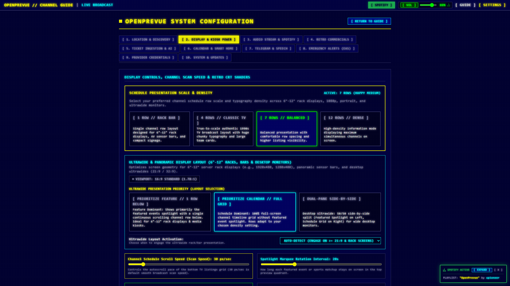
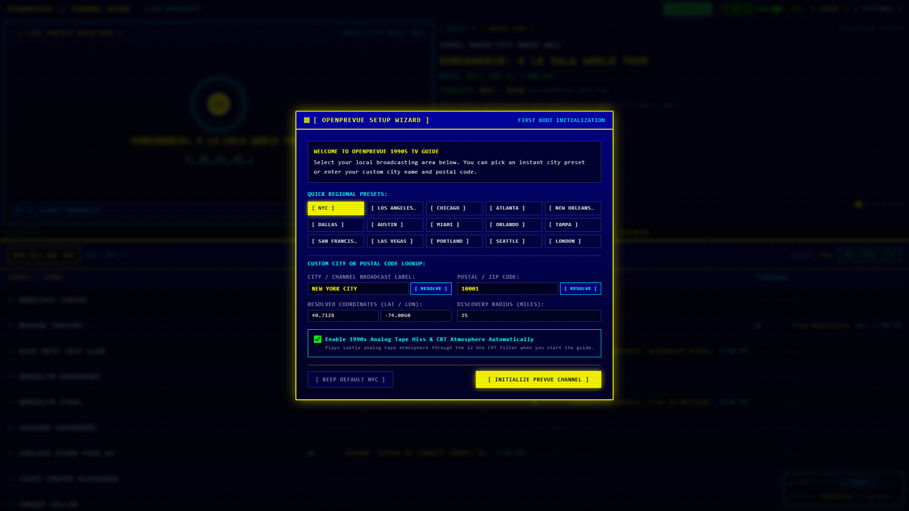

# Release v0.19.0: Ultrawide & Panoramic Display Layout, 6"-12" Rack Bar Screen Optimization, Dynamic Presentation Priority Toggles & Single Row Schedule Density

## Overview
Release v0.19.0 introduces comprehensive architecture support for ultrawide desktop monitors (21:9 and 32:9) as well as compact 6"-12" server rack displays, AV equipment consoles, and sensor bars (e.g., 1920x480, 1280x400). It features dedicated presentation priority toggles allowing operators to choose between Feature Priority (prominent featured event showcase with a single continuous scrolling row below) and Calendar Priority (100% full screen channel timeline schedule without featured events).

## What is New in v0.19.0

### 1. Ultrawide Presentation Priority Engine
* **Feature Priority Mode (`prioritize_feature`):** Designed specifically for short, wide stretch bar screens (such as 10" rack displays at 1920x480) and media kiosks. Dedicates the primary screen height to the rich featured event spotlight (artwork, sports matchup cards, turntable visualizers, ticket passes, and marquee tickers), followed by the middle status ribbon, and exactly one continuous scrolling channel row along the bottom.
* **Calendar Priority Mode (`prioritize_calendar`):** Completely hides the featured events spotlight pane, allocating 100% of display height to the channel timeline schedule grid. Allows viewing expansive multi-column listings across Today, Tonight, and Tomorrow without vertical space stolen by promo cards.
* **Dual-Pane Side-by-Side Mode (`side_by_side`):** Symmetrical 50/50 dual-pane presentation (Spotlight on Left, Schedule Grid on Right) separated by a vertical phosphor CRT divider for large desktop ultrawides (3440x1440 and 5120x1440).

### 2. Single Row Schedule Density for Rack Bars and Sensor Panels
* **`[ 1 ROW // RACK BAR ]` (`grid_density="single_row"`):** Added a new row density option tailored for 6"-12" AV rack displays, sensor panels, and compact horizontal signage where vertical pixels are constrained.
* **Seamless Dynamic Scaling:** Harmonizes row heights, channel badges, and venue names with the existing Classic TV (4 rows), Balanced (7 rows), and Dense (12 rows) presentation modes.

### 3. Settings Control Center Live Geometry Telemetry
* **Real-Time Viewport Ratio Detector:** Embedded live aspect ratio detector in Tab 2 (*Display & Kiosk Power*) displaying live feedback (e.g., `VIEWPORT: 16:9 STANDARD`, `VIEWPORT: 21:9 ULTRAWIDE`, `VIEWPORT: 32:9 ULTRA-WIDE`, `VIEWPORT: 2:1 PANORAMIC`).
* **Interactive Segmented Controls:** Rapid 1-click toggles between Feature Priority, Calendar Priority, and Dual-Pane Side-by-Side modes with descriptive operational summaries.
* **Configurable Activation Modes:** Choose between `AUTO-DETECT (ENGAGE ON >= 21:9 & RACK SCREENS)`, `FORCE ULTRAWIDE (ALL ASPECT RATIOS)`, and `DISABLED (ALWAYS USE CLASSIC 16:9 STACK)`.

## Visual Verification and Scale Showcase

### 10" Rack Display (1920x480) - Feature Priority (Spotlight + 1 Row Below)

### Desktop Ultrawide (3440x1440) - Calendar Priority (Full-Screen Schedule)

### 16:9 Hero Dashboard & Classic Presentation Modes

### Responsive Form Factors

### Control Center & Settings

## Verification and Testing
* **Backend Test Suite:** All 81 unit tests passed with 100% success rate.
* **Frontend Build:** `vue-tsc` typecheck and `vite build` completed with zero errors.
* **Automated Screenshots:** Full set of high-resolution responsive Playwright captures generated in `project_details/changelog/v0.19.0/`.
