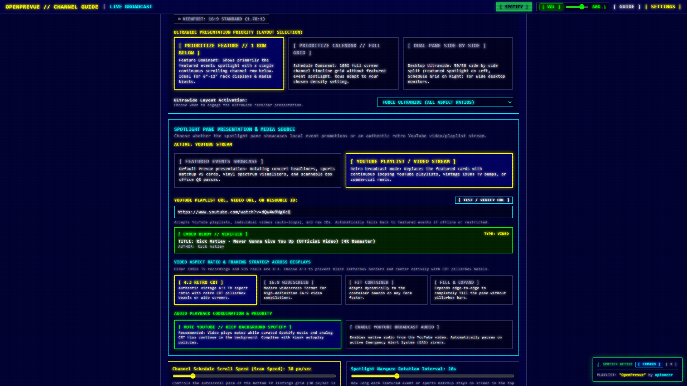
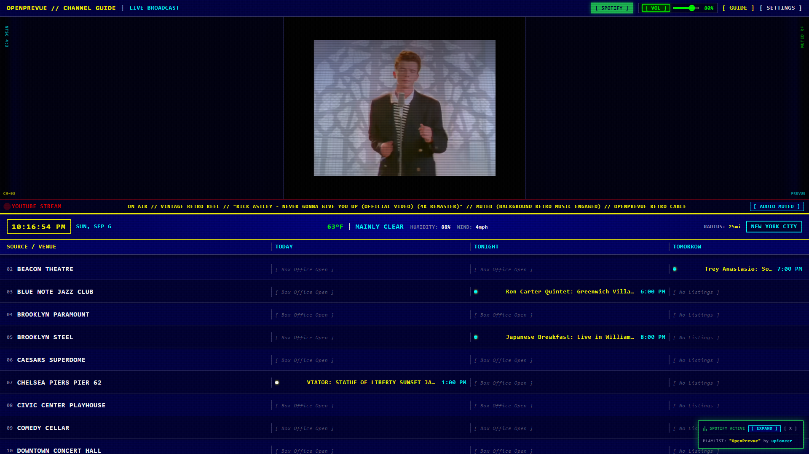
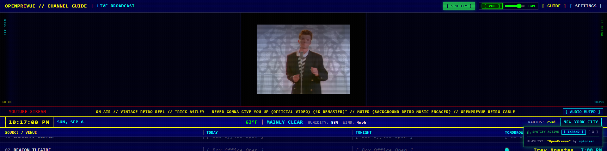
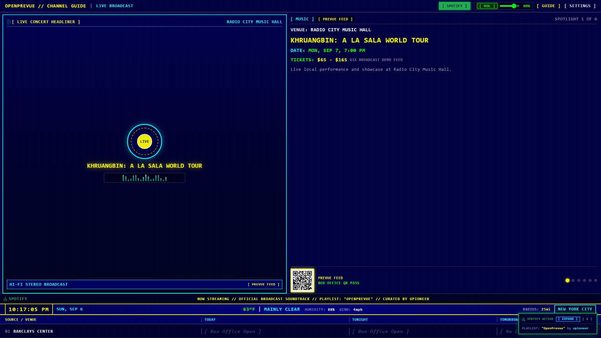
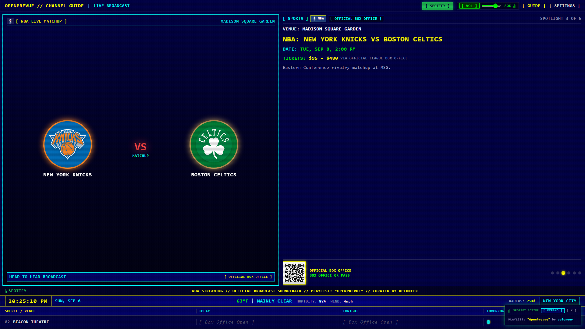

# Release v0.20.0: YouTube Video Streaming Engine, Authentic 4:3 CRT Aspect-Ratio Framing, Proactive Settings Validation & Audio Coordination

## Overview
Release v0.20.0 introduces native YouTube video streaming capabilities to OpenPrevue. Operators can now seamlessly swap the top featured event spotlight pane for a continuous looping YouTube playlist, vintage 1990s broadcast reel, or CRT commercial compilation. The release features a dedicated multi-aspect ratio framing engine designed specifically for authentic 4:3 vintage footage, live Settings verification telemetry via public metadata and oEmbed APIs, audio coordination with kiosk autoplay compliance, and automatic Emergency Alert System (EAS) pauses.

## What is New in v0.20.0

### 1. Spotlight Presentation & Media Source Selector
* **Graceful Media Swapping:** Added an operator toggle in Settings Tab 2 (*Display & Kiosk Power*) allowing the top preview quadrant to instantly switch between `[ FEATURED EVENTS SHOWCASE ]` and `[ YOUTUBE PLAYLIST / VIDEO STREAM ]`.
* **Universal Form Factor Integration:** Swapping applies cleanly across all responsive layouts:
  * Classic 16:9 and 4:3 vertically stacked dashboard.
  * Ultrawide Feature Priority mode (Spotlight on top, single row scrolling below).
  * Desktop Ultrawide Side-by-Side dual-pane mode (Video stream on Left, full schedule grid on Right).
  * Vertical 9:16 portrait wall kiosks.

### 2. Multi-Aspect Ratio CRT Framing Engine (Authentic 4:3 Video Support)
* **Elimination of Windowboxing:** Sizing engine prevents nested black bars when running older 1990s TV recordings, music videos, and VHS tapes.
* **Aspect Ratio Modes:**
  * **`[ 4:3 RETRO CRT ]`:** Renders videos in authentic vintage 4:3 proportions, flanked by retro CRT phosphor pillarbox side bezels (`NTSC 4:3`, `CH-03`, `MUTED RF`, `PREVUE`).
  * **`[ 16:9 WIDESCREEN ]`:** Sized for modern 16:9 high-definition video compilations.
  * **`[ FIT CONTAINER ]`:** Adapts dynamically to viewport bounds across 6"-12" rack consoles, tablets, and desktop displays.
  * **`[ FILL & EXPAND ]`:** Stretches edge-to-edge across the pane.
* **Scanline Shader Synergy:** The YouTube player sits underneath OpenPrevue's hardware-accelerated WebGL/CSS CRT scanline shaders, imparting an authentic analog phosphor tube texture.

### 3. Proactive Settings Validation & Probe Telemetry
* **Real-Time Verification Endpoint:** Implemented [backend/app/api/v1/endpoints/youtube.py](file:///C:/Users/hgran/OneDrive/Documents/code/Projects/OpenPrevue/backend/app/api/v1/endpoints/youtube.py) (`GET /api/v1/youtube/validate`) querying YouTube metadata and oEmbed endpoints without requiring proprietary API keys.
* **Instant Operator Feedback:** Tests input URLs and displays live status badges in the Settings panel:
  * Verified indicator showing video title, author, and resource type (video or playlist).
  * Clear warnings if third-party embedding is disabled by the creator, the playlist is private, or the link is invalid.

### 4. Audio Playback Coordination & Autoplay Compliance
* **Audio Source Priority Control:**
  * **`MUTE YOUTUBE (KEEP BACKGROUND SPOTIFY)`:** Recommended default that runs video muted, allowing background curated Spotify music, synthesized bells, and analog RF tape hiss to continue uninterrupted while complying with strict browser autoplay policies.
  * **`ENABLE YOUTUBE BROADCAST AUDIO`:** Unmutes the video stream for kiosks equipped with full sound systems.
* **Emergency Alert System (EAS) Priority:** If an active EAS civil emergency bulletin is dispatched, the YouTube player automatically pauses, ensuring sirens and emergency announcements are completely unobstructed. Playback resumes when the alert expires.
* **Graceful Degradation:** If network issues occur or a video is blocked, OpenPrevue automatically falls back to the native Featured Event cards with zero visual disruption.

## Visual Verification and Scale Showcase

### Settings Tab 2: Spotlight Presentation Mode & Live Verification Probe

### 16:9 Dashboard: Authentic 4:3 CRT Video Stream with Phosphor Pillarbox Bezels

### 10" Rack Bar Display (1920x480): Feature Priority Video Stream

### Graceful Fallback: Seamless Recovery to Featured Showcase

### Classic Channel Schedule Scales

## Verification and Testing
* **Backend Test Suite:** All 87 unit tests passed with 100% success rate (`tests/test_youtube_api.py`, `tests/test_settings_api.py`).
* **Frontend Build:** `vue-tsc` typechecking and `vite build` completed with zero errors in 2.42s.
* **Automated Visual Captures:** 10 responsive device screenshots generated in `project_details/changelog/v0.20.0/`.
