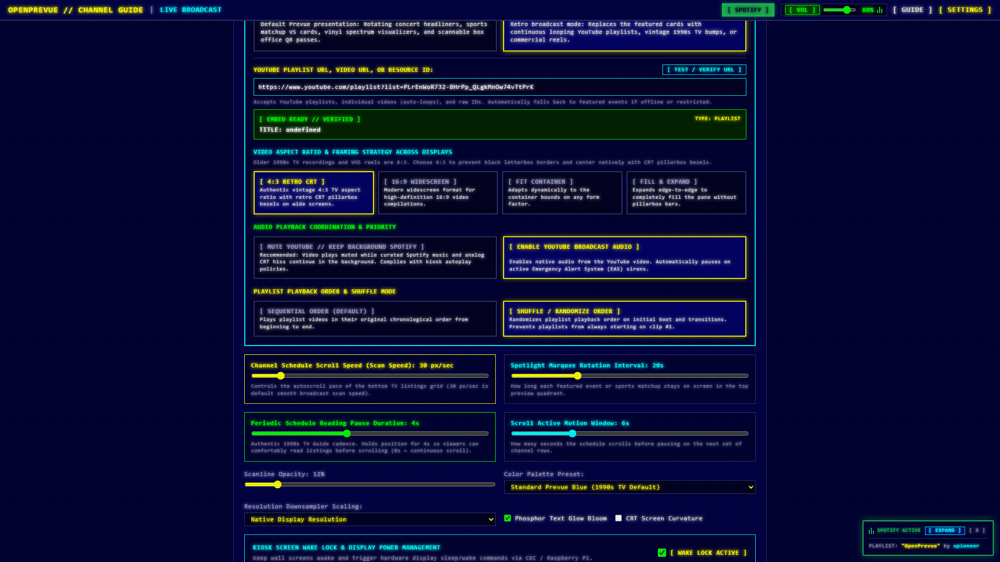
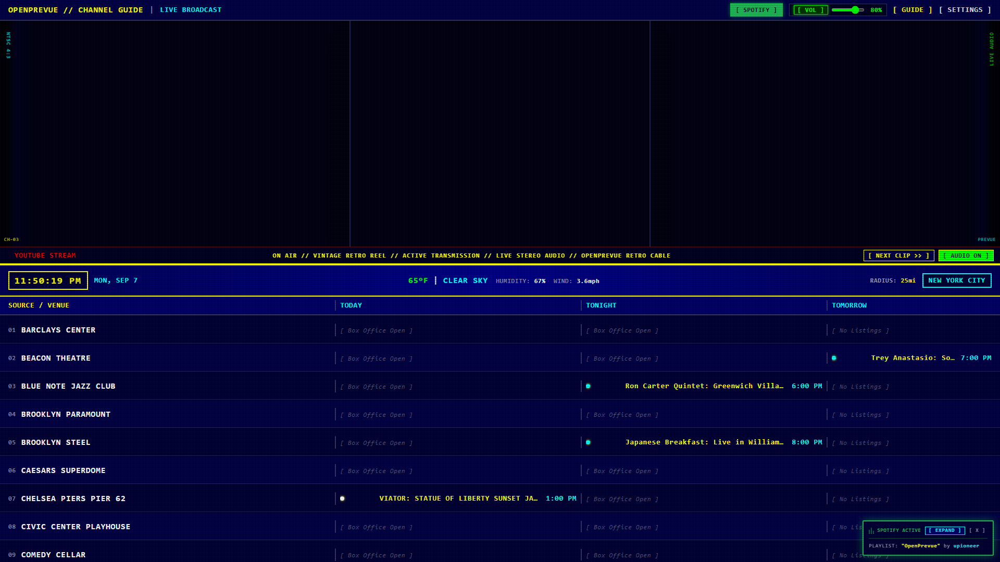
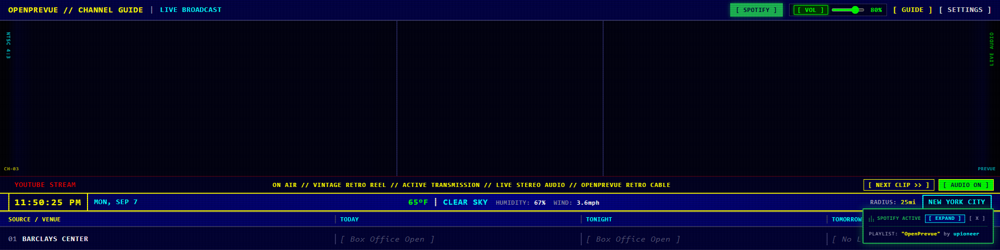
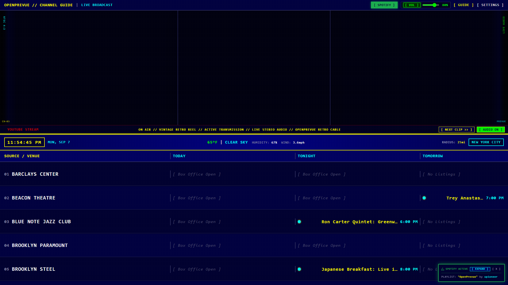
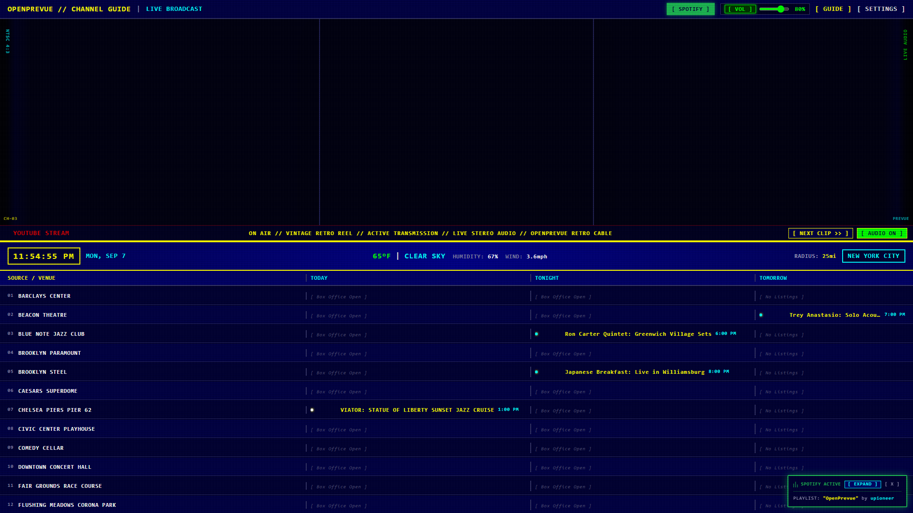
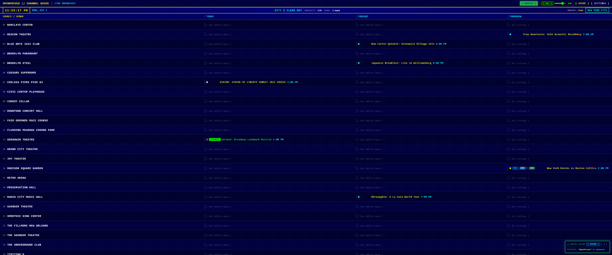
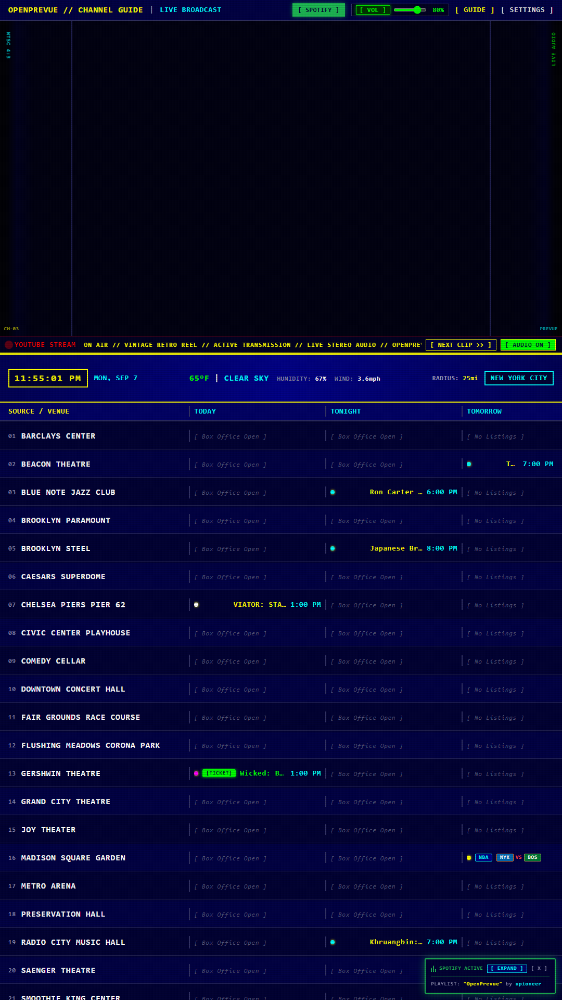
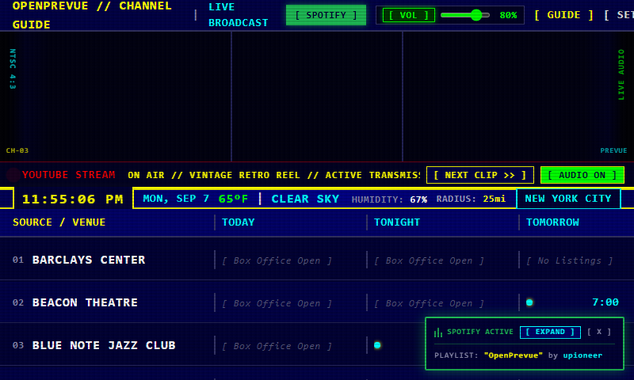

# Release v0.21.0: YouTube Playlist Shuffle Mode, On-Screen Channel Skipper & Direct Live Stream URL Parsing

## Overview
Release v0.21.0 builds upon OpenPrevue's broadcast video streaming capabilities with targeted usability enhancements for vintage video reels and commercial playlists. Operators can now randomize playlist order so continuous broadcast reels do not always start sequentially from clip #1, skip forward on demand with a dedicated on-screen `[ NEXT CLIP >> ]` channel button in the broadcast telemetry ribbon, and stream 24/7 YouTube live broadcasts via direct `/live/` URLs.

## What is New in v0.21.0

### 1. YouTube Playlist Shuffle Mode
* **Randomized Broadcast Playback:** Added `youtube_shuffle_enabled` configuration setting in the datastore to randomize playlist playback order upon initial guide boot and clip transitions.
* **Settings Toggle in Tab 2:** Added segmented buttons in [SettingsView.vue](file:///C:/Users/hgran/OneDrive/Documents/code/Projects/OpenPrevue/frontend/src/views/SettingsView.vue) under *Display & Kiosk Power*:
  * **`[ SEQUENTIAL ORDER (DEFAULT) ]`:** Plays playlist videos in chronological order from beginning to end.
  * **`[ SHUFFLE / RANDOMIZE ORDER ]`:** Randomizes playback queue so vintage commercials, bumpers, and music videos start on different clips every boot.
* **YouTube Player API Integration:** Wired `playerInstance.setShuffle(true)` into the YouTube IFrame API lifecycle on player initialization and responsive prop watches in [YouTubePane.vue](file:///C:/Users/hgran/OneDrive/Documents/code/Projects/OpenPrevue/frontend/src/components/YouTubePane.vue).

### 2. On-Screen Channel Skipper (`[ NEXT CLIP >> ]`)
* **Interactive Telemetry Control:** Added a high-contrast phosphor button `[ NEXT CLIP >> ]` directly in the bottom telemetry ribbon of the YouTube streaming pane.
* **Playlist-Aware Rendering:** Button automatically displays whenever a playlist is streaming, sitting alongside the live audio mute/unmute badge.
* **Immediate Queue Advancement:** Tied directly to `playerInstance.nextVideo()`, giving kiosk viewers and operators 1-click channel surfing capabilities to skip forward to the next retro clip immediately.

### 3. Direct 24/7 Live Stream URL Support (`youtube.com/live/...`)
* **Regex Expansion:** Enhanced YouTube URL parsing patterns across both backend [backend/app/api/v1/endpoints/youtube.py](file:///C:/Users/hgran/OneDrive/Documents/code/Projects/OpenPrevue/backend/app/api/v1/endpoints/youtube.py) and frontend [YouTubePane.vue](file:///C:/Users/hgran/OneDrive/Documents/code/Projects/OpenPrevue/frontend/src/components/YouTubePane.vue) to natively identify and extract 11-character video IDs from `/live/` endpoints (e.g. `https://www.youtube.com/live/<ID>?feature=shared`).
* **oEmbed and Embed Parity:** Direct live streams now resolve cleanly through validation APIs and stream directly inside CRT pillarboxed containers with full audio coordination.
* **Automated Unit Testing:** Added test case in [tests/test_youtube_api.py](file:///C:/Users/hgran/OneDrive/Documents/code/Projects/OpenPrevue/tests/test_youtube_api.py) verifying live stream URL parsing.

### 4. Backlog Tracking for Curated Retro Presets
* **Curated Presets Roadmap:** Explicitly tracked Item 2 (Curated 1-Click Retro YouTube Presets) in [project_details/todo.md](file:///C:/Users/hgran/OneDrive/Documents/code/Projects/OpenPrevue/project_details/todo.md) under future roadmap items, awaiting user-provided curated vintage playlists for 90s TV commercials, music television, and classic broadcast bumpers.

## Visual Verification and Scale Showcase

### Settings Tab 2: Playlist Playback Order & Shuffle Mode

### 16:9 Broadcast Dashboard: Live Playlist with On-Screen Channel Skipper

### 10" Rack Bar Display (1920x480): Feature Priority Stream with Channel Skipper

### Responsive Scale Benchmarks

## Verification and Testing
* **Backend Test Suite:** All 87 unit tests passed with 100% success rate ([tests/test_youtube_api.py](file:///C:/Users/hgran/OneDrive/Documents/code/Projects/OpenPrevue/tests/test_youtube_api.py), [tests/test_settings_api.py](file:///C:/Users/hgran/OneDrive/Documents/code/Projects/OpenPrevue/tests/test_settings_api.py)).
* **Frontend Build:** `vue-tsc` typechecking and `vite build` completed with zero errors in 1.43s.
* **Automated Visual Captures:** 13 responsive device screenshots and visual proof artifacts generated in `project_details/changelog/v0.21.0/`.
