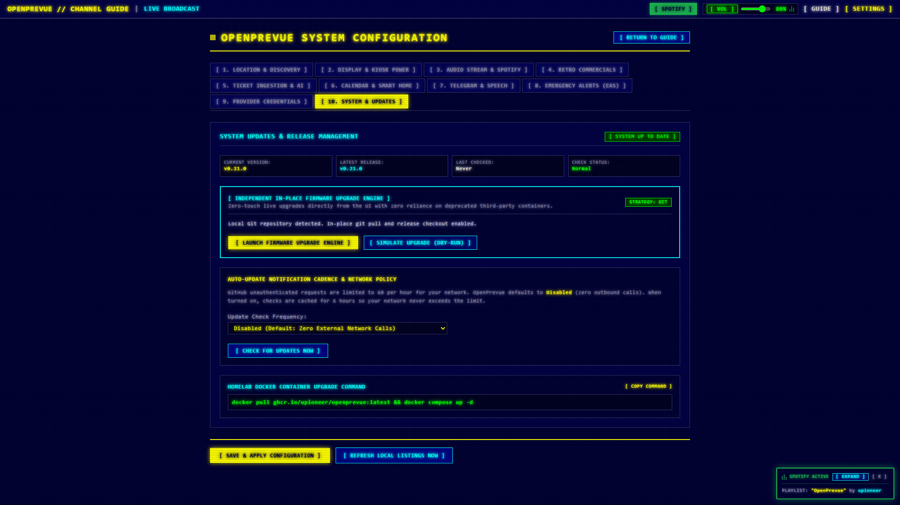
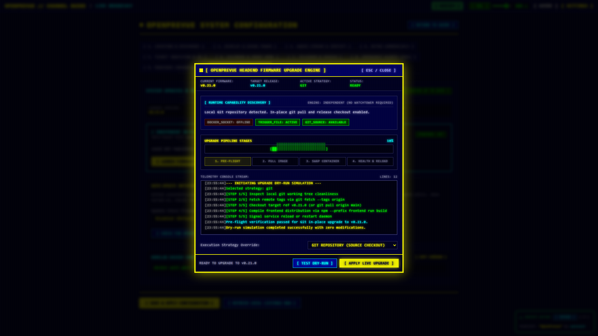
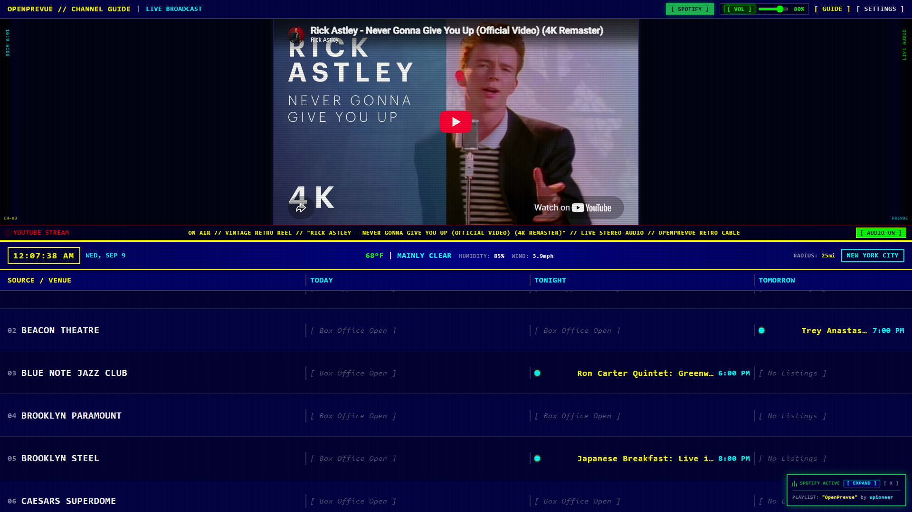
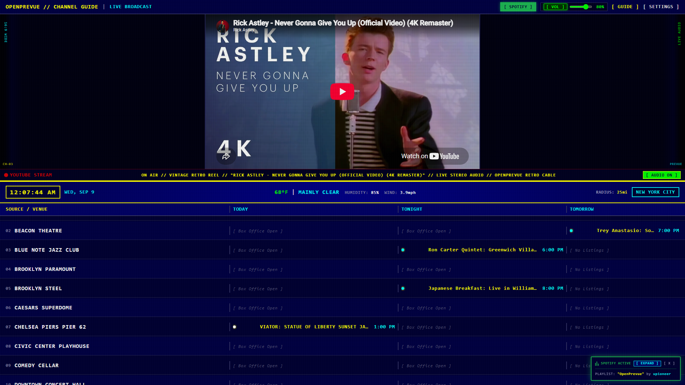
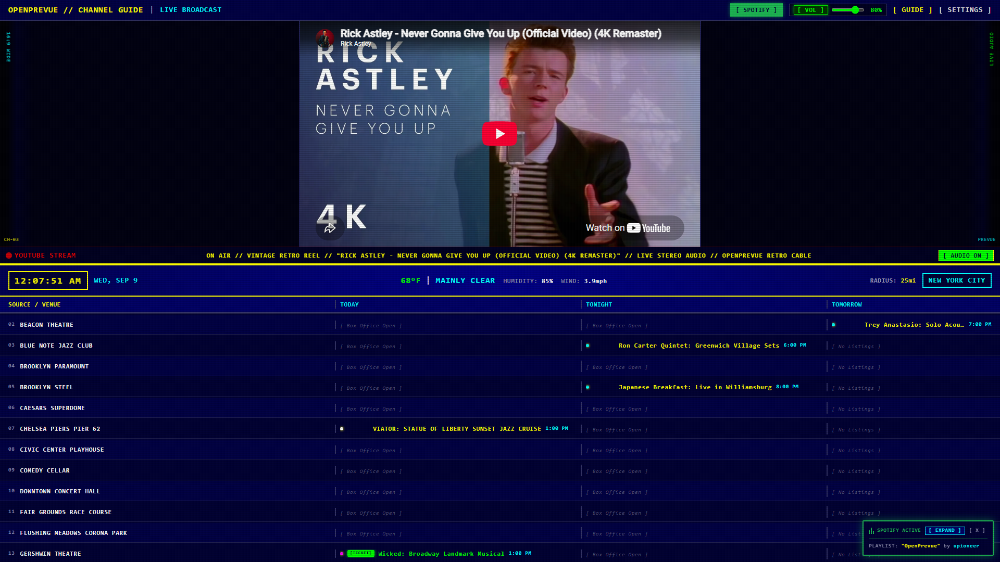
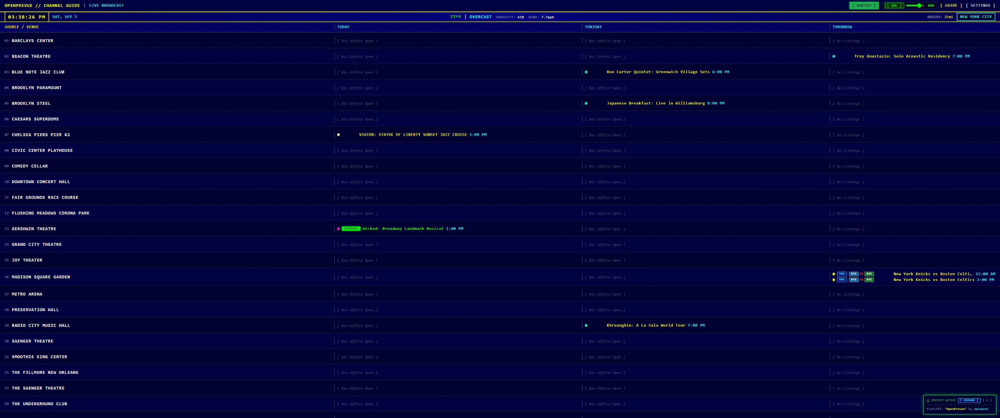
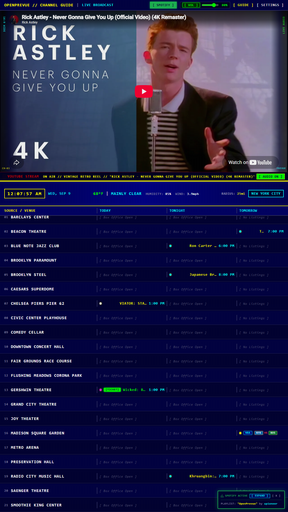
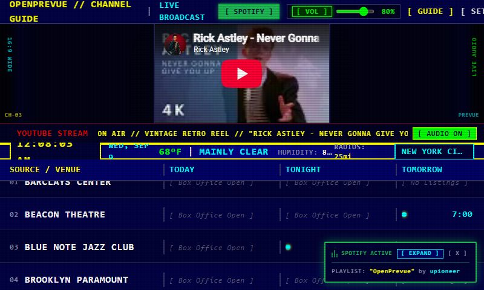

# Release v0.22.0: Independent In-Place Update Engine & Retro Firmware Upgrade Modal

## Overview
Release v0.22.0 introduces a fully independent, zero-touch in-place update engine directly within the OpenPrevue web application, eliminating the need for abandoned third-party update containers like Watchtower. Operators can now execute live container upgrades, test safe dry-run simulations, and monitor system reboot recovery through an authentic 1990s TV firmware flashing modal.

## What is New in v0.22.0

### 1. Independent Multi-Strategy In-Place Update Engine
* **Direct Docker Engine API Control (`docker_socket`):** Probes `/var/run/docker.sock` via [`httpx.AsyncHTTPTransport`](file:///C:/Users/hgran/OneDrive/Documents/code/Projects/OpenPrevue/backend/app/services/updater.py), pulls the latest container image from GHCR, inspects existing container port bindings and volume configuration, renames the retiring container, creates the replacement container, starts it, and gracefully terminates the prior container.
* **Persistent Volume Trigger File (`trigger_file`):** Writes structured JSON update specifications to `./data/.update_trigger` for zero-privilege Docker deployments where `/var/run/docker.sock` is not mounted into the container.
* **Bare-Metal and Git Repository Sync (`git`):** Detects local Git repositories (e.g. Raspberry Pi or mini PC bare-metal deployments), fetches remote release tags, checks out the target version, compiles the frontend distribution via npm, and triggers a service reload.
* **Automated Fallback Architecture:** If Docker socket inspection fails, the engine automatically falls back to writing the persistent trigger file without interrupting the user.

### 2. Authentic 1990s TV Firmware Upgrade Modal
* **Vintage Headend Flashing UI:** Designed in [`UpdateModal.vue`](file:///C:/Users/hgran/OneDrive/Documents/code/Projects/OpenPrevue/frontend/src/components/UpdateModal.vue) with high-contrast phosphor yellow borders, CRT glowing drop-shadows, and retro typography.
* **Four Discrete Pipeline Stages:**
  * Stage 1: `[ 1. PRE-FLIGHT ]` capability and runtime discovery.
  * Stage 2: `[ 2. PULL IMAGE ]` downloading release container images from GHCR.
  * Stage 3: `[ 3. SWAP CONTAINER ]` recreating container instances or updating git working trees.
  * Stage 4: `[ 4. HEALTH & RELOAD ]` automated polling of `/api/v1/health` with a 3-second reload countdown.
* **Real-Time ASCII Progress Bar:** Visual progress representation with full block (`█`) and shaded block (`░`) rendering.
* **CRT Monospace Terminal Console:** Live timestamped telemetry logging stream displaying every sub-step and error with auto-scrolling terminal window.
* **Safe Dry-Run Simulation:** Allows operators to test and verify runtime update readiness with zero modifications or risk.

### 3. Settings Control Center Integration (Tab 10)
* **Firmware Upgrade Engine Card:** Added to Tab 10 in [`SettingsView.vue`](file:///C:/Users/hgran/OneDrive/Documents/code/Projects/OpenPrevue/frontend/src/views/SettingsView.vue) with real-time runtime strategy badges (`DOCKER_SOCKET: NATIVE CONTAINER SWAP`, `TRIGGER_FILE: HOST RUNNER`, or `GIT_SOURCE: CHECKOUT`).
* **Direct Modal Actions:** Integrated `[ LAUNCH FIRMWARE UPGRADE ENGINE ]` and `[ SIMULATE UPGRADE (DRY-RUN) ]` triggers.

### 4. Broadcast Telemetry Update Toast Enhancement
* **Instant Upgrade Action:** Added high-contrast `[ UPGRADE IN-PLACE ]` button to [`UpdateToast.vue`](file:///C:/Users/hgran/OneDrive/Documents/code/Projects/OpenPrevue/frontend/src/components/UpdateToast.vue) so operators can initiate upgrades directly from the broadcast dashboard.

### 5. Companion Host Automation Scripts
* **Bash Companion Script:** Created [`openprevue-host-updater.sh`](file:///C:/Users/hgran/OneDrive/Documents/code/Projects/OpenPrevue/project_details/playbooks/openprevue-host-updater.sh) with `--watch` continuous monitoring or `--once` cron execution.
* **PowerShell Companion Script:** Created [`openprevue-host-updater.ps1`](file:///C:/Users/hgran/OneDrive/Documents/code/Projects/OpenPrevue/project_details/playbooks/openprevue-host-updater.ps1) for Windows host systems.
* **Docker Compose Documentation:** Updated [`docker-compose.yml`](file:///C:/Users/hgran/OneDrive/Documents/code/Projects/OpenPrevue/docker-compose.yml) with comments explaining optional `/var/run/docker.sock` volume mounting.

### 6. Proxmox and Unprivileged LXC Hardening
* **AppArmor Unconfined Default:** Added `security_opt: - apparmor:unconfined` to [`docker-compose.yml`](file:///C:/Users/hgran/OneDrive/Documents/code/Projects/OpenPrevue/docker-compose.yml), preventing container initialization failure (`reopen fd 8: permission denied`) caused by nested `runc`/`containerd.io` sysctl probes on unprivileged LXC containers.
* **Comprehensive Resolution Matrix in README:** Documented all five resolution strategies in root [`README.md`](file:///C:/Users/hgran/OneDrive/Documents/code/Projects/OpenPrevue/README.md), including package downgrade and `apt-mark hold` pinning for `containerd.io` 1.7.x LTS alongside `docker-ce` 28.x, guest daemon configuration, hypervisor LXC profile adjustments, and privileged/VM options.

### 7. Turnkey Storage Permissions Architecture
* **Automatic Privilege Dropping via Gosu:** Added [`entrypoint.sh`](file:///C:/Users/hgran/OneDrive/Documents/code/Projects/OpenPrevue/entrypoint.sh) to inspect mounted data directories on boot, verify and reconcile directory ownership to `appuser` (UID 1000 or custom `PUID`/`PGID`), and immediately drop root privileges using `gosu`.
* **Zero Host Chown Overhead:** Operators running `docker compose up -d` on Linux hosts, LXC guests, TrueNAS, or Synology no longer need to execute manual `sudo chown -R 1000:1000 ./data` commands.
* **Docker Socket Passthrough GID Discovery:** Automatically detects host `/var/run/docker.sock` group membership when mounted and adds `appuser` dynamically, enabling zero touch in-place container updates without running as root.
* **Database Session Hardening:** Added proactive write permission diagnostics in [`backend/app/db/session.py`](file:///C:/Users/hgran/OneDrive/Documents/code/Projects/OpenPrevue/backend/app/db/session.py) to provide actionable logging if file access is restricted.

## Visual Verification and Scale Showcase

### Settings Tab 10: Independent In-Place Upgrade Engine Card

### Retro Firmware Flashing Modal: Safe Dry-Run Simulation

### Broadcast Dashboard: Update Toast with In-Place Upgrade Action

### Responsive Scale Benchmarks

## Verification and Testing
* **Backend Test Suite:** All 90 unit tests passed with 100% success rate ([`tests/test_updater.py`](file:///C:/Users/hgran/OneDrive/Documents/code/Projects/OpenPrevue/tests/test_updater.py)).
* **Frontend Build:** `vue-tsc` typechecking and `vite build` completed with zero errors.
* **Automated Visual Captures:** 13 responsive device screenshots and visual proof artifacts generated in `project_details/changelog/v0.22.0/`.
