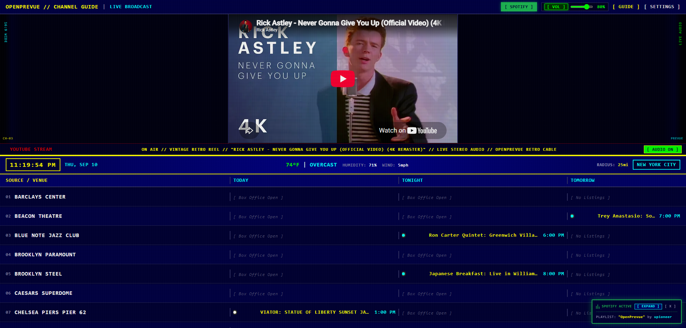
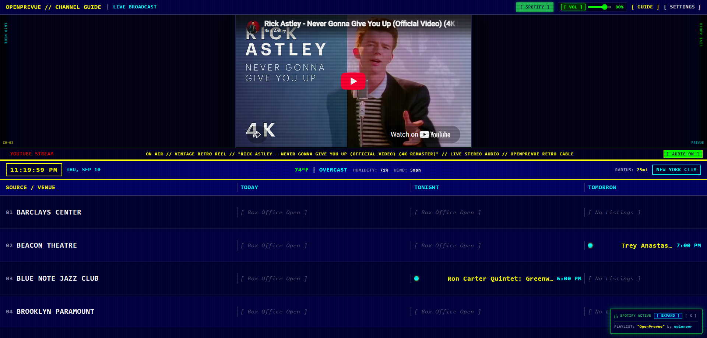
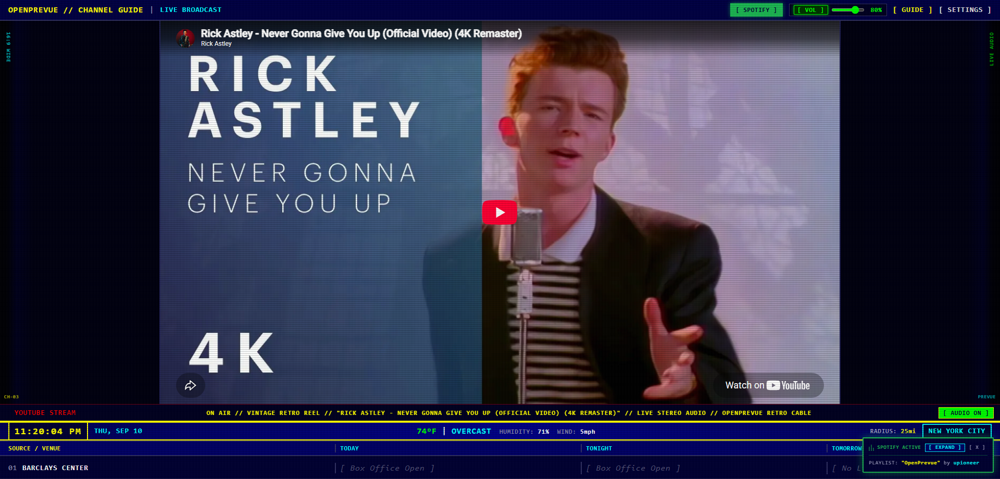
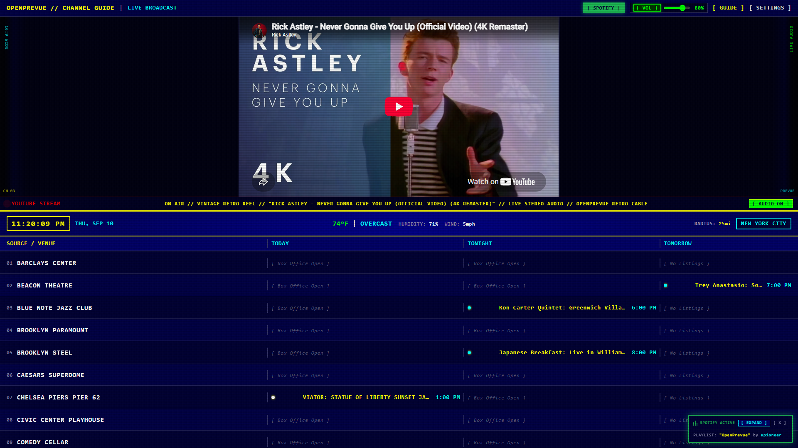
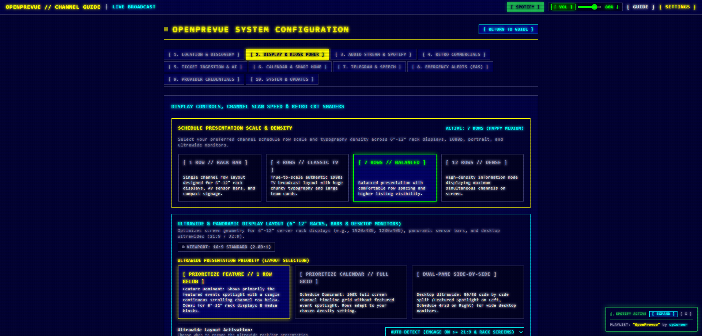
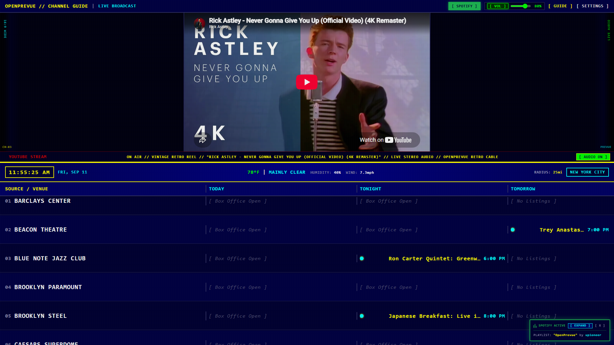
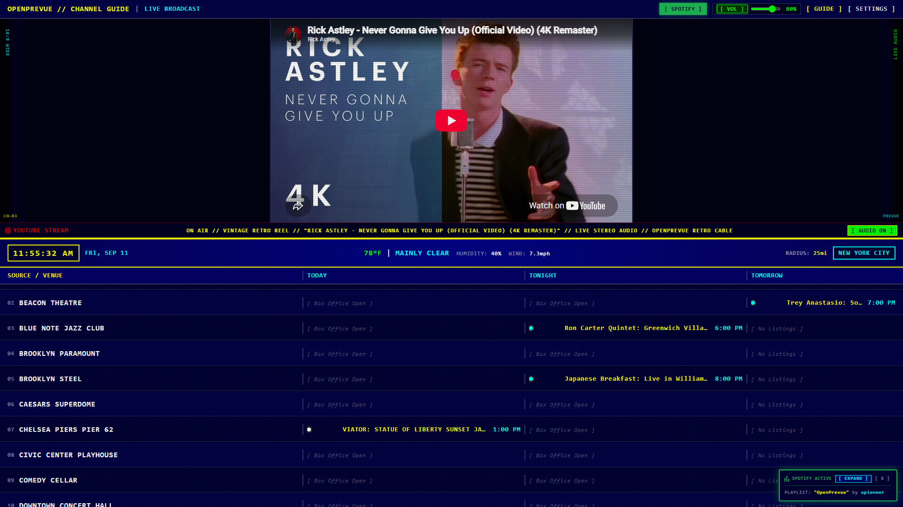
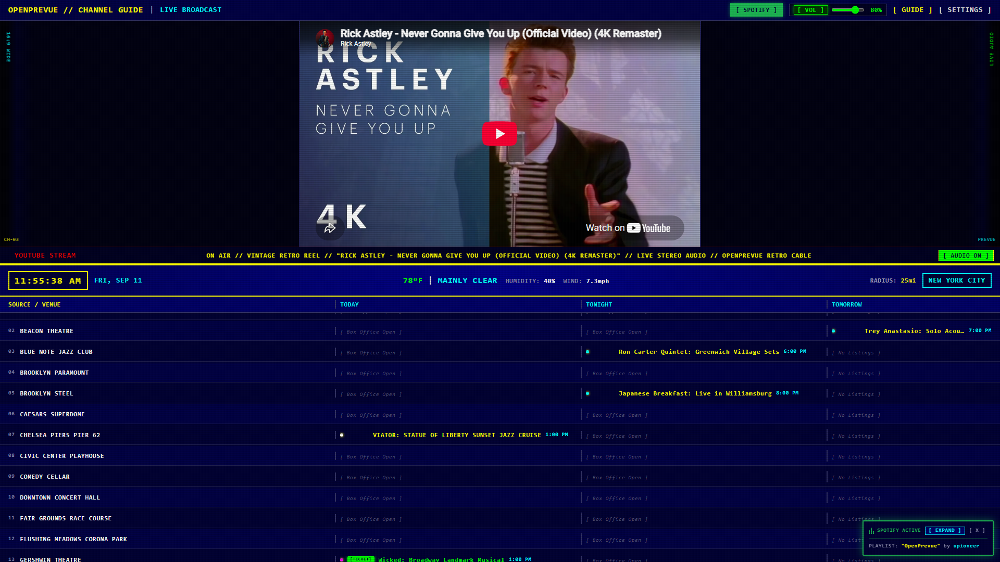

# Release v0.22.1: 1080p Standard Display Aspect Ratio Detection & Adaptive Density Layouts

## Overview
Release v0.22.1 delivers targeted visual hardening for standard 16:9 (1920x1080) desktop displays and browser viewports. This patch addresses an issue where desktop browser window chrome (OS taskbars, browser tab bars, and omniboxes) reduced viewport height and falsely triggered ultrawide display rules, inadvertently concealing the featured spotlight pane. The classic vertically stacked layout is now dynamically adaptive across all grid densities, and the system defaults to prioritizing the featured section.

## What is Fixed & Improved in v0.22.1

### 1. Robust Aspect Ratio Detection Hardening
* **Disassociated Physical Screen from Compressed Viewports:** In [`DashboardView.vue`](file:///C:/Users/hgran/OneDrive/Documents/code/Projects/OpenPrevue/frontend/src/views/DashboardView.vue) and [`SettingsView.vue`](file:///C:/Users/hgran/OneDrive/Documents/code/Projects/OpenPrevue/frontend/src/views/SettingsView.vue), aspect ratio evaluation now inspects both physical hardware resolution (`window.screen.width / window.screen.height`) and viewport dimensions.
* **Elimination of False Ultrawide Flags:** Standard 16:9 (1.78:1), 16:10 (1.60:1), and 4:3 (1.33:1) displays (`screenRatio < 2.2`) are never marked as ultrawide when browser window chrome compresses the height into an apparent 2.0:1 or 2.1:1 ratio.
* **Preserved Panoramic Support:** Viewports on physical 21:9 monitors (2.37:1), 32:9 monitors (3.55:1), and extreme panoramic custom displays (`viewportRatio >= 2.35`) continue to seamlessly transition into ultrawide multi-column presentations.

### 2. Adaptive Classic 16:9 Density Layouts
* **Guaranteed Featured Section Visibility:** The classic vertically stacked layout in [`DashboardView.vue`](file:///C:/Users/hgran/OneDrive/Documents/code/Projects/OpenPrevue/frontend/src/views/DashboardView.vue) now intelligently accommodates all four grid density selections without hiding the upper featured video or spotlight promo card:
  * **Classic TV (4 Rows):** Top featured section renders at 45% height above an authentic 4-row CRT timeline grid.
  * **Balanced (7 Rows):** Top featured section renders at 45% height above a 7-row timeline grid.
  * **Dense (12 Rows):** Compact high-information density grid alongside the full featured section.
  * **Single Row (1 Row):** The upper featured spotlight pane expands to fill the entire remaining vertical space (`flex-1 min-h-0`), positioned above a single scrolling channel row.

### 3. Default Ultrawide Priority Defaulting
* **Featured Spotlight Priority by Default:** Shifted the default setting for `ultrawide_priority` in [`backend/app/services/seeder.py`](file:///C:/Users/hgran/OneDrive/Documents/code/Projects/OpenPrevue/backend/app/services/seeder.py) and [`SettingsView.vue`](file:///C:/Users/hgran/OneDrive/Documents/code/Projects/OpenPrevue/frontend/src/views/SettingsView.vue) from `calendar` to `feature`.
* **Immediate Broadcast Presence:** When panoramic or ultrawide devices are connected for the first time, OpenPrevue prominently showcases featured video streams, weather forecasts, and event promos out-of-the-box rather than hiding them behind full-screen schedules.

### 4. Live Viewport Diagnostic Badge Update
* **Accurate Ratio Classification:** The real-time aspect ratio telemetry badge on Tab 2 in [`SettingsView.vue`](file:///C:/Users/hgran/OneDrive/Documents/code/Projects/OpenPrevue/frontend/src/views/SettingsView.vue) now displays `16:9 STANDARD (1.78:1)` with high-contrast slate styling on 1080p desktop browsers instead of falsely displaying a green pulsing `21:9 ULTRAWIDE` indicator.

## Visual Verification & Scale Showcase

### 1080p Windowed Desktop Browser: Balanced Density (7 Rows + Featured Spotlight)

### 1080p Windowed Desktop Browser: Classic TV Density (4 Rows + Featured Spotlight)

### 1080p Windowed Desktop Browser: Single Row Density (Full-Height Feature + Single Channel)

### 1080p Fullscreen Display (1920x1080)

### Settings Control Center: Accurate 16:9 Telemetry Badge

### Responsive Density Showcase

## Verification & Testing
* **Backend Test Suite:** All 90 unit and integration tests passed ([`tests/test_settings_api.py`](file:///C:/Users/hgran/OneDrive/Documents/code/Projects/OpenPrevue/tests/test_settings_api.py)).
* **Frontend Build:** `vue-tsc` type-checking and `vite build` completed with zero errors or warnings.
* **Playwright Automated Proofs:** Visual captures verified across windowed 1080p (1920x920) and fullscreen 1080p (1920x1080) viewports.
