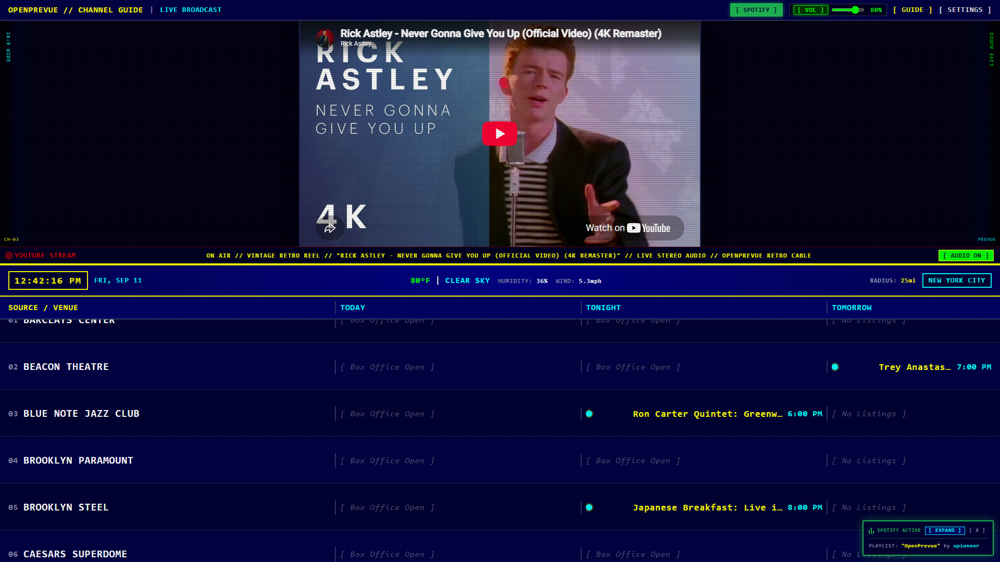
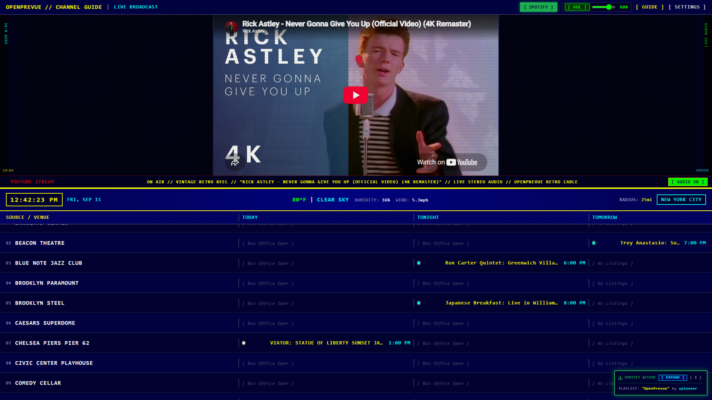
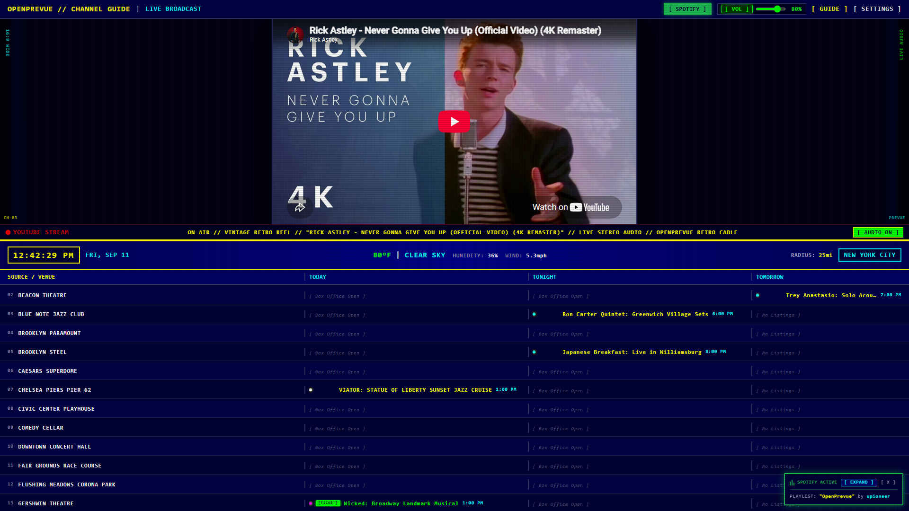
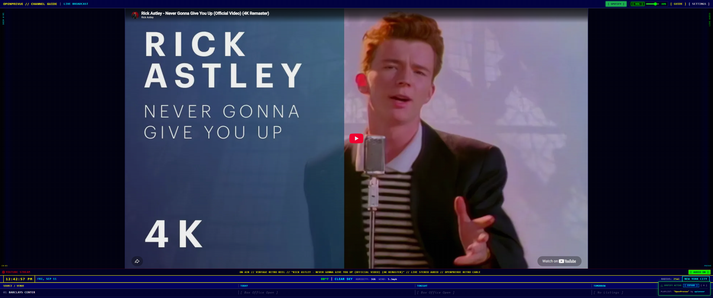
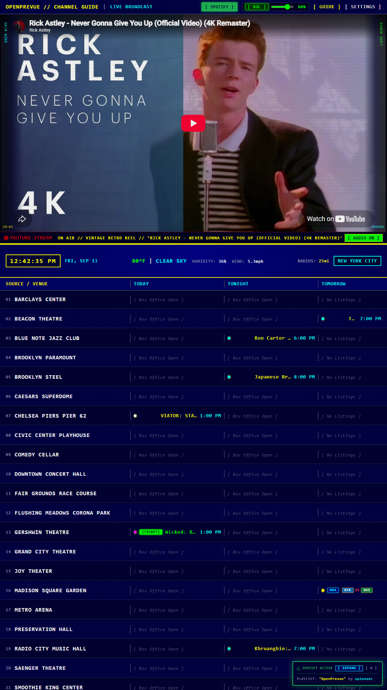
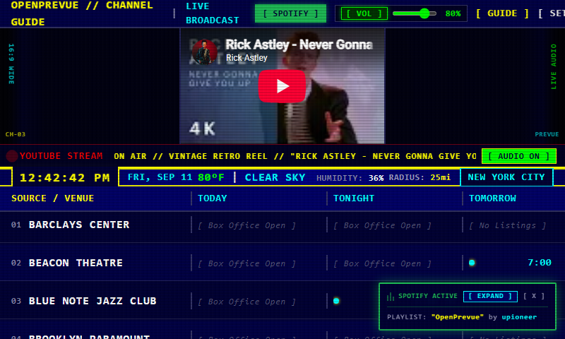

# Release v0.22.2: Git Tags Canonical Update Engine & Automated GitHub Releases

## Overview
Release v0.22.2 improves update discovery reliability by establishing Git tags as the authoritative source of truth for version tracking. Previously, querying GitHub's `/releases/latest` endpoint caused the update checker to return `HTTP 404` in repositories where releases had not been manually published through the web UI, falsely indicating that the system was up-to-date. This release updates the update service to query Git tags directly, introduces non-blocking release notes enrichment, and automates GitHub Release publication through the CI pipeline.

## What is New & Improved in v0.22.2

### 1. Git Tags as Canonical Update Source of Truth
* **Direct Git Tag Discovery:** Updated [`UpdateService.check_for_updates()`](file:///C:/Users/hgran/OneDrive/Documents/code/Projects/OpenPrevue/backend/app/services/updater.py#L92-L215) in [`backend/app/services/updater.py`](file:///C:/Users/hgran/OneDrive/Documents/code/Projects/OpenPrevue/backend/app/services/updater.py) to query `https://api.github.com/repos/upioneer/OpenPrevue/tags` directly rather than relying on `/releases/latest`.
* **Reliable Semantic Version Sorting:** All repository tags are parsed through [`parse_semver()`](file:///C:/Users/hgran/OneDrive/Documents/code/Projects/OpenPrevue/backend/app/services/updater.py#L24-L35), sorted in descending order, and compared against [`settings.VERSION`](file:///C:/Users/hgran/OneDrive/Documents/code/Projects/OpenPrevue/backend/app/core/config.py).
* **Elimination of False 404 Failures:** Update checks no longer fail or stall when a tag has been pushed and a container published to GHCR without a corresponding manual GitHub release page.
* **Optional Release Notes Enrichment:** If a formal GitHub Release object exists for the discovered tag, the engine asynchronously enriches the update status with official release titles, markdown changelogs, and direct links without blocking or failing if the release object is absent.

### 2. Automated GitHub Release Publishing in CI
* **Automated Tag Release Workflow:** Added the `create-release` job to [`.github/workflows/ci.yml`](file:///C:/Users/hgran/OneDrive/Documents/code/Projects/OpenPrevue/.github/workflows/ci.yml) utilizing `softprops/action-gh-release@v2`.
* **Elevated Contents Permission:** Configured `permissions: contents: write` to allow the GitHub Actions runner to create releases via the standard repository token.
* **Dynamic Walkthrough Body Attachment:** The release job checks for the existence of `project_details/changelog/${{ github.ref_name }}/readme.md` and attaches the documentation directly as the GitHub release body, with an automated fallback to generated Git commit logs.

### 3. Automated Test Coverage
* **Tag Discovery Unit Testing:** Added [`test_check_for_updates_with_tags()`](file:///C:/Users/hgran/OneDrive/Documents/code/Projects/OpenPrevue/tests/test_updater.py#L155-L198) in [`tests/test_updater.py`](file:///C:/Users/hgran/OneDrive/Documents/code/Projects/OpenPrevue/tests/test_updater.py), verifying that older versions correctly trigger `update_available = True` when newer Git tags are detected on GitHub and verifying clean state when the system is already up to date.

## Visual Verification & Scale Showcase

### Settings Control Center: In-Place Upgrade Engine (Tab 10)

### Broadcast Telemetry: In-Place Upgrade Action Toast

### Responsive Scale Benchmarks

## Verification & Testing
* **Backend Test Suite:** All 91 unit and integration tests passed ([`tests/test_updater.py`](file:///C:/Users/hgran/OneDrive/Documents/code/Projects/OpenPrevue/tests/test_updater.py)).
* **Frontend Build:** `vue-tsc` type-checking and `vite build` completed with zero errors or warnings.
* **Simulated Tag Discovery:** Validated via automated test suite that simulated running on `v0.22.0` correctly detects available tag `v0.22.1` and triggers the in-place upgrade banner.
