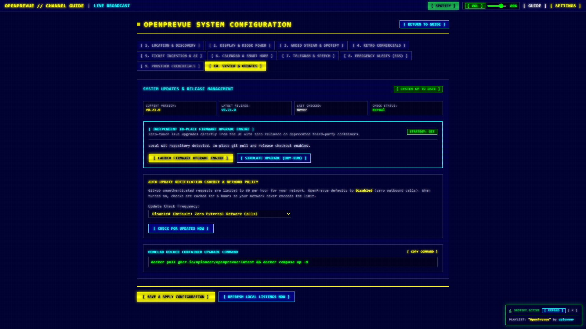
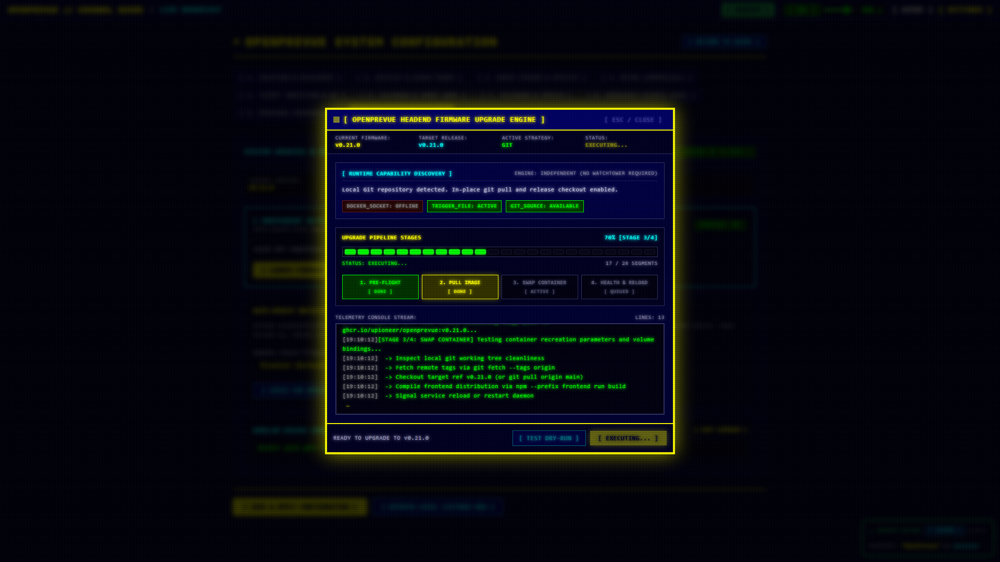
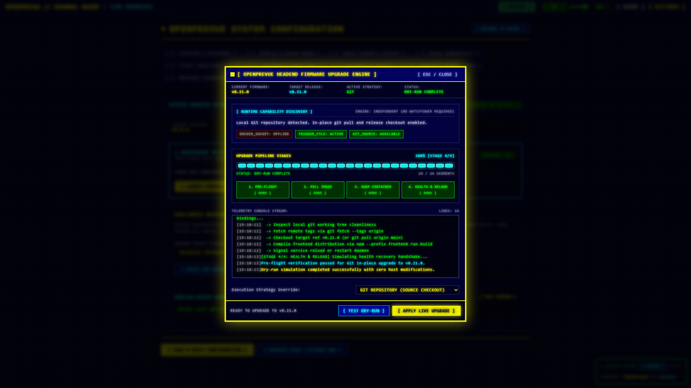
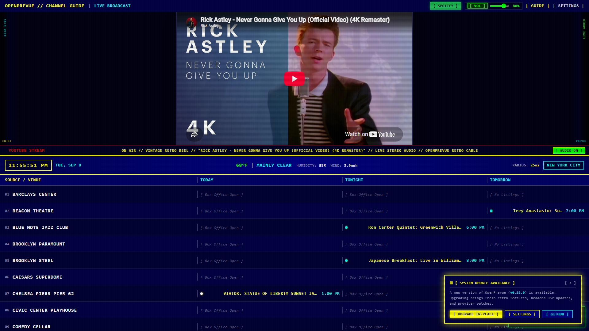
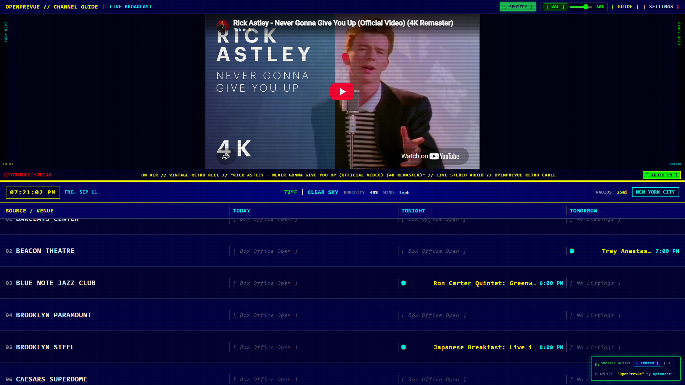
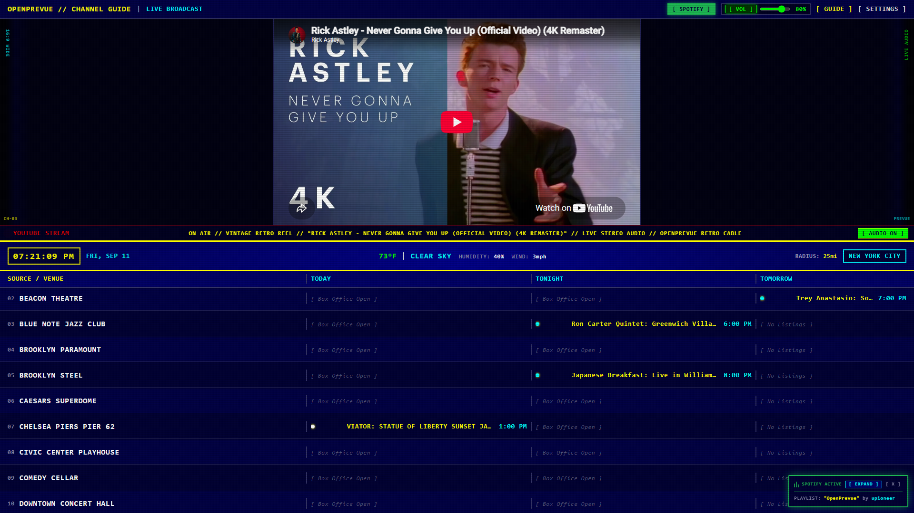
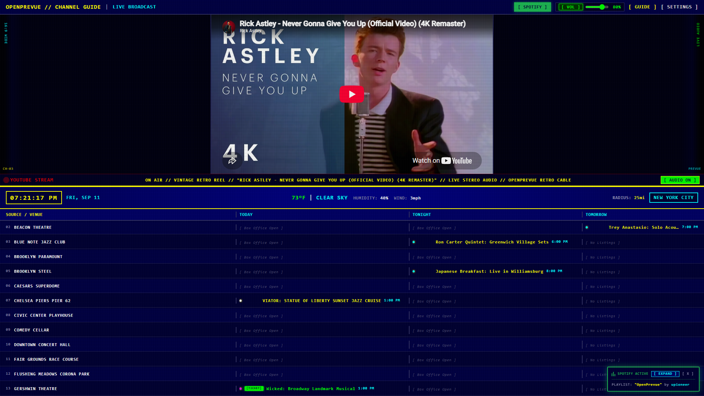
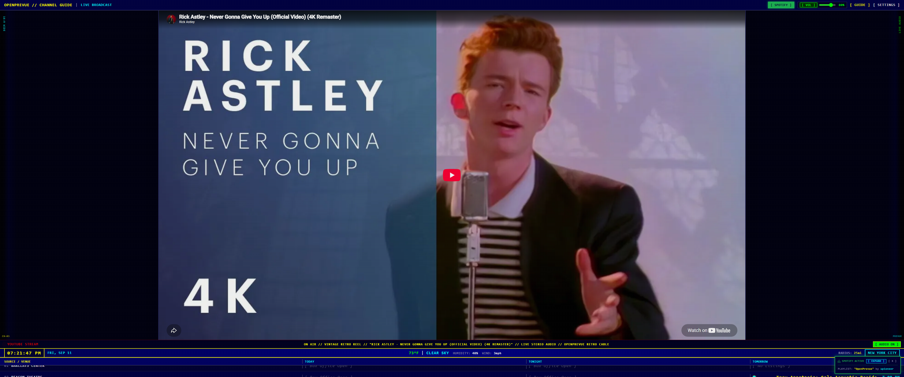
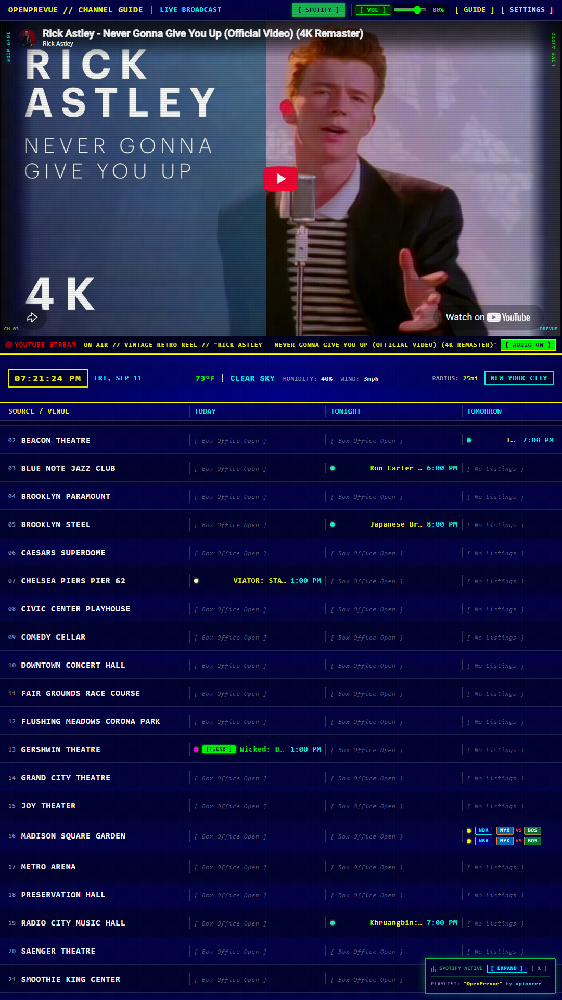
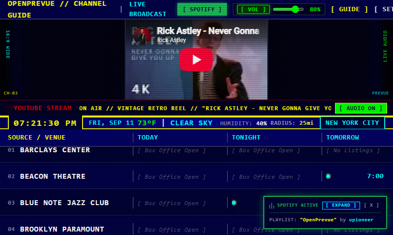

# Release v0.22.3: Phosphor LED Firmware Engine & Deep-Linked Update Navigation

## Overview
Release v0.22.3 delivers major user experience and reliability enhancements to OpenPrevue's in-place upgrade subsystem. It resolves navigation routing to direct users straight into the System & Updates configuration panel, replaces legacy Unicode character rendering with an authentic 24-segment phosphor green LED progress meter featuring active scanner animations, tightens health polling verification to prevent premature reloads during container recreation, and activates the Docker socket volume by default in compose deployments for true zero-touch 1-click updates.

## What is New & Improved in v0.22.3

### 1. Direct Deep-Linked Settings Tab Navigation
* **Query Parameter Routing:** [SettingsView.vue](file:///C:/Users/hgran/OneDrive/Documents/code/Projects/OpenPrevue/frontend/src/views/SettingsView.vue) now parses and reacts to ?tab=updates route queries, automatically activating Tab 10 (System & Updates) on initial load and route changes.
* **Header and Toast Badges:** Direct links in [HeaderBar.vue](file:///C:/Users/hgran/OneDrive/Documents/code/Projects/OpenPrevue/frontend/src/components/HeaderBar.vue) and [UpdateToast.vue](file:///C:/Users/hgran/OneDrive/Documents/code/Projects/OpenPrevue/frontend/src/components/UpdateToast.vue) route directly to /settings?tab=updates, eliminating previous disorientation where users landed on Tab 1 (Location & Discovery).

### 2. Segmented Phosphor LED Meter & Pipeline Visualization
* **24-Segment LED Display:** In [UpdateModal.vue](file:///C:/Users/hgran/OneDrive/Documents/code/Projects/OpenPrevue/frontend/src/components/UpdateModal.vue), replaced static Unicode light shade blocks with a high fidelity 24-segment hardware LED meter glowing phosphor green (#00FF00) during execution and switching to cyan (#00FFFF) upon successful headend recovery.
* **Active Sweep Scanner Animation:** An animated scanner pulse sweeps continuously across the meter during pre-flight checks, image pulling, container replacement, and reboot polling.
* **Dynamic Pipeline Stage Cards:** Real-time stage cards display live status badges ([ READY ], [ ACTIVE ], [ DONE ], [ QUEUED ]) across all four upgrade phases (PRE-FLIGHT, PULL IMAGE, SWAP CONTAINER, HEALTH & RELOAD).

### 3. Version-Verified Health Polling
* **Endpoint Version Reporting:** Added running ersion attribute to [HealthResponse](file:///C:/Users/hgran/OneDrive/Documents/code/Projects/OpenPrevue/backend/app/schemas/health.py) and populated it from application configuration in [health.py](file:///C:/Users/hgran/OneDrive/Documents/code/Projects/OpenPrevue/backend/app/api/v1/endpoints/health.py).
* **Prevention of Premature Reloads:** The health probe in [UpdateModal.vue](file:///C:/Users/hgran/OneDrive/Documents/code/Projects/OpenPrevue/frontend/src/components/UpdateModal.vue) now verifies that the headend responds with the target version before declaring success, avoiding false positive reloads when running in trigger file fallback mode.
* **Explicit Diagnostic Notices:** Informative console telemetry provides guidance regarding Docker socket availability and execution status.

### 4. Zero-Touch 1-Click Upgrades Enabled by Default
* **Docker Compose Out-of-the-Box:** Enabled /var/run/docker.sock:/var/run/docker.sock by default in [docker-compose.yml](file:///C:/Users/hgran/OneDrive/Documents/code/Projects/OpenPrevue/docker-compose.yml) and [
eadme.md](file:///C:/Users/hgran/OneDrive/Documents/code/Projects/OpenPrevue/readme.md), enabling seamless 1-click in-place upgrades directly from the web interface for standard container deployments without host CLI intervention.

## Visual Verification & Scale Showcase

### Settings Control Center: In-Place Upgrade Engine (Tab 10 Direct Deep-Link)

### Firmware Upgrade Engine: Active 24-Segment Phosphor LED Meter

### Firmware Upgrade Engine: Completed State & Verified Telemetry

### Broadcast Telemetry: In-Place Upgrade Action Toast

### Responsive Scale Benchmarks

## Verification & Testing
* **Backend Test Suite:** All 91 unit and integration tests passed ([	ests/test_health.py](file:///C:/Users/hgran/OneDrive/Documents/code/Projects/OpenPrevue/tests/test_health.py), [	ests/test_updater.py](file:///C:/Users/hgran/OneDrive/Documents/code/Projects/OpenPrevue/tests/test_updater.py)).
* **Frontend Build:** ue-tsc type-checking and ite build completed with zero errors.
* **Playwright Automated Verification:** End-to-end verification executed for direct tab routing, LED progress bar states, and responsive layout snapshots.
