# Release v0.23.0: Direct Media Volume Routing & Multi-Display Kiosk Architecture

## Overview
Release v0.23.0 delivers comprehensive multi-screen independent client architecture, dedicated kiosk deployment capabilities, and direct media volume regulation to OpenPrevue. It fixes the top navigation volume slider to directly control YouTube video and background music playback, completely decouples ambient analog tape hiss static into its own preference (silenced to 0% by default), introduces URL query parameter overrides for per-screen density and behavior customization on a single headend instance, and introduces a dedicated Operator Guide (Tab 11: Deployment & Kiosk Guide) with one-click clipboard copying for turnkey kiosk URLs, Raspberry Pi autostart recipes, and Docker volume management.

## What is New & Improved in v0.23.0

### 1. Direct Media Volume Regulation & Tape Hiss Decoupling
* **Direct Audio Routing:** The top navigation volume slider in [HeaderBar.vue](file:///C:/Users/hgran/OneDrive/Documents/code/Projects/OpenPrevue/frontend/src/components/HeaderBar.vue) now directly regulates YouTube video loudness and Spotify/background music in [YouTubePane.vue](file:///C:/Users/hgran/OneDrive/Documents/code/Projects/OpenPrevue/frontend/src/components/YouTubePane.vue) through [audioSynth.ts](file:///C:/Users/hgran/OneDrive/Documents/code/Projects/OpenPrevue/frontend/src/services/audioSynth.ts).
* **Decoupled Ambient Static:** Web Audio analog tape hiss and 60 Hz hum pink noise is now fully decoupled from the master volume slider. It has its own dedicated setting ([tapeHissLevel](file:///C:/Users/hgran/OneDrive/Documents/code/Projects/OpenPrevue/frontend/src/services/audioSynth.ts#L61)) defaulting to 0% (silent by default).
* **Synchronized Mute State:** The bottom footer audio toggle button, the top volume slider, and the CRT bezel telemetry badge ([LIVE AUDIO] vs [MUTED RF]) react synchronously across all user interactions.
* **Equalizer Animation:** The top header volume equalizer bars animate dynamically during active audible playback and freeze when muted or set to zero volume.

### 2. Multi-Screen Independent Kiosk URL Query Overrides
* **Per-Display Overrides:** A single OpenPrevue headend instance can now drive displays of completely different aspect ratios and locations without running separate containers. Client parameters can be overridden per screen directly in the browser URL:
  * `?density=`: Sets channel row density (`classic_tv`, `balanced`, `dense`, `single_row`).
  * `?kiosk=1`: Suppresses the top navigation header bar for clean, edge-to-edge full-bleed broadcast signage.
  * `?audio=`: Configures initial audio behavior on boot (`on`, `1`, `mute`, `0`).
  * `?volume=`: Sets default media volume percentage (`0` to `100`).
  * `?priority=`: Sets ultrawide panoramic presentation preference (`feature` spotlight or `side_by_side` split screen).
  * `?aspect=`: Overrides video aspect ratio framing (`4:3`, `16:9`, `stretch`, `auto`).
  * `?video=`: Disables external video streaming (`video=off` or `video=0`) and locks local Featured Events spotlight on low-power devices.
  * `?speed=`: Fine-tunes timeline marquee scrolling velocity in pixels per second.
* **Signage Layout Engine:** [App.vue](file:///C:/Users/hgran/OneDrive/Documents/code/Projects/OpenPrevue/frontend/src/App.vue) dynamically toggles [HeaderBar.vue](file:///C:/Users/hgran/OneDrive/Documents/code/Projects/OpenPrevue/frontend/src/components/HeaderBar.vue) based on route query flags, while [DashboardView.vue](file:///C:/Users/hgran/OneDrive/Documents/code/Projects/OpenPrevue/frontend/src/views/DashboardView.vue) applies URL overrides without modifying shared database settings.

### 3. Settings Tab 11: Deployment & Kiosk Operator Manual
* **Dedicated Operator Guide:** Added `[ 11. DEPLOYMENT & KIOSK GUIDE ]` to [SettingsView.vue](file:///C:/Users/hgran/OneDrive/Documents/code/Projects/OpenPrevue/frontend/src/views/SettingsView.vue) detailing multi-screen geometry, orientation detection, and headless operation.
* **Interactive Bookmark Profiles:** Built-in copy buttons allow one-click clipboard copying of fully qualified URLs for living room 16:9 TVs, 9:16 vertical hallway posters, 10-inch server rack panoramic bars, and silent ambient displays.
* **Raspberry Pi & Linux Autostart Recipe:** Full systemd and desktop autostart configuration templates for running Chromium in full-screen kiosk mode with GPU flags and Screen WakeLock.
* **Docker Socket Upgrade Integration:** Step-by-step documentation for enabling the Docker socket volume mount for zero-touch web UI upgrades.

## Visual Verification & Scale Showcase

### Settings Control Center: Deployment & Kiosk Guide (Tab 11)
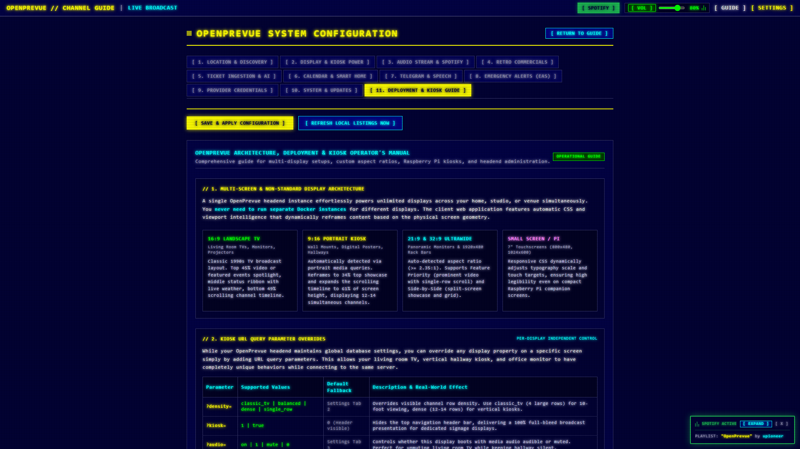

### Kiosk URL Parameters & Copyable Bookmark Profiles
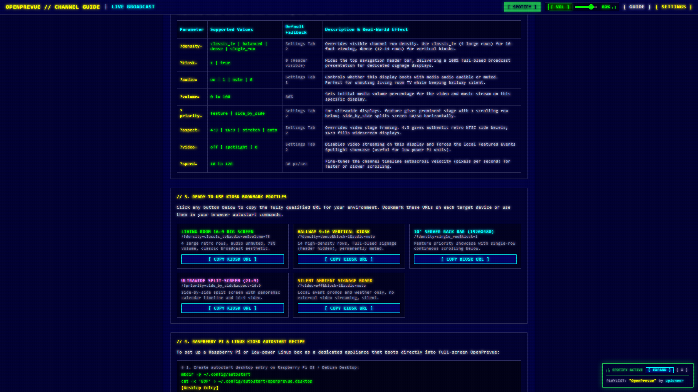

### Master Volume Slider: Direct Media Loudness Regulation
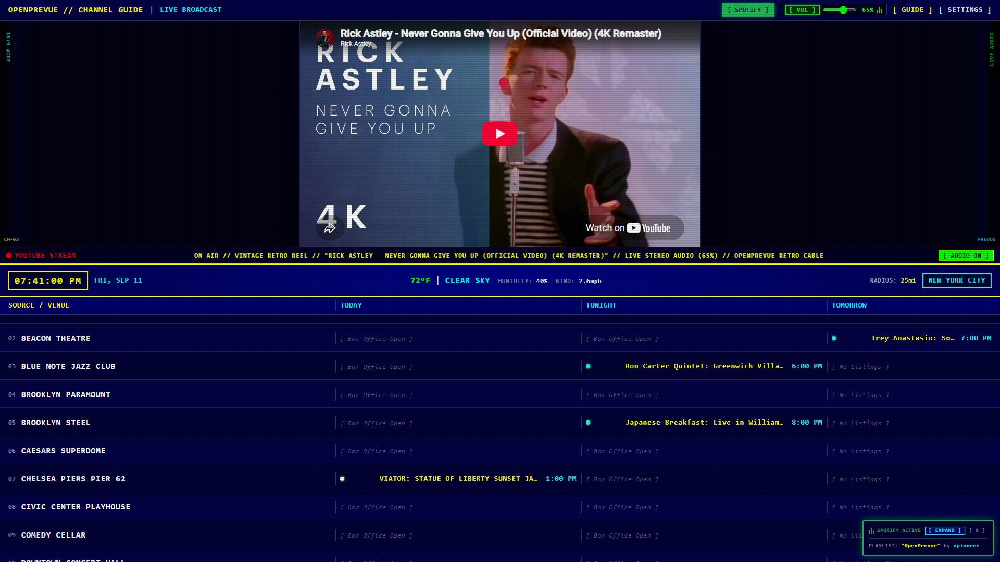

### Master Volume Slider: Muted State & Sync
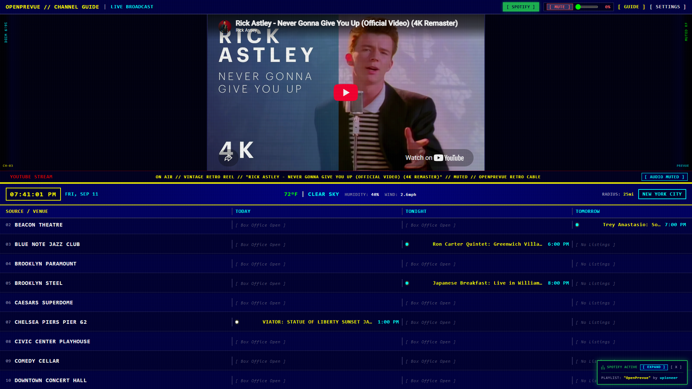

### Multi-Display Geometry & Density Profiles
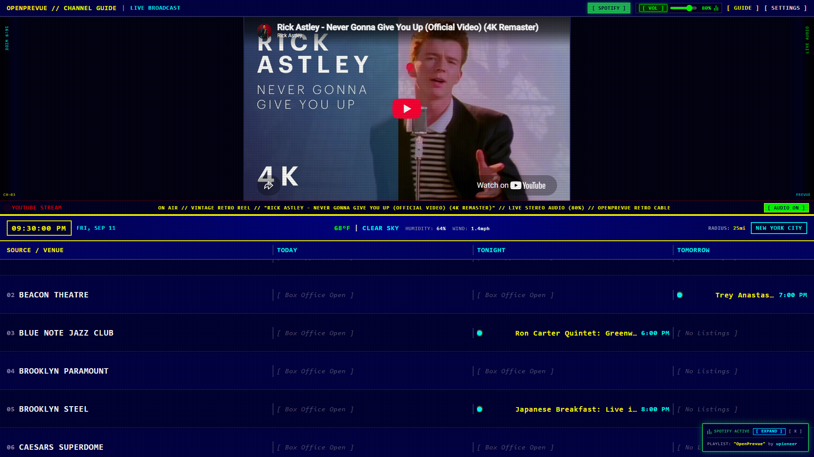
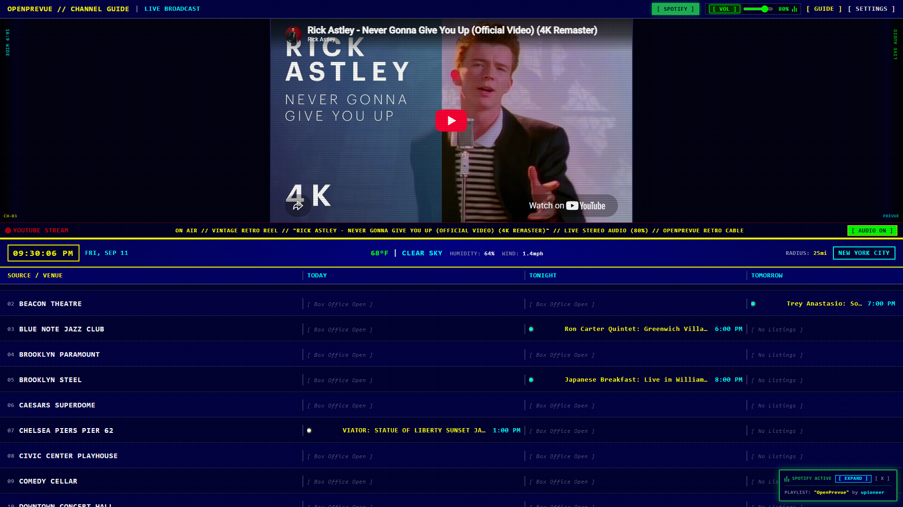
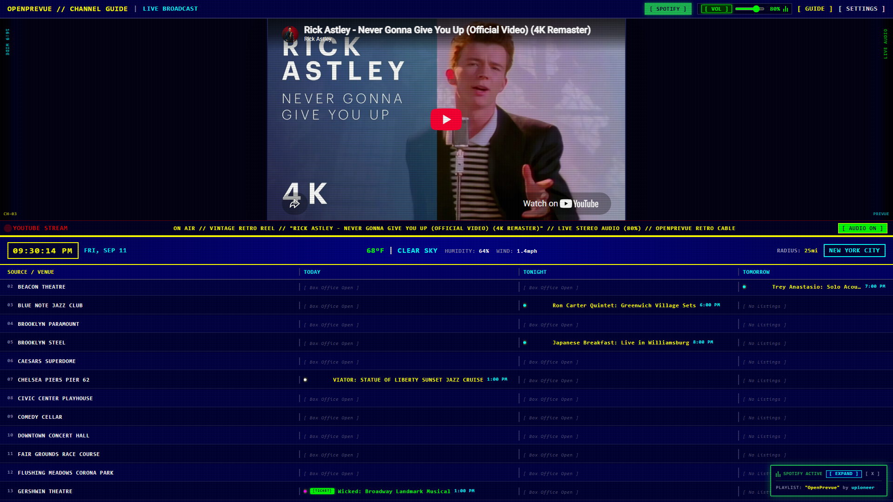
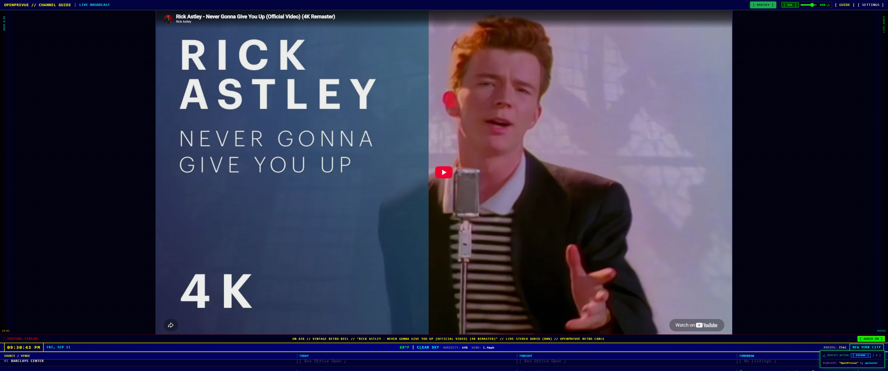
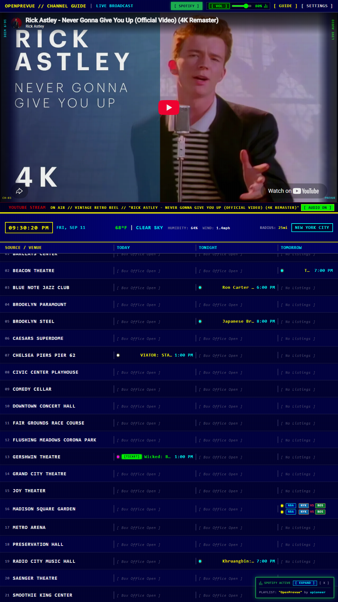
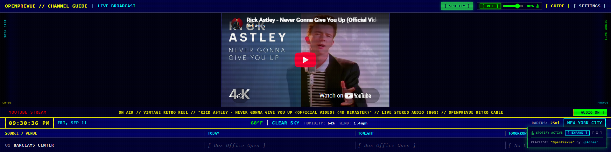
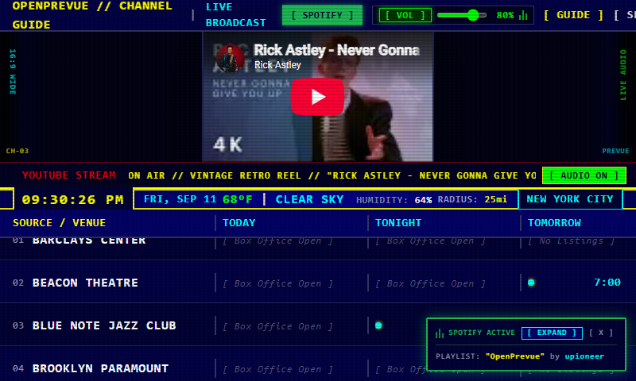

## Verification & Testing
* **Backend Test Suite:** All 91 unit and integration tests passed in 12.81s ([tests/test_health.py](file:///C:/Users/hgran/OneDrive/Documents/code/Projects/OpenPrevue/tests/test_health.py), [tests/test_updater.py](file:///C:/Users/hgran/OneDrive/Documents/code/Projects/OpenPrevue/tests/test_updater.py), [tests/test_settings_api.py](file:///C:/Users/hgran/OneDrive/Documents/code/Projects/OpenPrevue/tests/test_settings_api.py)).
* **Frontend Build:** `vue-tsc` type-checking and `vite build` completed with zero errors.
* **Playwright Automated Verification:** End-to-end verification executed for volume slider synchronization, mute toggle, kiosk guide deep-linking, clipboard copy triggers, and responsive layout snapshots.
