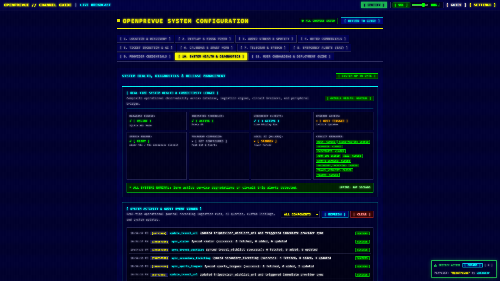
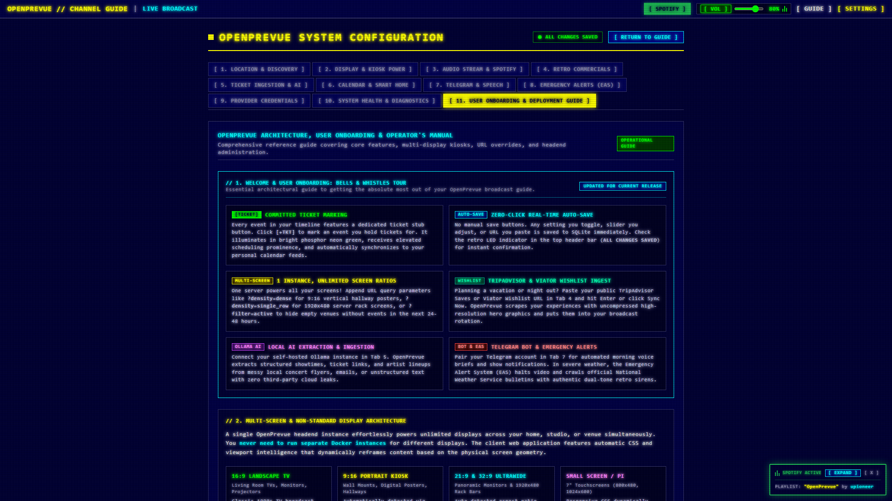
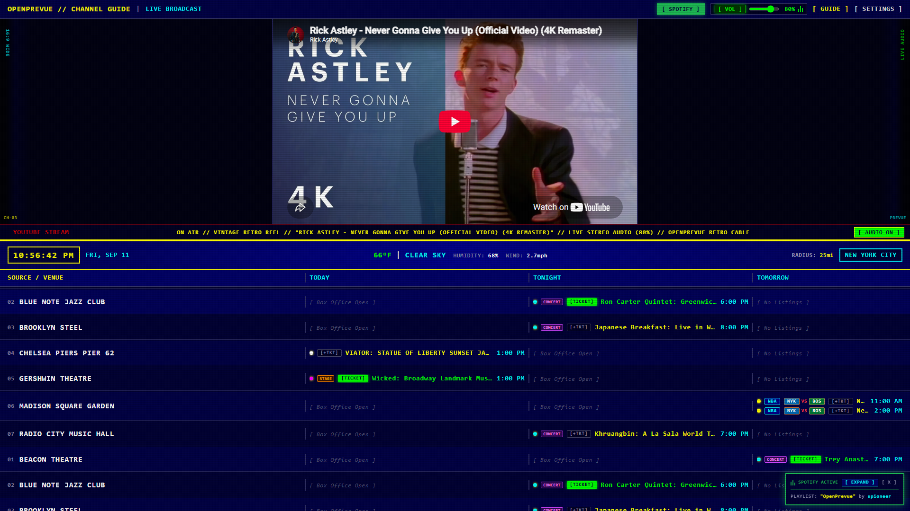
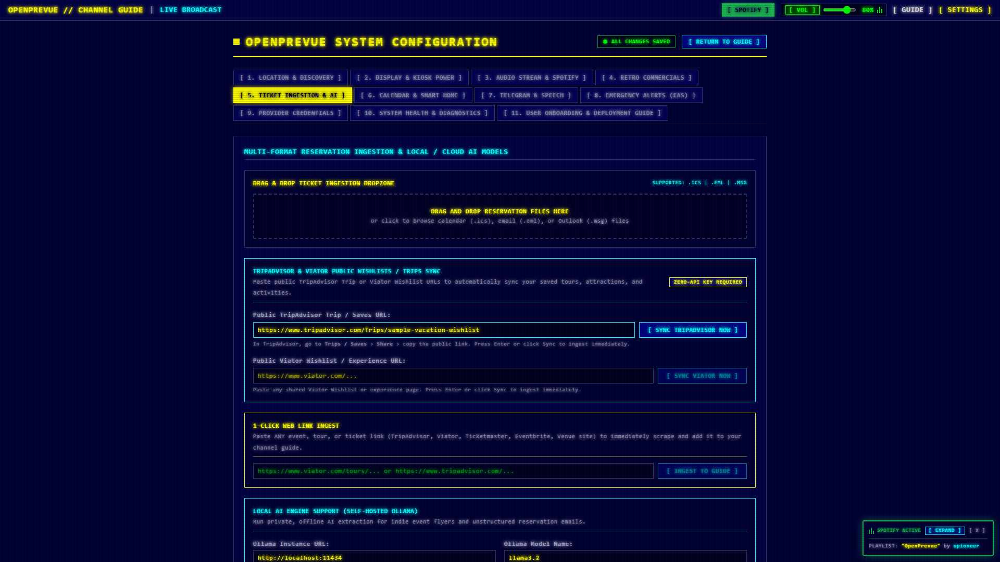
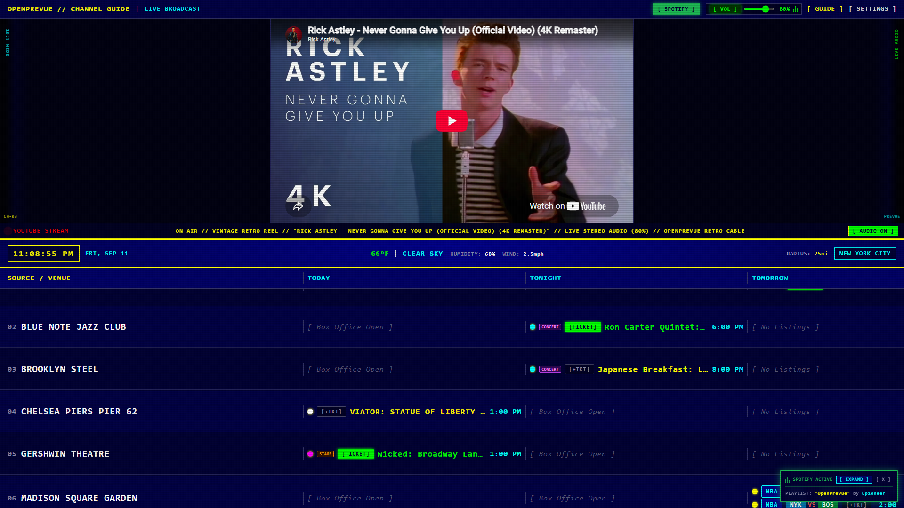
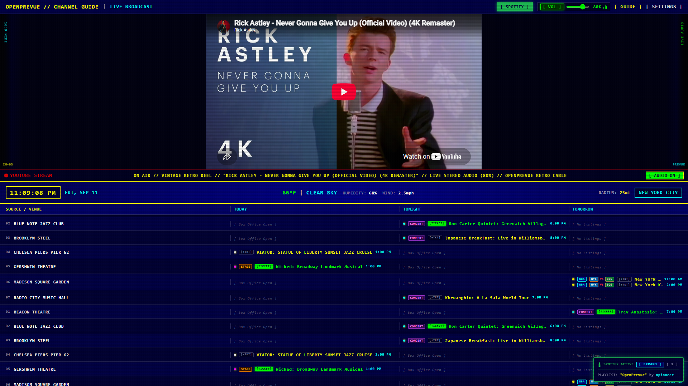
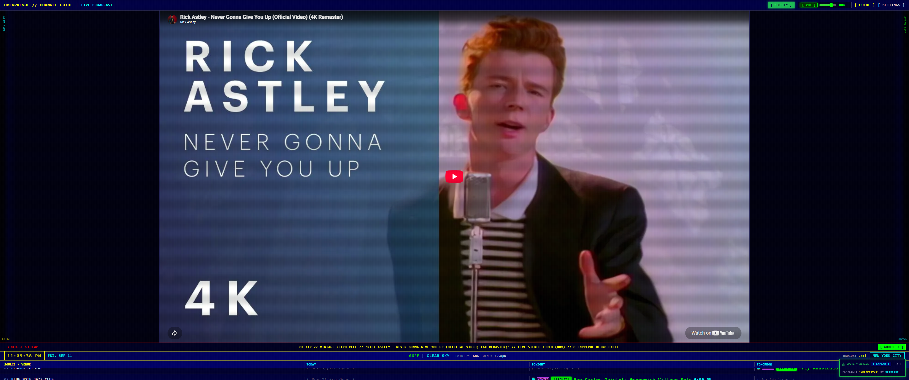
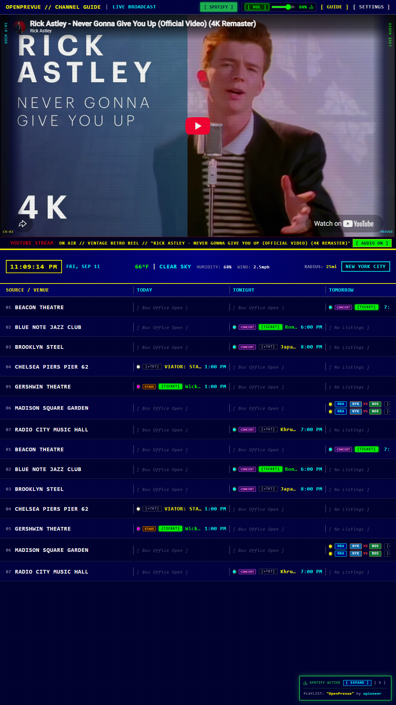
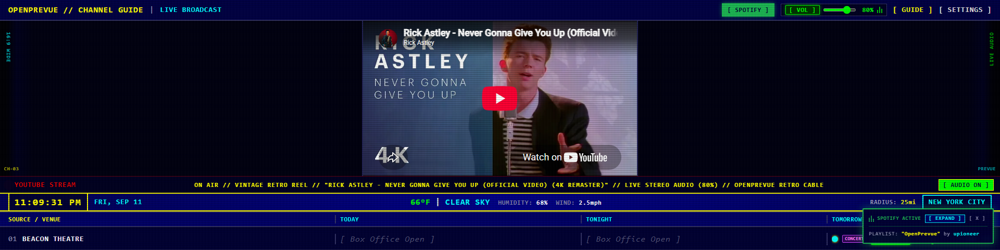
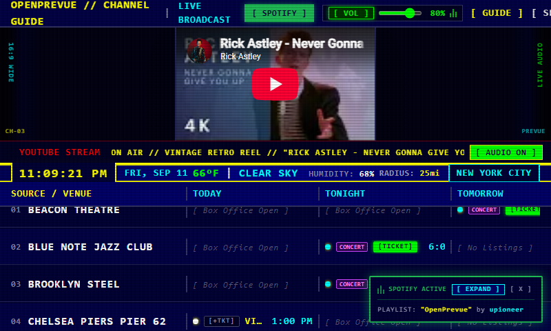

# Release v0.24.0: System Health Ledger, CRT Event Viewer, User Onboarding & Travel Wishlist Sync

## Overview
Release v0.24.0 introduces major observability, usability, and content expansion features across OpenPrevue. It delivers a comprehensive Real-Time System Health and Connectivity Ledger and a live CRT Event Viewer terminal in Settings Tab 10, an interactive User Onboarding and Bells and Whistles Tour in Tab 11, a zero-click phosphor auto-save engine that saves changes in real time across the entire configuration interface, dedicated TripAdvisor and Viator wishlist sync controls with multi-event scraping and local geo-radius exemption, a listing density and empty venue suppression filter, prominent retro ticket stub indicators, and expanded genre badges and artwork for non-sports events.

## What is New & Improved in v0.24.0

### 1. Real-Time System Health & Connectivity Ledger
* **Comprehensive Component Health:** Added an observability ledger in [SettingsView.vue](file:///C:/Users/hgran/OneDrive/Documents/code/Projects/OpenPrevue/frontend/src/views/SettingsView.vue) driven by [health.py](file:///C:/Users/hgran/OneDrive/Documents/code/Projects/OpenPrevue/backend/app/api/v1/endpoints/health.py) monitoring SQLite WAL mode database status, background APScheduler cadence, active WebSocket client connections, Docker host upgrade trigger access, local Piper-TTS speech readiness, Telegram companion status, and Ollama AI availability.
* **Per-Provider Circuit Breakers:** Visual neon pills display the real-time trip status (`closed`, `open`, `half-open`) across all 10 provider services (Mock, Ticketmaster, SeatGeek, Eventbrite, JSON-LD, iCal, Sports Leagues, Secondary Ticketing, Travel Wishlists, and Viator).
* **Uptime & Anomaly Banner:** An active status banner reports continuous system uptime and highlights any degraded services or circuit breaker trips.

### 2. Retro CRT Activity & Audit Event Viewer Terminal
* **Operational Event Logging:** Introduced an [activity_log](file:///C:/Users/hgran/OneDrive/Documents/code/Projects/OpenPrevue/backend/app/db/schema.py) database table and [activity.py](file:///C:/Users/hgran/OneDrive/Documents/code/Projects/OpenPrevue/backend/app/services/activity.py) service that automatically logs configuration adjustments, scheduled ingestion runs, custom venue movements, and Ollama AI flyer extraction calls.
* **Filterable CRT Terminal:** Embedded a retro CRT event viewer terminal in Settings Tab 10 allowing real-time event browsing, component filtering (`all`, `ingestion`, `settings`, `ai`, `custom_venues`), manual refresh, and log clearing via [activity.py](file:///C:/Users/hgran/OneDrive/Documents/code/Projects/OpenPrevue/backend/app/api/v1/endpoints/activity.py).

### 3. User Onboarding & Bells and Whistles Tour
* **Interactive Feature Guide:** Embedded an architectural tour at the top of Settings Tab 11 ([SettingsView.vue](file:///C:/Users/hgran/OneDrive/Documents/code/Projects/OpenPrevue/frontend/src/views/SettingsView.vue)) detailing core capabilities:
  * `[TICKET]` Committed Ticket Marking: High-visibility ticket stubs and personal calendar integration.
  * `AUTO-SAVE` Zero-Click Real-Time Auto-Save: Instant persistence with retro LED confirmation.
  * `MULTI-SCREEN` 1 Instance, Unlimited Screen Ratios: URL parameters for kiosk layouts (`?density=`, `?filter=`).
  * `WISHLIST` TripAdvisor & Viator Wishlist Ingest: Scraping public saves with hero artwork.
  * `OLLAMA AI` Local AI Extraction & Ingestion: Unstructured flyer parsing with local LLMs.
  * `BOT & EAS` Telegram Bot & Emergency Alerts: Morning briefings and retro NWS broadcast sirens.

### 4. TripAdvisor & Viator Wishlist Ingestion UX
* **Dedicated Sync Triggers:** Added `[ SYNC TRIPADVISOR NOW ]` and `[ SYNC VIATOR NOW ]` action buttons and Enter-key submission handlers in Settings Tab 5 with immediate inline terminal status banners.
* **Multi-Event Extraction:** Enhanced [events.py](file:///C:/Users/hgran/OneDrive/Documents/code/Projects/OpenPrevue/backend/app/api/v1/endpoints/events.py) and [travel_wishlist.py](file:///C:/Users/hgran/OneDrive/Documents/code/Projects/OpenPrevue/backend/app/providers/travel_wishlist.py) to ingest and persist all experiences scraped from public travel wishlists instead of truncating at the first item.
* **Geo-Radius Filter Exemption:** Updated [ingestion.py](file:///C:/Users/hgran/OneDrive/Documents/code/Projects/OpenPrevue/backend/app/services/ingestion.py) to exempt vacation travel wishlist items from the local home geo-radius filter so out-of-town trips always display on the broadcast schedule.

### 5. Zero-Click Real-Time Auto-Save Persistence
* **Instant Persistence:** Replaced manual save buttons across the configuration center with a reactive auto-save engine that persists changes on input directly to the SQLite backend.
* **Phosphor Confirmation:** Header bar features an instantaneous `[ ALL CHANGES SAVED ]` green LED indicator that updates dynamically upon every preference modification.

### 6. Listing Density & Empty Venue Window Filter
* **Window Filter Setting:** Added the `listing_filter` setting in Tab 2 to toggle between showing all venues or suppressing empty channels to display only active listings scheduled within the next 24 to 48 hours.
* **Kiosk URL Overrides:** Supported via query parameter `?filter=active` or `?filter=all` in [DashboardView.vue](file:///C:/Users/hgran/OneDrive/Documents/code/Projects/OpenPrevue/frontend/src/views/DashboardView.vue), allowing individual kiosk screens to suppress blank channels without altering global server settings.

### 7. Discoverable Ticket Stub Indicator & Non-Sports Category Badging
* **Prominent Ticket Stub:** Removed hidden hover states so the ticket button is permanently visible as `[+TKT]`, illuminating in bright phosphor green as `[TICKET]` when toggled.
* **Expanded Visual Jazz:** Added category badges (`[CONCERT]`, `[STAGE]`, `[COMEDY]`, `[TOUR]`, `[TRIPADVISOR]`, `[VIATOR]`) and miniature artwork across non-sports events in [TimelineGrid.vue](file:///C:/Users/hgran/OneDrive/Documents/code/Projects/OpenPrevue/frontend/src/components/TimelineGrid.vue) to complement team logos.

---

## Visual Verification & Scale Showcase

### Settings Tab 10: Real-Time System Health Ledger & CRT Event Viewer

### Settings Tab 11: Welcome & User Onboarding Tour

### Broadcast Dashboard: Prominent Ticket Stubs & Category Badges

### Settings Tab 5: TripAdvisor & Viator Sync Controls

### Multi-Display Geometry & Density Profiles

---

## Verification & Testing
* **Backend Test Suite:** All 91 unit and integration tests passed in 13.21s ([tests/test_health.py](file:///C:/Users/hgran/OneDrive/Documents/code/Projects/OpenPrevue/tests/test_health.py), [tests/test_settings_api.py](file:///C:/Users/hgran/OneDrive/Documents/code/Projects/OpenPrevue/tests/test_settings_api.py), [tests/test_sports_and_ticketing.py](file:///C:/Users/hgran/OneDrive/Documents/code/Projects/OpenPrevue/tests/test_sports_and_ticketing.py)).
* **Frontend Build:** `vue-tsc` type-checking and `vite build` completed with 0 errors.
* **Playwright Automated Verification:** End-to-end verification script ([test_v0240_features.py](file:///C:/Users/hgran/OneDrive/Documents/code/Projects/OpenPrevue/project_details/playbooks/test_v0240_features.py)) successfully validated:
  * Stage 1: TripAdvisor and Viator wishlist sync triggers and status banner feedback.
  * Stage 2: Health ledger card rendering and CRT event viewer terminal log streaming.
  * Stage 3: Onboarding feature cards and tour accessibility.
  * Stage 4: Ticket stub toggle behavior (`[+TKT]` -> `[TICKET]`) and category badging.
