# Release v0.25.0: First Launch Onboarding Guide, Post Update Changelog & Multi Tier Settings Persistence

## Overview
Release v0.25.0 establishes comprehensive user orientation and data resilience systems for OpenPrevue. It introduces an interactive first launch Operator Quick Start Onboarding Modal guiding operators to key interface landmarks, an automated Post Update Changelog Modal displaying release notes on every upgrade, granular preference controls in Settings Tab 11, and a robust multi tier configuration persistence and recovery architecture. This persistence engine safeguards local AI endpoints, API keys, and custom venues against data loss across Docker container upgrades, image pulls, or volume disconnects through automated disk backups, SQLite seed auto restoration, Settings Tab 10 backup management controls, and browser local cache mirrors.

## What is New & Improved in v0.25.0

### 1. First Launch Operator Onboarding Modal
* **Guided System Orientation:** Introduced [OnboardingModal.vue](file:///C:/Users/hgran/OneDrive/Documents/code/Projects/OpenPrevue/frontend/src/components/OnboardingModal.vue) featuring five retro styled landmark orientation cards that render automatically on initial application boot.
* **Landmark Callouts:**
  * System Settings Control Center: Highlights the gear icon in the top right header for location, display, audio, and diagnostic controls.
  * Curated 1990s Synth and Jazz Radio: Directs users to the curated Spotify playlist preset and now playing audio controls in the top bar.
  * Where to Add Events and Wishlists: Points users to Tab 1 for location presets and Tab 5 for ticket stubs and travel wishlist URLs.
  * Opt In Local AI Flyer Ingestion: Explains how to connect local Ollama models in Tab 5 to ingest unstructured event flyers with zero cloud leakage.
  * Complete Operator Guide: Directs operators to Tab 11 for hardware display setup, Raspberry Pi kiosk autostart recipes, and feature documentation.
* **Persistent Boot Suppression:** Includes a retro checkbox `[X] NEVER SHOW AGAIN ON STARTUP` that records the completion state in browser storage via [onboardingModalState.ts](file:///C:/Users/hgran/OneDrive/Documents/code/Projects/OpenPrevue/frontend/src/services/onboardingModalState.ts) so subsequent reboots proceed directly to the broadcast schedule.

### 2. Post Update Changelog Release Notes Modal
* **Automated Upgrade Detection:** Implemented [ChangelogModal.vue](file:///C:/Users/hgran/OneDrive/Documents/code/Projects/OpenPrevue/frontend/src/components/ChangelogModal.vue) and [changelogModalState.ts](file:///C:/Users/hgran/OneDrive/Documents/code/Projects/OpenPrevue/frontend/src/services/changelogModalState.ts) which compare the running headend version with the client's last observed version.
* **Structured Release Notes:** Sourced from [releaseNotes.ts](file:///C:/Users/hgran/OneDrive/Documents/code/Projects/OpenPrevue/frontend/src/services/releaseNotes.ts), presenting version highlights, architectural summaries, and direct links to comprehensive project changelogs.
* **Release Suppression Toggle:** Provides a `[X] NEVER SHOW CHANGELOG ON UPDATES` preference to suppress release popups for automated unattended displays.

### 3. Settings Tab 11 Modal Preference Banners & Resets
* **Visual Status Telemetry:** Integrated dedicated configuration cards in [SettingsView.vue](file:///C:/Users/hgran/OneDrive/Documents/code/Projects/OpenPrevue/frontend/src/views/SettingsView.vue) Tab 11 reflecting the live state of both modal controllers (`ACTIVE ON BOOT` versus `DISMISSED / HIDDEN`, and `ACTIVE ON UPDATES` versus `SUPPRESSED / NEVER SHOW`).
* **Instant Preview & Re Enable:** Added `[ PREVIEW ]` buttons to review modal layouts on demand and `[ RE-ENABLE ]` buttons to restore first launch orientation or update notes after previous suppression.

### 4. Automated Multi Tier Settings Persistence Architecture
* **Automated Server Disk Backup Engine:** Created [settings_backup.py](file:///C:/Users/hgran/OneDrive/Documents/code/Projects/OpenPrevue/backend/app/services/settings_backup.py) which automatically serializes all SQLite key value settings and user created custom venues into `openprevue_settings_backup.json` in the persistent data volume on every configuration change.
* **Automated Boot Time Configuration Restoration:** Enhanced [seeder.py](file:///C:/Users/hgran/OneDrive/Documents/code/Projects/OpenPrevue/backend/app/services/seeder.py) so that when a container is launched with a fresh SQLite database, the system automatically checks for `openprevue_settings_backup.json` and restores all previous custom AI settings, API keys, and venues before initial seed execution.
* **Complete Baseline Schema Registration:** Added baseline schema entries for `ai_ollama_url`, `ai_ollama_model`, `ai_groq_key`, `ai_openai_key`, `ai_anthropic_key`, and `listing_filter` in [seeder.py](file:///C:/Users/hgran/OneDrive/Documents/code/Projects/OpenPrevue/backend/app/services/seeder.py) to prevent null key wipeouts during database initialization.
* **Settings Tab 10 Backup & Recovery Center:** Added a dedicated persistence control card in [SettingsView.vue](file:///C:/Users/hgran/OneDrive/Documents/code/Projects/OpenPrevue/frontend/src/views/SettingsView.vue) Tab 10 exposing:
  * Real time disk backup status telemetry (presence, file path, timestamp, settings count, file size).
  * `[ DOWNLOAD BACKUP (JSON) ]`: Client side JSON export for offsite disaster recovery backups via [client.ts](file:///C:/Users/hgran/OneDrive/Documents/code/Projects/OpenPrevue/frontend/src/api/client.ts).
  * `[ RESTORE FROM SERVER DISK ]`: One click rollback restoring server stored configuration from disk.
  * `[ IMPORT BACKUP (JSON) ]`: File upload interface to restore and apply previous JSON configuration exports.
* **Browser Local Cache Mirror & Auto Recovery Banner:** Synchronizes full configuration to browser local storage on every successful auto save. If a user recreates a container without persistent volumes, an alert banner immediately prompts `[ RESTORE FROM BROWSER CACHE ]` to repopulate all endpoints and keys in one click.
* **Docker Container Volume Enforcement:** Declared `VOLUME ["/app/data"]` in [Dockerfile](file:///C:/Users/hgran/OneDrive/Documents/code/Projects/OpenPrevue/Dockerfile) to enforce anonymous volume persistence if host mounts are omitted, and updated [updater.py](file:///C:/Users/hgran/OneDrive/Documents/code/Projects/OpenPrevue/backend/app/services/updater.py) to preserve all container `Mounts` and `Binds` during in place upgrades.

### 5. Strict SemVer Live In Place Upgrade Guard
* **Enforced Newer Version Prerequisite:** Updated [updater.py](file:///C:/Users/hgran/OneDrive/Documents/code/Projects/OpenPrevue/backend/app/services/updater.py) to compare semantic versions before triggering container restarts. In place live upgrades are strictly disallowed when the target release is equal to or older than the currently running firmware.
* **Non Destructive Refusal Status:** When an equal or older release is submitted for live upgrade, the backend returns status `up_to_date` and skips container destruction, returning clear messaging that the headend is already running the requested version or newer. Dry run simulations remain accessible for diagnostic validation.
* **Shared Frontend SemVer Utility:** Created [semver.ts](file:///C:/Users/hgran/OneDrive/Documents/code/Projects/OpenPrevue/frontend/src/services/semver.ts) implementing `parseSemver()` and `isNewerVersion(current, target)` to drive dynamic client interface gating.
* **Settings Tab 10 Firmware Up To Date Indicator:** In [SettingsView.vue](file:///C:/Users/hgran/OneDrive/Documents/code/Projects/OpenPrevue/frontend/src/views/SettingsView.vue), replaced the yellow pulsing update button with a disabled green `[ FIRMWARE UP TO DATE: vX.Y.Z ]` badge when running current firmware, alongside an adjacent `[ RUN DIAGNOSTIC SIMULATION ]` button.
* **Firmware Upgrade Modal Guard:** In [UpdateModal.vue](file:///C:/Users/hgran/OneDrive/Documents/code/Projects/OpenPrevue/frontend/src/components/UpdateModal.vue), surfaced a phosphor green `[ SYSTEM FIRMWARE IS CURRENT ]` card, disabled the live upgrade button with label `[ FIRMWARE IS UP TO DATE ]`, and surfaced `[ RUN DIAGNOSTIC DRY-RUN ]` so operators can safely test execution hooks without triggering container restarts.

---

## Visual Verification & Scale Showcase

### Operator Quick Start Onboarding Modal
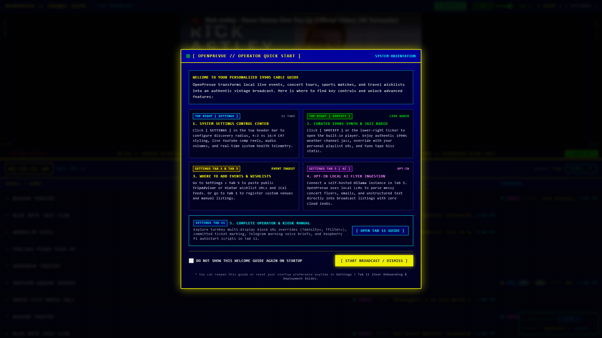

### Post Update Changelog Release Notes Modal
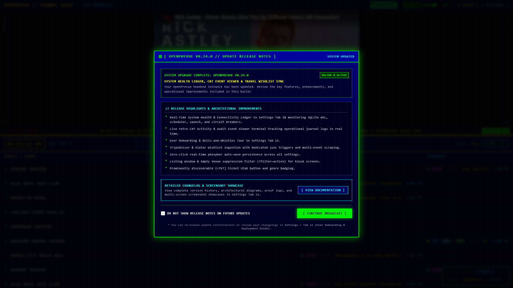

### Settings Tab 11: Modal Preference Cards & Reset Controls
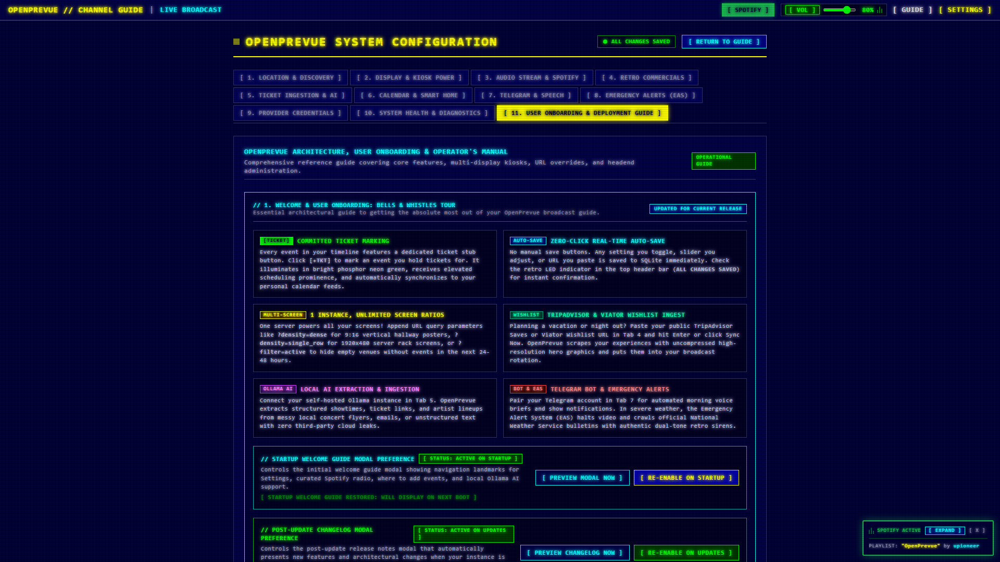

### Settings Tab 10: Configuration Persistence & Disk Recovery Center

### Settings Tab 10: Firmware Up To Date Status & Simulation
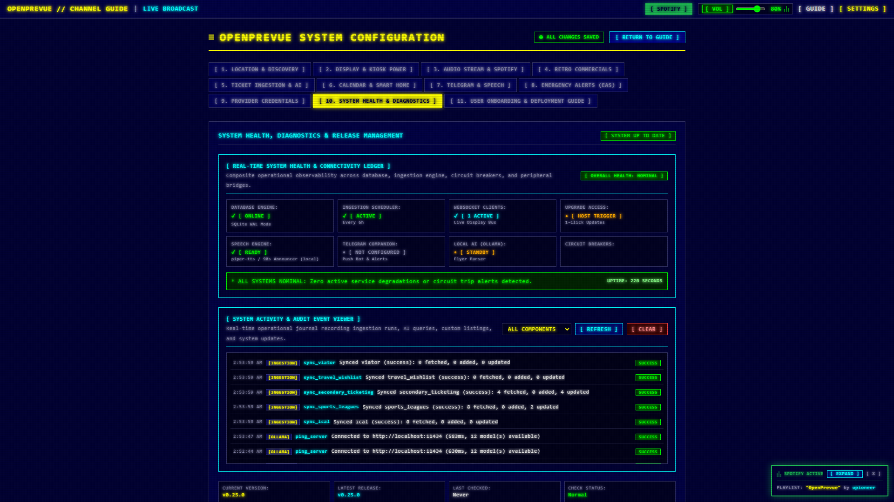

### Firmware Upgrade Modal: Current Firmware Guard & Dry Run
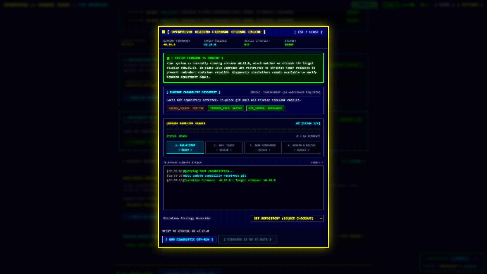

### Browser Local Cache Mirror Auto Detection Banner
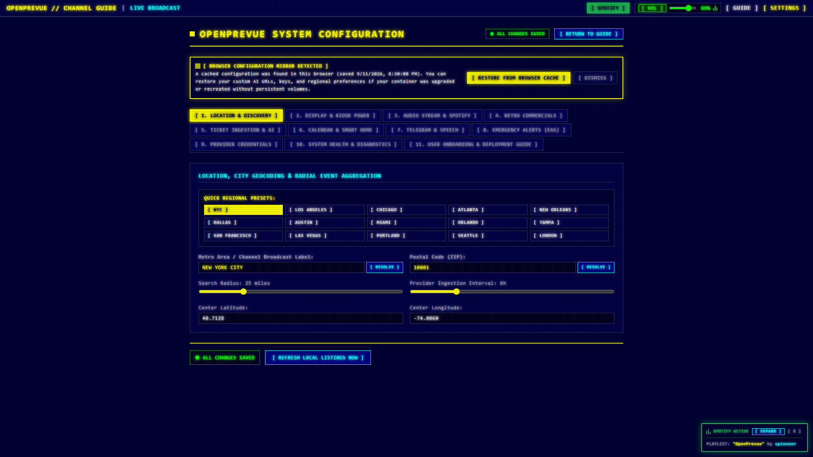

### Multi Display Geometry & Density Profiles
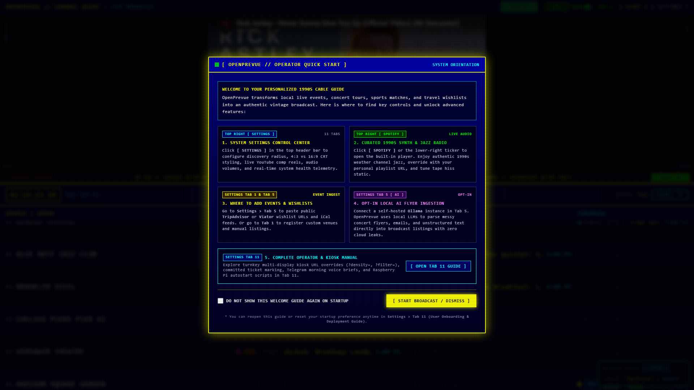
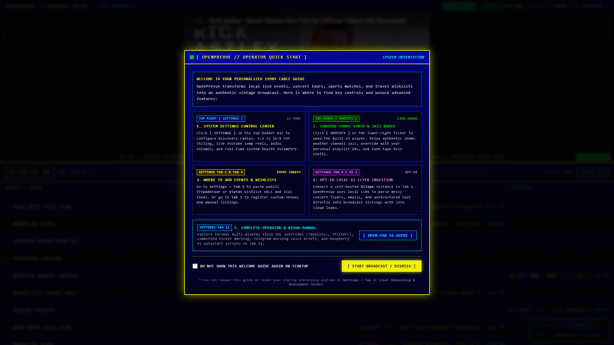

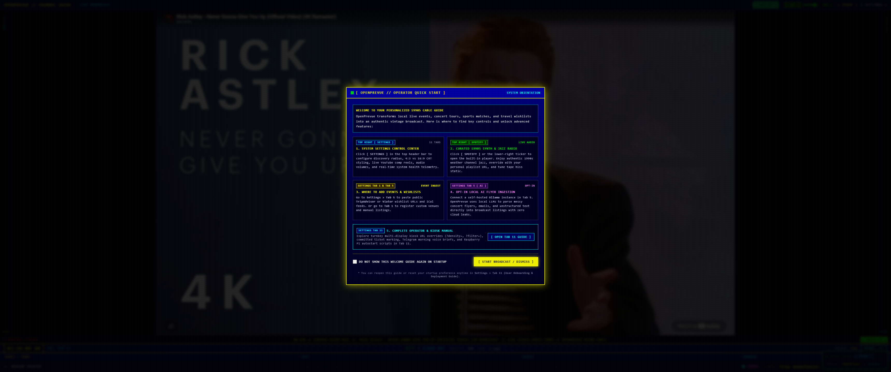
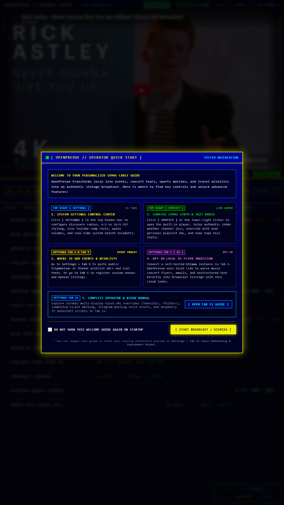

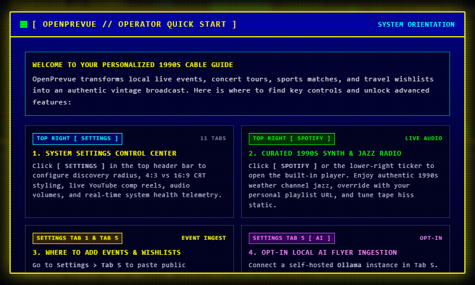

---

## Verification & Automated Test Suites

The release updates have been validated using automated Playwright end to end scripts and backend test suites:

* **Strict SemVer Upgrade Guard Suite:** [test_version_comparison_upgrade_block.py](file:///C:/Users/hgran/OneDrive/Documents/code/Projects/OpenPrevue/project_details/playbooks/test_version_comparison_upgrade_block.py) verified backend live upgrade refusal (`status: "up_to_date"`), capability flag suppression (`can_upgrade_now: false`), disabled Tab 10 button, up to date modal banner, and safe diagnostic dry run execution.
* **Updater Pytest Suite:** [test_updater.py](file:///C:/Users/hgran/OneDrive/Documents/code/Projects/OpenPrevue/tests/test_updater.py) added `test_apply_update_blocks_equal_or_older_version()` asserting live upgrade refusal on equal or older releases while verifying that dry run simulations remain operational.
* **Onboarding & Changelog Playwright Suite:** [test_modals_onboarding_and_changelog.py](file:///C:/Users/hgran/OneDrive/Documents/code/Projects/OpenPrevue/project_details/playbooks/test_modals_onboarding_and_changelog.py) verified first launch appearance, never show suppression, post update triggering, Tab 11 status toggling, and dashboard boot reappearance.
* **Settings Persistence Playwright Suite:** [test_settings_backup_and_recovery.py](file:///C:/Users/hgran/OneDrive/Documents/code/Projects/OpenPrevue/project_details/playbooks/test_settings_backup_and_recovery.py) verified Tab 10 telemetry, JSON download, disk restore, and browser cache mirror detection and restoration.
* **Backend Unit Test Suite:** `pytest tests -q` verified all 92 test cases passing with zero regressions.
* **Frontend Compilation:** `npm --prefix frontend run build` completed cleanly with zero TypeScript errors.
