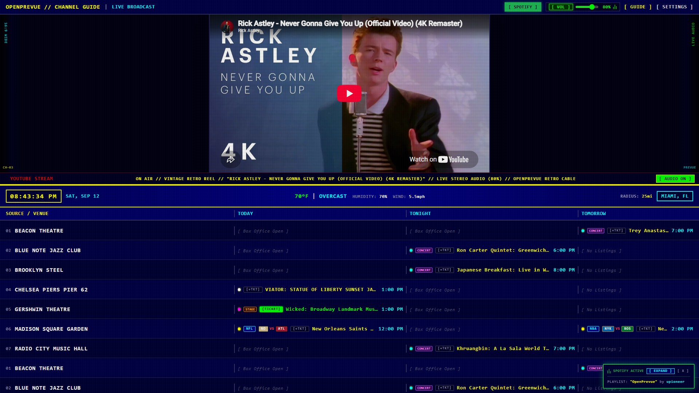
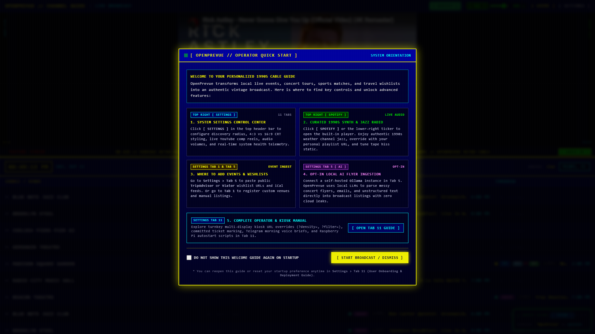
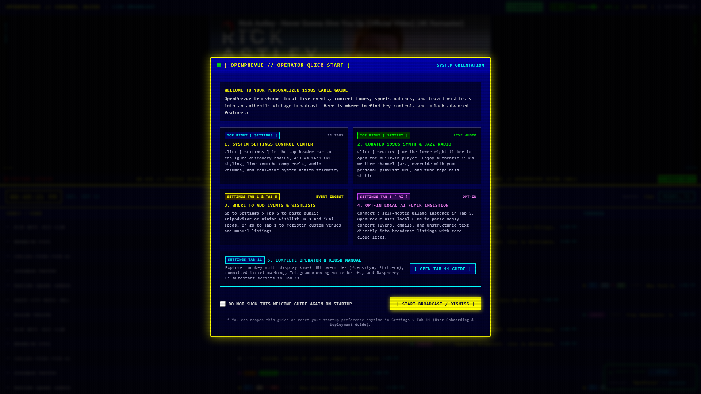
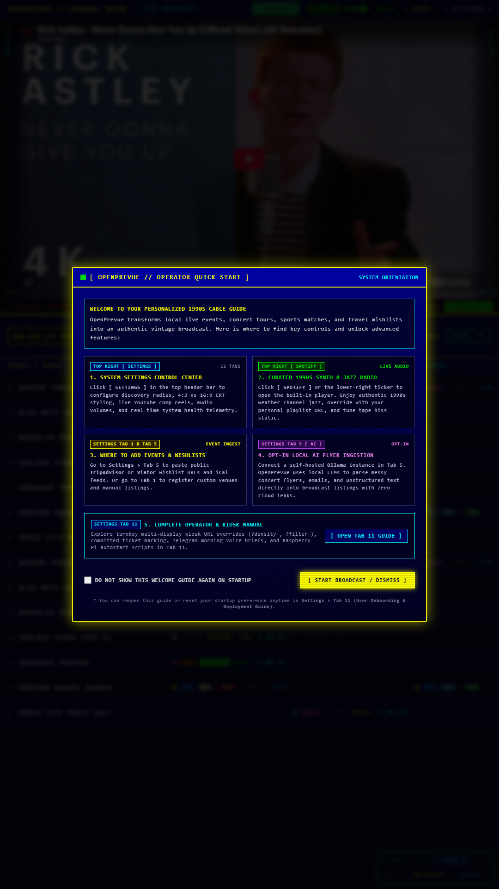
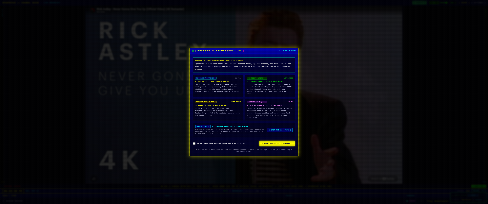

# Release v0.25.1: Local Start Time Simplification & Timeline Grid Breathing Room

## Overview
Release v0.25.1 delivers important display refinements and sanitization improvements for OpenPrevue. It resolves duplicate start time clutter on sporting events (such as NFL and NBA broadcasts) where static multi zone broadcast times were previously appended to event titles alongside the local schedule time badge. By removing static broadcast strings both at ingestion and during display rendering, event titles are streamlined to strictly feature local start times. In addition, flexbox shrinkage parameters (`min-w-0`) have been applied across all timeline grid rows, allowing event titles to shrink gracefully and providing generous horizontal breathing room for team matchup pills, league badges, ticket toggles, and local time indicators.

## What is New & Improved in v0.25.1

### 1. Local Start Time Simplification
* **Elimination of Duplicate Times:** Stripped static broadcast time strings (such as `(1:00 PM ET / 12:00 PM CT)`, `- 1:00 PM ET`, `@ 12:00 PM CST`) from event titles so the timeline grid strictly features the operator local start time.
* **Unified Time Presentation:** Ensured all event schedules across today, tonight, and tomorrow columns unambiguously reflect the viewer local timezone via the time badge.

### 2. Timeline Grid Horizontal Breathing Room
* **Flexbox Shrinkage Correction:** Added `min-w-0` to the event title span elements across `today`, `tonight`, and `tomorrow` slot templates in [TimelineGrid.vue](file:///C:/Users/hgran/OneDrive/Documents/code/Projects/OpenPrevue/frontend/src/components/TimelineGrid.vue).
* **Unconstrained Badge Visibility:** Prevented text overflow from displacing or compressing adjacent visual elements, ensuring team pills (`[NO] VS [ATL]`, `[NYK] VS [BOS]`), league badges (`[NFL]`, `[NBA]`), ticket buttons (`[+TKT]`), and cyan local time badges retain their full spacing and visibility.

### 3. Title Sanitization Engine (Frontend & Backend)
* **Frontend Sanitizer:** Implemented [`cleanEventTitle`](file:///C:/Users/hgran/OneDrive/Documents/code/Projects/OpenPrevue/frontend/src/services/sportsTheme.ts) in [sportsTheme.ts](file:///C:/Users/hgran/OneDrive/Documents/code/Projects/OpenPrevue/frontend/src/services/sportsTheme.ts), handling multi zone parenthesized pairs, hyphenated broadcast annotations, and at notations while protecting legitimate band and tour names like The 1975 or Blink 182.
* **Backend Ingestion Sanitizer:** Added [`clean_event_title`](file:///C:/Users/hgran/OneDrive/Documents/code/Projects/OpenPrevue/backend/app/services/ingestion.py) to [ingestion.py](file:///C:/Users/hgran/OneDrive/Documents/code/Projects/OpenPrevue/backend/app/services/ingestion.py), ensuring new events ingested through external providers or calendar feeds are cleaned prior to SQLite insertion.
* **Database Startup Sweep:** Added an automated retroactive cleanup sweep in [seeder.py](file:///C:/Users/hgran/OneDrive/Documents/code/Projects/OpenPrevue/backend/app/services/seeder.py) that scrubs lingering broadcast time strings from active SQLite database records on server launch.
* **Spotlight Marquee Protection:** Integrated [`cleanEventTitle`](file:///C:/Users/hgran/OneDrive/Documents/code/Projects/OpenPrevue/frontend/src/services/sportsTheme.ts) into [SpotlightPane.vue](file:///C:/Users/hgran/OneDrive/Documents/code/Projects/OpenPrevue/frontend/src/components/SpotlightPane.vue) computed display titles, ensuring hero cards and QR modals also display clean event titles.

### 4. Sports Asset Normalization
* **Expanded Matchup Parsing:** Enhanced [`parseMatchup`](file:///C:/Users/hgran/OneDrive/Documents/code/Projects/OpenPrevue/frontend/src/services/sportsTheme.ts) and [`parseSportsMatchup`](file:///C:/Users/hgran/OneDrive/Documents/code/Projects/OpenPrevue/frontend/src/services/sportsAssets.ts) in [sportsAssets.ts](file:///C:/Users/hgran/OneDrive/Documents/code/Projects/OpenPrevue/frontend/src/services/sportsAssets.ts) to detect `AT` and `@` notations alongside `VS`, ensuring away at home games correctly map team colors, abbreviations, and logos.

### 5. Automated Verification & Regression Suite
* **Unit Tests:** Added comprehensive tests in [test_sports_and_ticketing.py](file:///C:/Users/hgran/OneDrive/Documents/code/Projects/OpenPrevue/tests/test_sports_and_ticketing.py) validating the regex sanitizer against numerous time zone patterns.
* **Playwright UI Automation:** Authored [test_sports_timezone_cleanup_ui.py](file:///C:/Users/hgran/OneDrive/Documents/code/Projects/OpenPrevue/project_details/playbooks/test_sports_timezone_cleanup_ui.py) validating rendered cell text, badge presence, and flex layout on the timeline grid.

---

## Visual Verification & Scale Showcase

### Sports Matchup Row with Local Time & Breathing Room

### Standard Balanced Density (1080p Landscape)

### Classic TV 4 Row 1990s Broadcast Scale

### High Density 12 Row Overview

### Vertical 9:16 Portrait Kiosk Display (1080x1920)

### Ultra Wide 3440x1440 Display

### 1920x480 Panoramic Rack Mount Display

