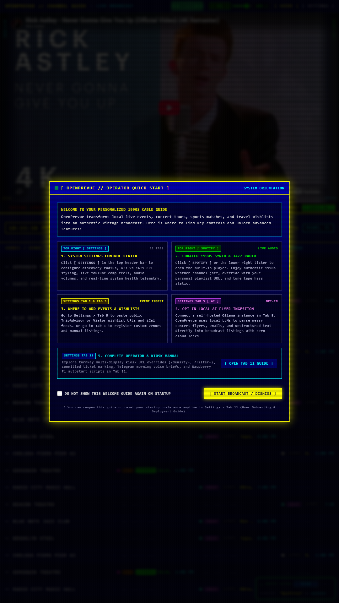
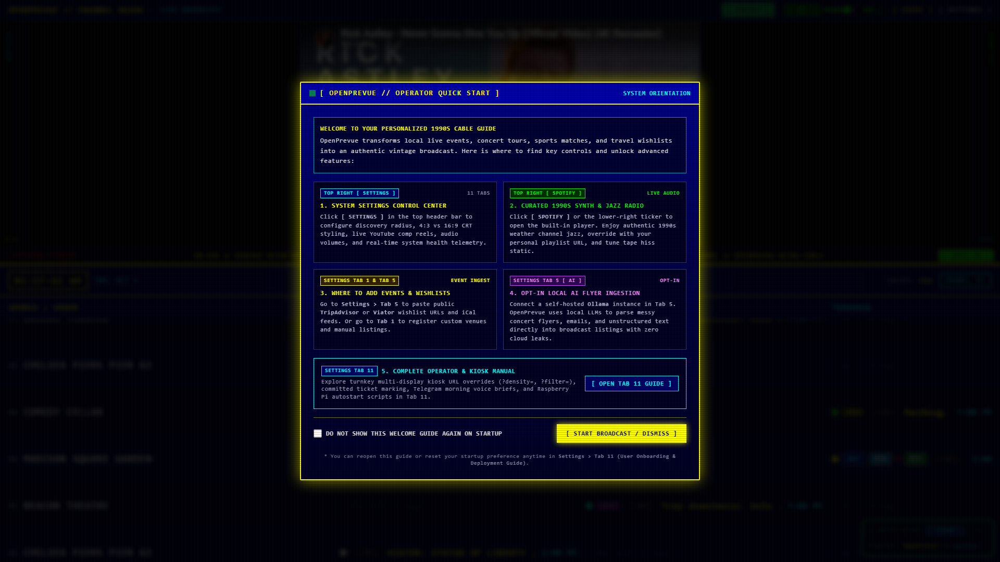
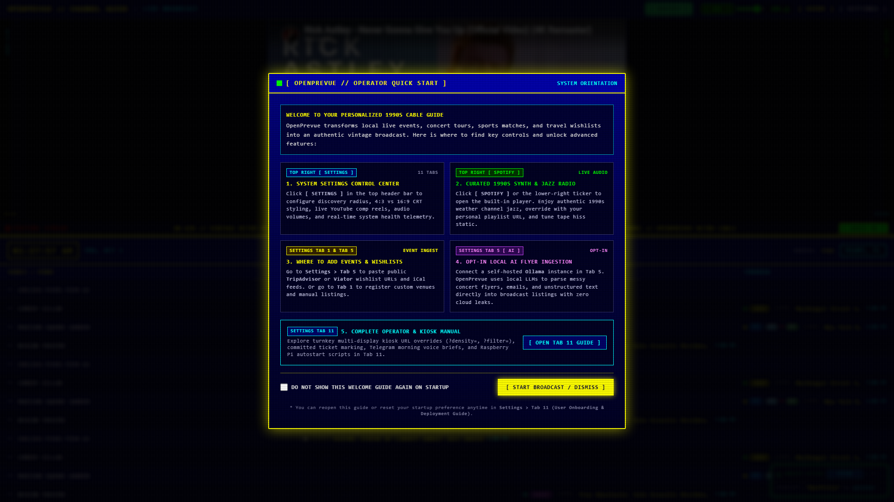
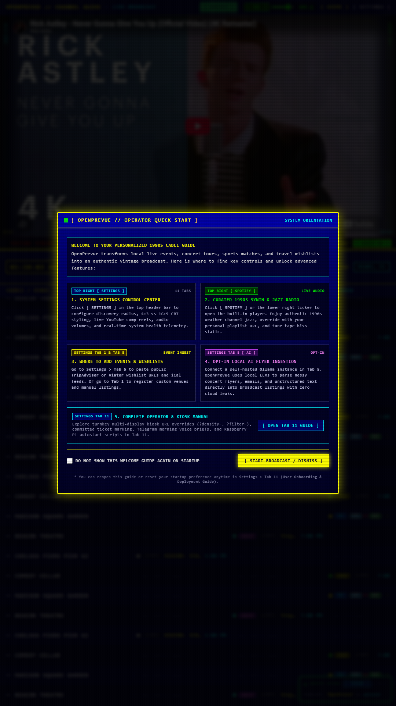
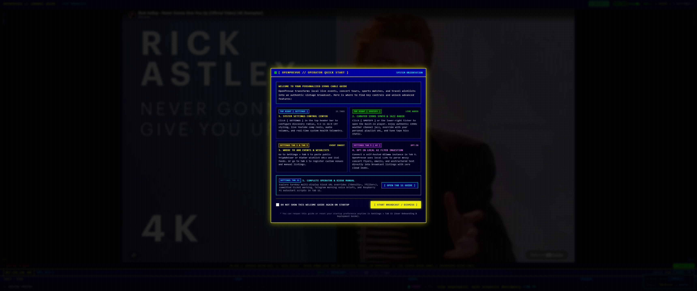
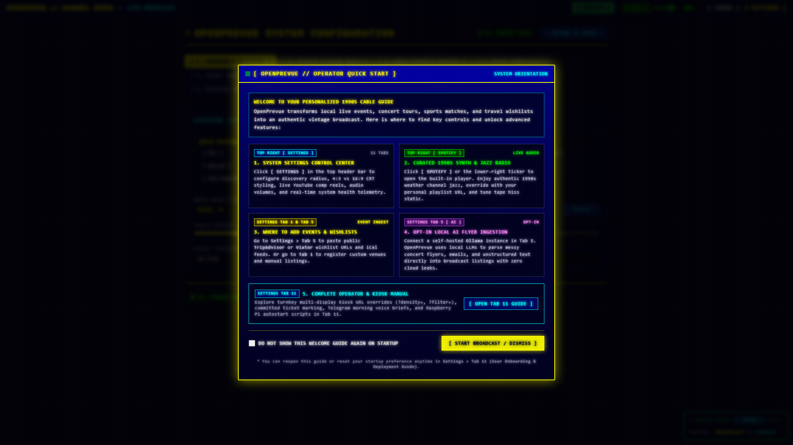

# Release v0.25.2: Local Calendar Date Slotting, Vertical Kiosk Infinite Scroll & Cryptographic Provenance

## Overview
Release v0.25.2 addresses critical scheduling accuracy and viewport scaling edge cases in OpenPrevue. It resolves a timezone discrepancy in the timeline grid where evening UTC rollover caused events to prematurely shift into upcoming slots or display events several days out under tomorrow. Furthermore, it fixes a display freezing issue in vertical portrait kiosk modes when filtering for active scheduled venues only: by dynamically multiplying venues to guarantee at least 36 rows and enforcing even repeat multipliers, the grid fills tall screens without dead space and scrolls infinitely without boundary stalls. Additionally, explicit calendar date extraction has been added across travel and experience providers, and the GhostPrint 9-layer cryptographic code provenance suite has been onboarded into workspace agent capabilities.

## What is New & Improved in v0.25.2

### 1. Local Calendar Date Normalization & Slot Filtering
* **Local Date Key Extraction:** Implemented [`getLocalDateKey`](file:///C:/Users/hgran/OneDrive/Documents/code/Projects/OpenPrevue/frontend/src/components/TimelineGrid.vue) in [TimelineGrid.vue](file:///C:/Users/hgran/OneDrive/Documents/code/Projects/OpenPrevue/frontend/src/components/TimelineGrid.vue) to evaluate `YYYY-MM-DD` strictly in the viewer local browser timezone rather than relying on UTC ISO strings.
* **Slot Leak Prevention:** Fixed [`getVenueSlotEvents`](file:///C:/Users/hgran/OneDrive/Documents/code/Projects/OpenPrevue/frontend/src/components/TimelineGrid.vue) to parse event start timestamps into local Date objects. Events occurring beyond tomorrow (such as in 2 to 5 days, like October 5th) are strictly excluded from `today`, `tonight`, and `tomorrow` slots.
* **Evening Rollover Protection:** Eliminated the bug where evening hours (e.g. 7:00 PM to 11:59 PM in Western timezones) shifted all columns forward by one calendar day due to UTC midnight arriving ahead of local midnight.
* **Backend Mock Timezone Anchoring:** Updated [mock.py](file:///C:/Users/hgran/OneDrive/Documents/code/Projects/OpenPrevue/backend/app/providers/mock.py) so mock listings calculate relative date offsets anchored to the target coordinates local timezone (`America/New_York` or `America/Chicago`) rather than UTC.

### 2. Vertical Kiosk Display Infinite Scroll & Dead Space Elimination
* **Dynamic Venue Multiplication:** Updated [`displayedVenues`](file:///C:/Users/hgran/OneDrive/Documents/code/Projects/OpenPrevue/frontend/src/components/TimelineGrid.vue) to repeat the active venue list until a minimum threshold of at least 36 rows is satisfied (`targetMinRows = 36`).
* **Tall Viewport Fill:** Prevents large blank dead space on vertical 9:16 portrait screens (1080x1920) and 4K commercial kiosk displays when the user enables active-only filtering (`gridFilterMode === 'active_only'`).
* **Continuous Scroll Guarantee:** Solves the browser DOM issue where `content.scrollHeight <= container.clientHeight` clamped `scrollTop` to 0 and froze auto-scrolling.
* **Even Repeat Splitting:** Enforces that repeat multipliers are always even numbers, ensuring that dividing scrollHeight by two splits cleanly on an exact repetition boundary for seamless, flicker-free infinite wrapping.
* **Fallback Boundary Wrap:** Enhanced [`startAutoScroll`](file:///C:/Users/hgran/OneDrive/Documents/code/Projects/OpenPrevue/frontend/src/components/TimelineGrid.vue) with bottom boundary detection, guaranteeing that auto-scrolling wraps cleanly under all viewport dimensions.
* **Consistent Channel Numbering:** Preserved channel numbers via modulo indexing `(idx % filteredVenues.length) + 1` so repeated venue blocks display consistent guide numbering.

### 3. Explicit Calendar Date Extraction for Travel Providers
* **Date Parsing Helper:** Implemented [`extract_date_from_text`](file:///C:/Users/hgran/OneDrive/Documents/code/Projects/OpenPrevue/backend/app/providers/travel_wishlist.py) in [travel_wishlist.py](file:///C:/Users/hgran/OneDrive/Documents/code/Projects/OpenPrevue/backend/app/providers/travel_wishlist.py), extracting dates formatted as `YYYY-MM-DD`, `MM/DD/YYYY`, `MM/DD`, or month names (`Oct 5`, `October 5, 2026`).
* **TripAdvisor Wishlist Integration:** Integrated date extraction into TripAdvisor and Viator wishlist scraping, preventing future tours from falling back to the current timestamp.
* **Viator Partner Provider:** Integrated date extraction into [viator.py](file:///C:/Users/hgran/OneDrive/Documents/code/Projects/OpenPrevue/backend/app/providers/viator.py) product parsing, preserving explicit dates from product data or description text.

### 4. GhostPrint Cryptographic Provenance Suite
* **Skill Onboarding:** Integrated and onboarded the GhostPrint cryptographic code provenance and digital forensics suite into [.agents/skills/ghostprint/](file:///C:/Users/hgran/OneDrive/Documents/code/Projects/OpenPrevue/.agents/skills/ghostprint/SKILL.md).
* **Workspace Discovery:** Mounted GhostPrint into Antigravity workspace agent discovery paths for key ceremony, proof generation, and repository protection.

### 5. Automated Verification & Regression Suite
* **Unit Testing:** Added unit tests in [test_travel_wishlist.py](file:///C:/Users/hgran/OneDrive/Documents/code/Projects/OpenPrevue/tests/test_travel_wishlist.py) validating regex date parsing across all date formats (all 93 backend tests passing).
* **Scripted Proof Validation:** Authored [verify_date_slots_and_multiplication.js](file:///C:/Users/hgran/OneDrive/Documents/code/Projects/OpenPrevue/project_details/proof/verify_date_slots_and_multiplication.js) validating local calendar slot assignment and venue multiplication math across diverse venue list sizes.
* **Playwright Kiosk Verification:** Authored [test_vertical_infinite_scroll_and_dates.py](file:///C:/Users/hgran/OneDrive/Documents/code/Projects/OpenPrevue/project_details/playbooks/test_vertical_infinite_scroll_and_dates.py), confirming 36 rendered rows, active auto-scrolling from scrollTop 18 to 199 within 5 seconds, and zero date slot leakage.

---

## Visual Verification & Scale Showcase

### Vertical 9:16 Portrait Kiosk Display (Active Only Filter with Infinite Scroll)

### Standard Balanced Density (1080p Landscape)

### Classic TV 4 Row 1990s Broadcast Scale

### High Density 12 Row Overview

### Full Vertical Portrait Showcase (1080x1920)

### Ultra Wide 3440x1440 Display

### 1920x480 Panoramic Rack Mount Display

### Settings Control Center

