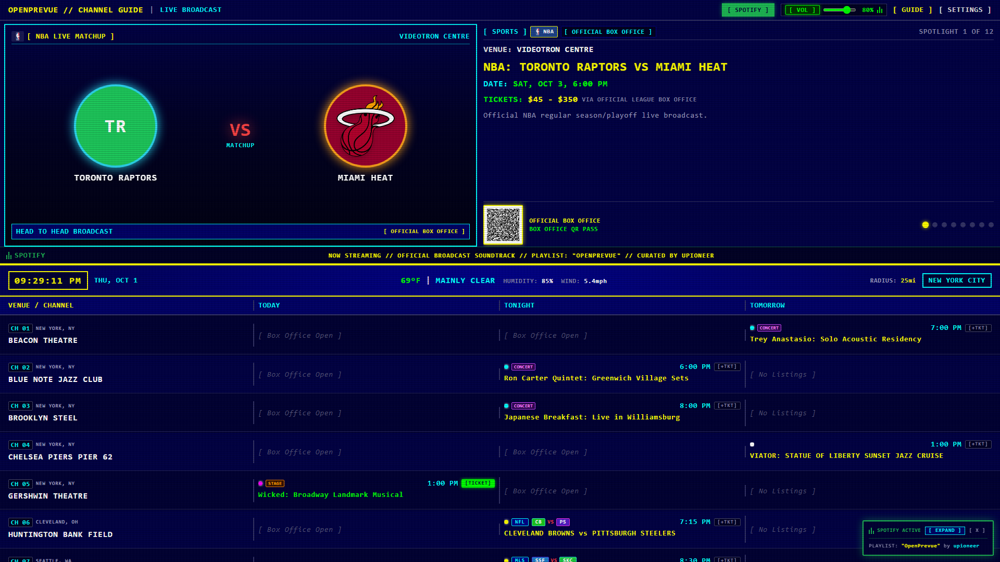
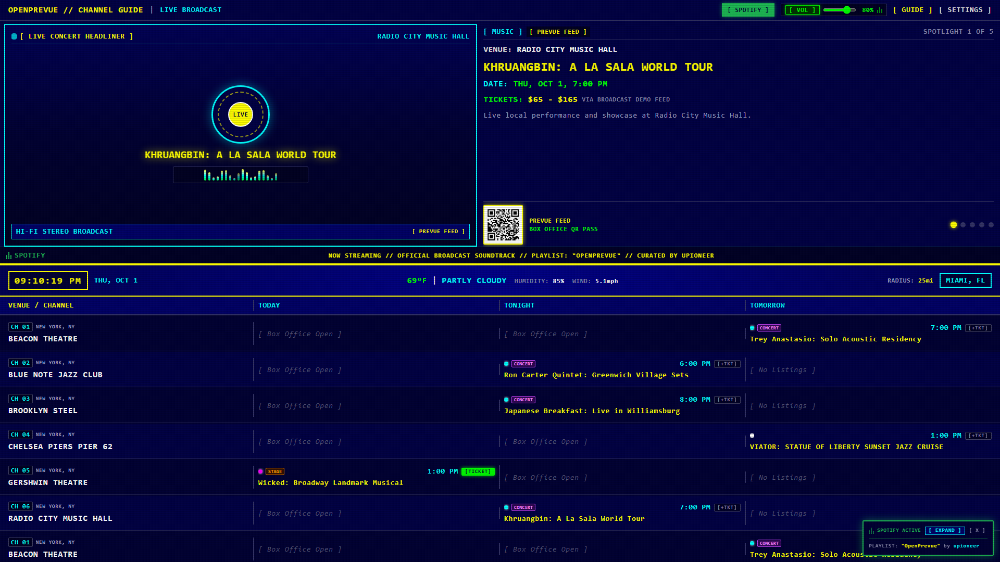
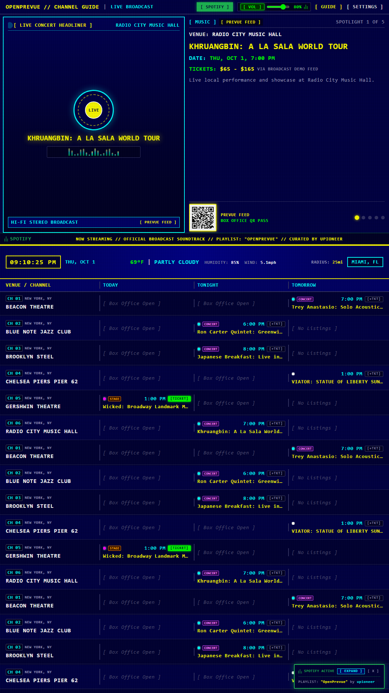
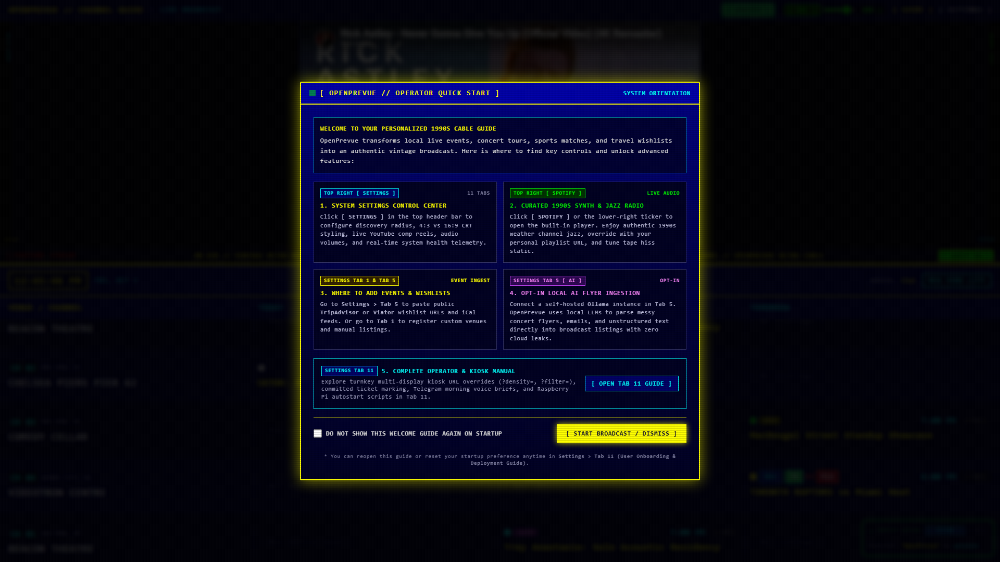
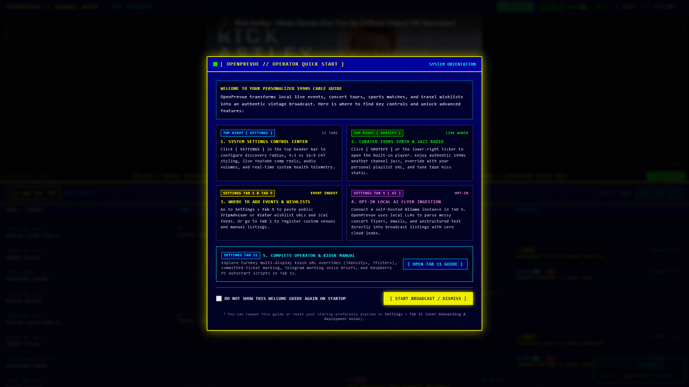
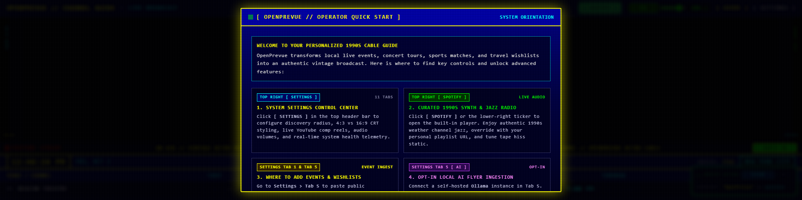
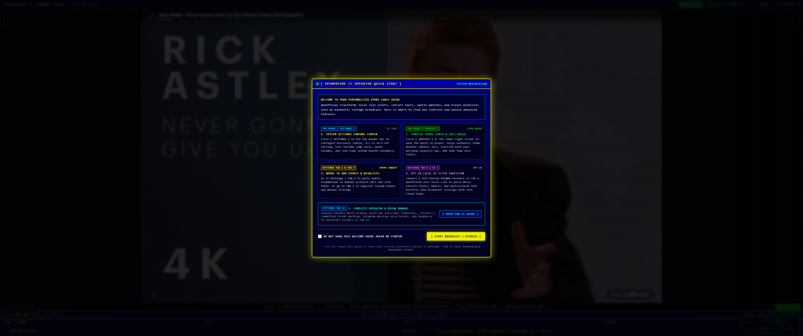
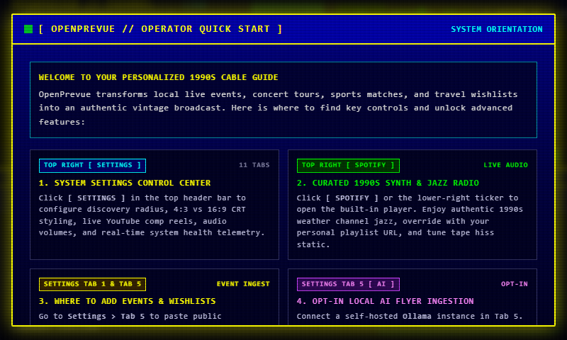
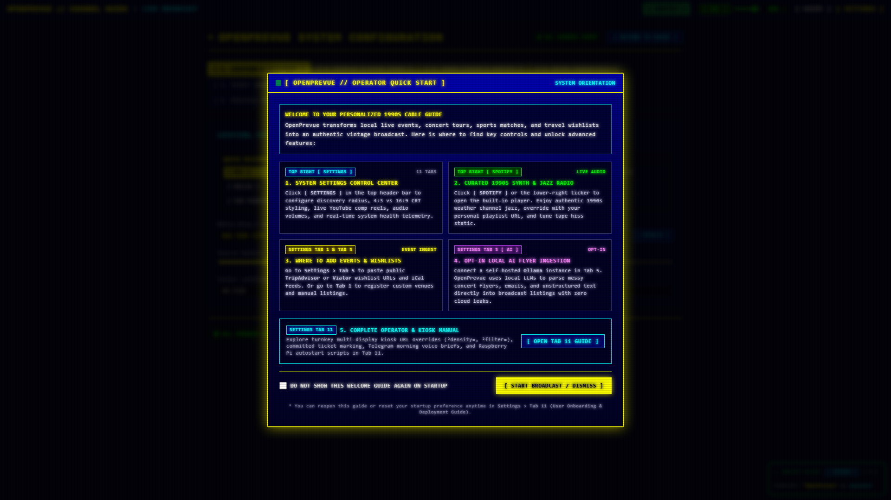

# Release v0.26.0: Balanced 3x3x3x3 Multiline Grid, Overflow Headline Marquee, 1-Week Meta-Saturated Spotlight & Official ESPN Scoreboards

## Overview
Release v0.26.0 delivers substantial architectural and presentation enhancements across OpenPrevue. It replaces the uneven 4-3-3-2 column layout with a mathematically balanced 3x3x3x3 12-column grid, doubling vertical information density with two-line stacked venue and event cells. To eliminate character truncation, a native ResizeObserver auto-scrolling headline marquee smoothly animates overflow text on hover and idle. Furthermore, the top preview spotlight has been upgraded to a 7-day planning horizon driven by a metadata saturation scoring engine that prioritizes user-submitted events, ticket holds, artwork posters, and official sports franchise matchups. Live ESPN public scoreboards have been integrated to ingest authentic out-of-band kickoff and tipoff timestamps with zero arbitrary calendar offsets.

## What is New & Improved in v0.26.0

### 1. Balanced 3x3x3x3 12-Column Timeline Grid
* **Equal Weight Time Slots:** Updated [`TimelineGrid.vue`](file:///C:/Users/hgran/OneDrive/Documents/code/Projects/OpenPrevue/frontend/src/components/TimelineGrid.vue) from the legacy `4-3-3-2` distribution to a symmetrical `3-3-3-3` layout. `VENUE / CHANNEL`, `TODAY`, `TONIGHT`, and `TOMORROW` each receive an exact 25% column allocation (`col-span-3`).
* **Double-Stacked Venue Cells:** Venue headers now render on two distinct rows (Line 1: Channel number badge `CH 01` accompanied by City and State; Line 2: Venue Name in bold uppercase font), preventing venue truncation while preserving channel numbering identity.
* **Two-Line Multiline Event Cells:** Event slots now stack vertically across two functional lines:
  * **Line 1 (Meta Header):** Left-aligned category indicator dot, league badge, and team franchise matchup badges; right-aligned broadcast start time and interactive neon phosphor green `[+TKT]` ticket button.
  * **Line 2 (Headline Title):** Full-width event headline typography, providing maximum horizontal width for artists, matchups, and tour names.

### 2. Native Dynamic Headline Marquee on Overflow
* **Overflow Detection Component:** Created [`HeadlineMarquee.vue`](file:///C:/Users/hgran/OneDrive/Documents/code/Projects/OpenPrevue/frontend/src/components/HeadlineMarquee.vue) leveraging native `ResizeObserver` to evaluate element geometry (`scrollWidth > clientWidth + 4`).
* **Ping-Pong Keyframe Animation:** When text exceeds container boundaries, smooth CSS translation smoothly glides the headline to the end, pauses for comfortable readability, and glides back (`infinite alternate`).
* **Hover Freeze Interaction:** The animation instantly pauses on mouse hover via `animation-play-state: paused`, allowing users to inspect the complete title at their own pace.
* **Left-Aligned Static Fallback:** Short titles that fit within cell boundaries remain cleanly left-aligned with zero unnecessary DOM transformations.

### 3. 1-Week Scope & Meta-Saturated Spotlight Carousel
* **7-Day Strategic Planning Horizon:** Expanded [`SpotlightPane.vue`](file:///C:/Users/hgran/OneDrive/Documents/code/Projects/OpenPrevue/frontend/src/components/SpotlightPane.vue) from an uncurated pool to a 7-day window (`now - 2 hours` to `now + 168 hours`). While the lower grid remains focused on tactical 24 to 48 hour schedules, the top spotlight acts as a "Coming Attractions" showcase for upcoming weekend games, headliners, and community festivals.
* **Metadata Saturation Scoring Engine:** Replaced the crude `is_featured = 1` boolean check with an intelligent multi-factor scoring model:
  * User-submitted custom events (`source in ['custom', 'user', 'manual']`): `+60 pts`
  * Personal ticket hold commitment (`has_ticket === 1`): `+50 pts`
  * Curated or pinned featured event (`is_featured === 1`): `+30 pts`
  * High-resolution artwork poster (`image_url` valid): `+25 pts`
  * Live sports matchup with official franchise emblems & colors: `+25 pts`
  * Detailed event description (>= 25 characters): `+15 pts`
  * Scannable box office ticket URL (`ticket_url`): `+10 pts`
  * Explicit pricing tier (`price_min` defined): `+10 pts`
  * Imminence proximity decay bonus: `+0 to +15 pts`
* **Chronological Flow:** Selects the top 12 highest-scoring saturated listings and arranges them chronologically so the carousel progresses naturally across the week.
* **Visual Badging:** Added a dedicated `[USER EVENT]` badge alongside the phosphor green `[TICKET OWNED]` badge.
* **Home Assistant Telemetry Sensor:** Aligned [`homeassistant.py`](file:///C:/Users/hgran/OneDrive/Documents/code/Projects/OpenPrevue/backend/app/services/homeassistant.py) to score spotlight events using the identical saturation and user-event prioritization logic.

### 4. Official Live ESPN Scoreboard Ingestion
* **Real Out-of-Band Game Times:** Refactored [`sports.py`](file:///C:/Users/hgran/OneDrive/Documents/code/Projects/OpenPrevue/backend/app/providers/sports.py) to query live unauthenticated public ESPN scoreboards for NFL, NBA, MLB, and MLS.
* **Elimination of Arbitrary Offsets:** Ingests official UTC ISO kickoff and tipoff timestamps directly from league feeds, correctly representing Thursday night football, morning international fixtures, Sunday doubleheaders, and playoff games without rolling relative offsets.
* **Deduplication Keying:** Normalized match keys prevent duplication between live scoreboard feeds and static motorsport broadcasts.
* **Database Ingestion Integrity:** Updated [`ingestion.py`](file:///C:/Users/hgran/OneDrive/Documents/code/Projects/OpenPrevue/backend/app/services/ingestion.py) to use `INSERT OR REPLACE INTO ticket_links` to prevent SQLite unique constraint conflicts during background re-ingestion passes.

---

## Visual Verification & Layout Showcase

### Balanced 3x3x3x3 Multiline Grid & Meta-Saturated Spotlight (1080p Landscape)

### 1-Week Scope Meta-Saturated Spotlight Showcase with Franchise Emblems & QR Pass

### Balanced Multiline 3x3x3x3 Grid Detail View

### Vertical 9:16 Portrait Kiosk Display (Multiline Stacking & Infinite Scroll)

### Classic TV 4-Row 1990s Broadcast Scale

### High Density 12-Row Overview

### 1920x480 Panoramic Rack Mount Display (Feature Priority)

### Ultra Wide 3440x1440 Panoramic Display (Calendar Priority)

### Small Form Factor Raspberry Pi Display (800x480)

### Settings Control Center & Diagnostics

