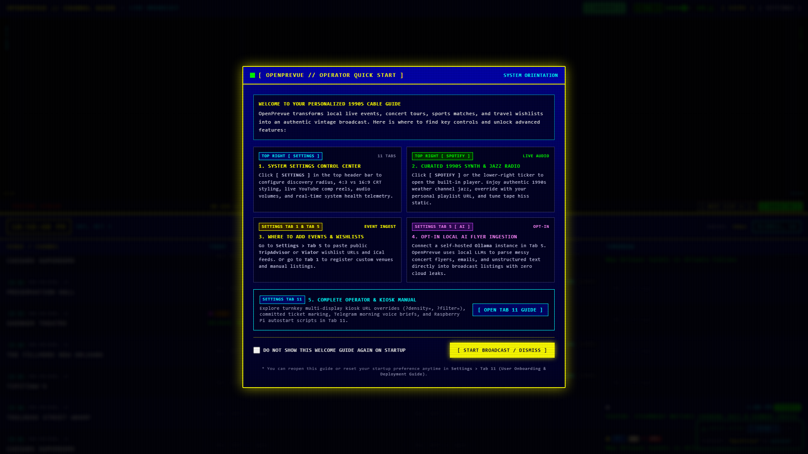
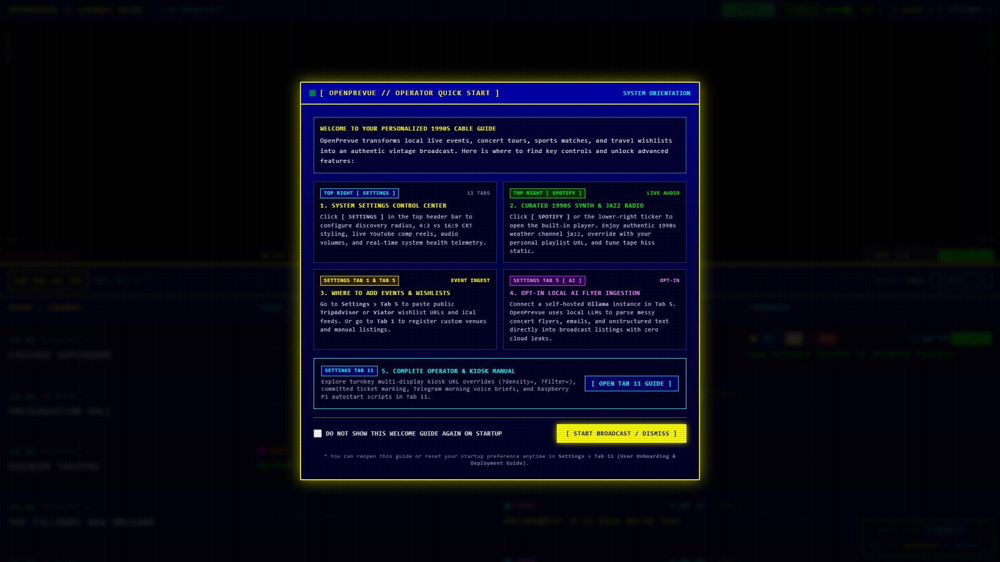
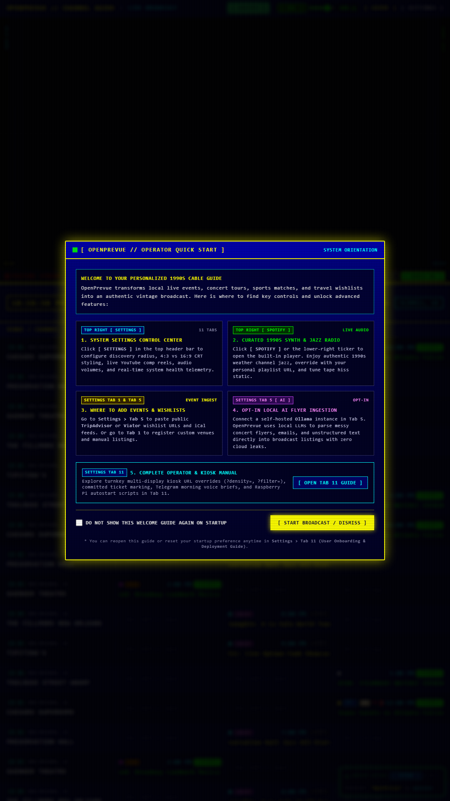
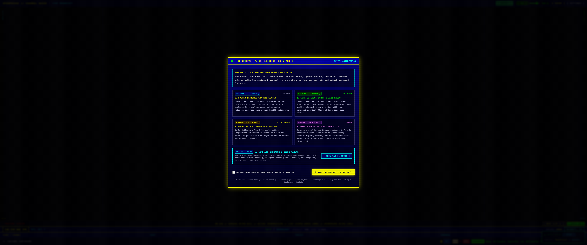
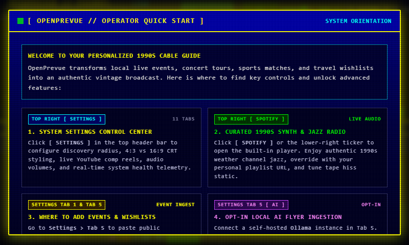
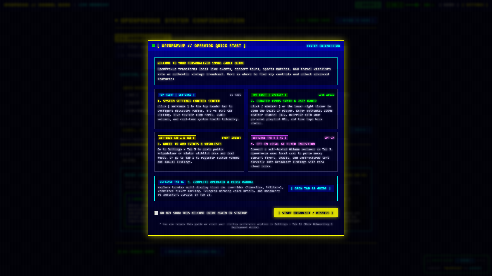

# Release v0.27.0: Major League Sports Localization, Curated 1990s TV Commercials Playlist & Retro Break Interruption Engine

## Overview
Release v0.27.0 delivers major architectural enhancements to both broadcast localization and authentic 1990s cable television ambiance across OpenPrevue. It resolves out-of-market sports flooding by introducing a strict geographic localization engine with coordinate-verified radial filtering, stadium mapping, and user-configurable sports coverage modes. Additionally, it integrates a curated 1990s television commercials YouTube playlist with boot-time shuffle randomization, one-click settings restore, and a retro commercial break interruption engine that periodically airs commercials in the top preview quadrant with audio ducking and automatic guide return.

## What is New & Improved in v0.27.0

### 1. Major League Sports Coverage Localization Engine
* **Strict Radial Geographic Filtering:** Resolved the issue where sports fixtures across the country flooded local timeline grids. The sports ingestion engine in [`sports.py`](file:///C:/Users/hgran/OneDrive/Documents/code/Projects/OpenPrevue/backend/app/providers/sports.py) and [`ingestion.py`](file:///C:/Users/hgran/OneDrive/Documents/code/Projects/OpenPrevue/backend/app/services/ingestion.py) now strictly enforces the configured `radius_miles` boundary relative to the system coordinates.
* **Expanded Stadium Coordinate Registry:** Added precise geographic latitude and longitude coordinates for all NFL, NBA, MLB, and MLS franchises. Fixtures are now verified by exact stadium venue coordinates, with home-city fallback calculations.
* **User-Configurable Sports Coverage Modes:**
  * **Local Radius Only (Default):** Ingests and displays exclusively matchups taking place within the user radius.
  * **National Broadcasts & Local:** Includes local matchups plus marquee nationally televised games.
  * **Disabled:** Mutes all sports league matchups from the timeline grid and spotlight cards.
* **Automatic Out-of-Market Sports Purge:** Changing sports coverage settings or saving system parameters automatically executes `purge_out_of_market_sports()`, safely evicting out-of-market fixtures from the database without deleting community concert or theater listings.
* **Settings Control Card:** Added a dedicated Major League Sports Coverage configuration card in [`SettingsView.vue`](file:///C:/Users/hgran/OneDrive/Documents/code/Projects/OpenPrevue/frontend/src/views/SettingsView.vue) with instantaneous mode switching.

### 2. Curated 1990s Television Commercials YouTube Playlist
* **Pre-Bake Curated Playlist:** Defaulted the system YouTube source to the authentic curated 1990s television commercial reel (`https://www.youtube.com/playlist?list=PLQ82R4ElALew`) across [`seeder.py`](file:///C:/Users/hgran/OneDrive/Documents/code/Projects/OpenPrevue/backend/app/services/seeder.py) and [`SettingsView.vue`](file:///C:/Users/hgran/OneDrive/Documents/code/Projects/OpenPrevue/frontend/src/views/SettingsView.vue).
* **Boot Randomization & Shuffle:** Upgraded [`YouTubePane.vue`](file:///C:/Users/hgran/OneDrive/Documents/code/Projects/OpenPrevue/frontend/src/components/YouTubePane.vue) with `applyBootShuffle()` logic. When `youtube_shuffle_enabled` is active, the player automatically randomizes the playlist order on initial cue and selects a random starting video.
* **One-Click Default Restore:** Added a `[ RESTORE DEFAULT PLAYLIST ]` button in the Settings Spotlight tab, enabling users to test custom channels or VHS streams and revert back to the curated 90s commercials playlist with a single click.

### 3. Retro Commercial Break Interruption Engine
* **Scheduled Commercial Breaks:** Connected the commercials engine in [`commercialsEngine.ts`](file:///C:/Users/hgran/OneDrive/Documents/code/Projects/OpenPrevue/frontend/src/services/commercialsEngine.ts) directly into [`DashboardView.vue`](file:///C:/Users/hgran/OneDrive/Documents/code/Projects/OpenPrevue/frontend/src/views/DashboardView.vue). When Spotlight is set to "Featured Events Showcase" and commercials are enabled, the guide automatically interrupts regular programming at user-defined intervals (1 to 10 breaks per hour) to air a retro commercial.
* **Ducking & Volume Management:** Background audio streams (Muzak synthesizers, tape hiss, and Spotify) automatically duck and pause when a commercial begins and resume immediately upon conclusion.
* **Commercial Video Sources:** Added configurable sources in Settings Tab 4:
  * **Curated 90s YouTube (Default):** Streams randomized clips from the curated YouTube playlist with zero local disk footprint.
  * **Local Video Dropzone:** Plays custom `.mp4` and `.webm` retro video bumpers uploaded to `./data/commercials/`.
  * **Combined Rotation:** Randomly alternates between online YouTube commercials and custom local files.
* **Visual Telemetry & Skip Controls:** Commercial breaks display a prominent yellow `[ RETRO COMMERCIAL BREAK ]` broadcast telemetry banner and provide an instant `[ RETURN TO GUIDE ]` skip button.
* **Safety Fallback Guard:** Added an automatic 90-second duration cap to protect against multi-hour compilation videos hanging the top preview quadrant indefinitely.

---

## Visual Verification & Layout Showcase

### Balanced 3x3x3x3 Grid with Localized Sports & Spotlight (1080p Landscape)

### Classic TV 4-Row 1990s Broadcast Scale

### High Density 12-Row Overview

### Vertical 9:16 Portrait Kiosk Display

### 1920x480 Panoramic Rack Mount Display (Feature Priority)

### Ultra Wide 3440x1440 Panoramic Display (Calendar Priority)

### Small Form Factor Raspberry Pi Display (800x480)

### Settings Control Center: Sports Coverage & Retro Commercial Source

