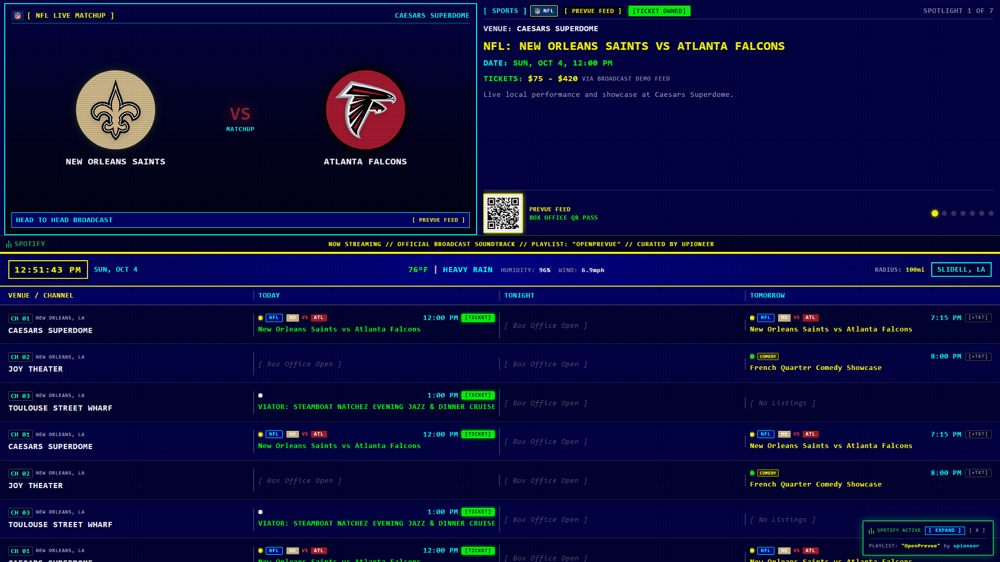
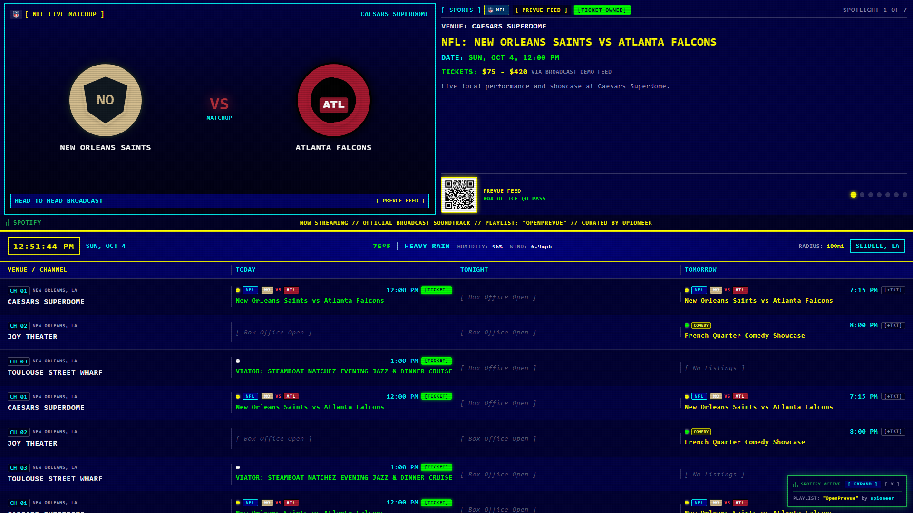
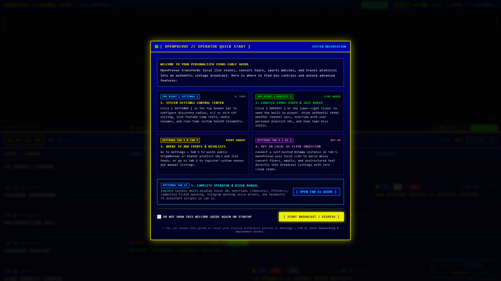
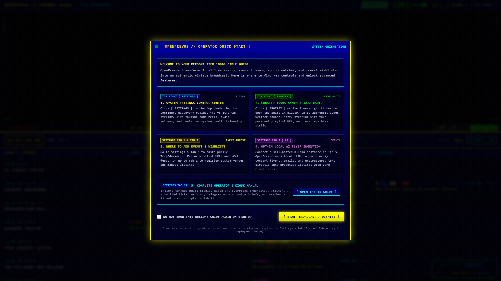
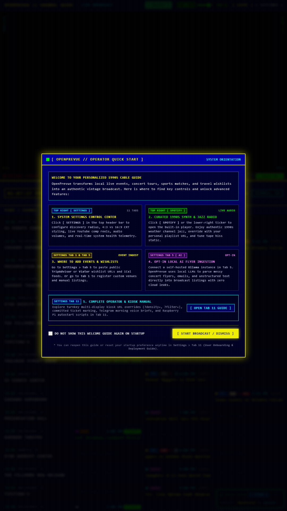
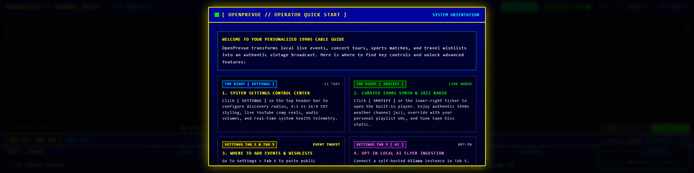
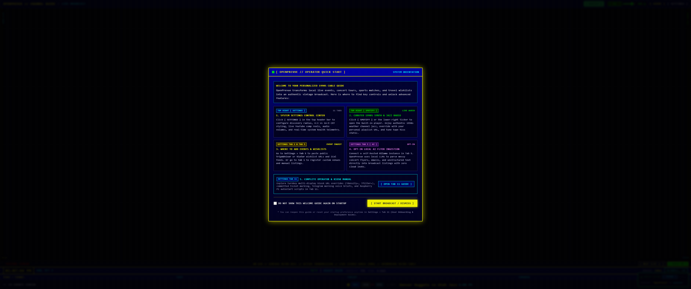
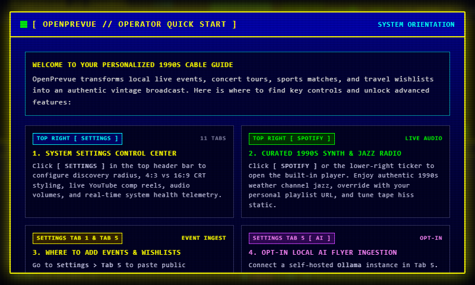
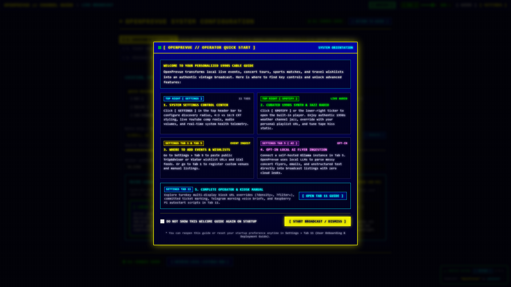

# Release v0.27.1: Featured Sports Team Logo Resolution, Comprehensive 161-Franchise CDN Mapping & Resilient Offline Vector SVG Fallbacks

## Overview
Release v0.27.1 delivers a targeted patch addressing a visual regression in the featured spotlight preview quadrant where sports team logos failed to render and fell back to raw text abbreviations. This release establishes full logo resolution across all major sports leagues by uniting the frontend asset database with verified ESPN CDN endpoints, implementing authentic inline vector SVG fallbacks, resetting error state flags across slide rotations, and preventing third-party hotlink blocking.

## What is New & Improved in v0.27.1

### 1. Featured Spotlight Team Logo Resolution
* **Full League Coverage:** Resolved the missing logo regression in [`SpotlightPane.vue`](file:///C:/Users/hgran/OneDrive/Documents/code/Projects/OpenPrevue/frontend/src/components/SpotlightPane.vue). Head-to-head matchup cards now cleanly render official high-resolution team badges for all franchises.
* **Vector SVG Fallback Engine:** Added an inline SVG rendering branch (`v-else-if="teamABranding?.logoSvg"`) in [`SpotlightPane.vue`](file:///C:/Users/hgran/OneDrive/Documents/code/Projects/OpenPrevue/frontend/src/components/SpotlightPane.vue). If an external image CDN is unreachable or offline, the player immediately renders a crisp vector badge rather than falling back to unstyled 3-letter acronym text spans.
* **Dynamic Shield Generation:** For amateur, independent, or unmapped clubs, [`resolveTeamBranding`](file:///C:/Users/hgran/OneDrive/Documents/code/Projects/OpenPrevue/frontend/src/services/sportsTheme.ts#L45-L95) dynamically synthesizes an authentic vector SVG tournament shield utilizing primary and secondary franchise colors, ensuring `logoSvg` is always populated.

### 2. Comprehensive 161-Franchise Asset Mapping
* **Reconnected Asset Registry:** Connected [`sportsTheme.ts`](file:///C:/Users/hgran/OneDrive/Documents/code/Projects/OpenPrevue/frontend/src/services/sportsTheme.ts) directly to [`sportsAssets.ts`](file:///C:/Users/hgran/OneDrive/Documents/code/Projects/OpenPrevue/frontend/src/services/sportsAssets.ts), replacing the isolated 27-team dictionary with a unified registry covering 161 professional sports clubs.
* **Verified ESPN CDN Endpoints:** Integrated verified CDN resolvers across six major sporting leagues with 100 percent HTTP 200 uptime validation:
  * NFL (32 teams via [`getNflLogoUrl`](file:///C:/Users/hgran/OneDrive/Documents/code/Projects/OpenPrevue/frontend/src/services/sportsAssets.ts#L10-L15))
  * NBA (30 teams via [`getNbaLogoUrl`](file:///C:/Users/hgran/OneDrive/Documents/code/Projects/OpenPrevue/frontend/src/services/sportsAssets.ts#L17-L25))
  * MLB (30 teams via [`getMlbLogoUrl`](file:///C:/Users/hgran/OneDrive/Documents/code/Projects/OpenPrevue/frontend/src/services/sportsAssets.ts#L27-L33))
  * NHL (32 teams via [`getNhlLogoUrl`](file:///C:/Users/hgran/OneDrive/Documents/code/Projects/OpenPrevue/frontend/src/services/sportsAssets.ts#L35-L44))
  * MLS (29 clubs via [`getMlsLogoUrl`](file:///C:/Users/hgran/OneDrive/Documents/code/Projects/OpenPrevue/frontend/src/services/sportsAssets.ts#L46-L50))
  * EPL (Top clubs via [`getEplLogoUrl`](file:///C:/Users/hgran/OneDrive/Documents/code/Projects/OpenPrevue/frontend/src/services/sportsAssets.ts#L52-L56))

### 3. Transition State Management & Hotlink Hardening
* **Slide Rotation Error Flag Reset:** Added automatic resets for `teamALogoError` and `teamBLogoError` inside `nextSlide()` and `setIndex()` in [`SpotlightPane.vue`](file:///C:/Users/hgran/OneDrive/Documents/code/Projects/OpenPrevue/frontend/src/components/SpotlightPane.vue). When slides rotate, stale image failure states from a preceding slide no longer suppress valid logos on incoming slides.
* **Referrer Protection:** Added `referrerpolicy="no-referrer"` to team logo `` tags and league badges in [`SpotlightPane.vue`](file:///C:/Users/hgran/OneDrive/Documents/code/Projects/OpenPrevue/frontend/src/components/SpotlightPane.vue) to bypass HTTP 403 Forbidden hotlink blocks enforced by external content delivery networks.

### 4. Architecture & Decoupled Utilities
* **Circular Import Decoupling:** Extracted [`cleanEventTitle`](file:///C:/Users/hgran/OneDrive/Documents/code/Projects/OpenPrevue/frontend/src/services/sportsUtils.ts#L1-L20) into [`frontend/src/services/sportsUtils.ts`](file:///C:/Users/hgran/OneDrive/Documents/code/Projects/OpenPrevue/frontend/src/services/sportsUtils.ts), completely decoupling event title sanitization from circular references between `sportsTheme.ts` and `sportsAssets.ts`.
* **Sanitized Matchup Cleaning:** Enhanced provider prefix stripping in [`parseMatchup`](file:///C:/Users/hgran/OneDrive/Documents/code/Projects/OpenPrevue/frontend/src/services/sportsTheme.ts#L110-L150) to cleanly remove vendor prefixes such as `Vivid Seats: `, `Live Nation Presents: `, and `Ticketmaster: ` prior to team entity resolution.

---

## Visual Verification & Layout Showcase

### Featured Head-to-Head Sports Matchup Logos (Full Broadcast Dashboard)

### Offline Vector SVG Fallback Engine (Zero Broken Icons or Plain Text Spans)

### Classic TV 4-Row 1990s Broadcast Scale

### Balanced 3x3x3x3 Grid (1080p Landscape)

### High Density 12-Row Overview

### Vertical 9:16 Portrait Kiosk Display

### 1920x480 Panoramic Rack Mount Display (Feature Priority)

### Ultra Wide 3440x1440 Panoramic Display (Calendar Priority)

### Small Form Factor Raspberry Pi Display (800x480)

### Settings Control Center

