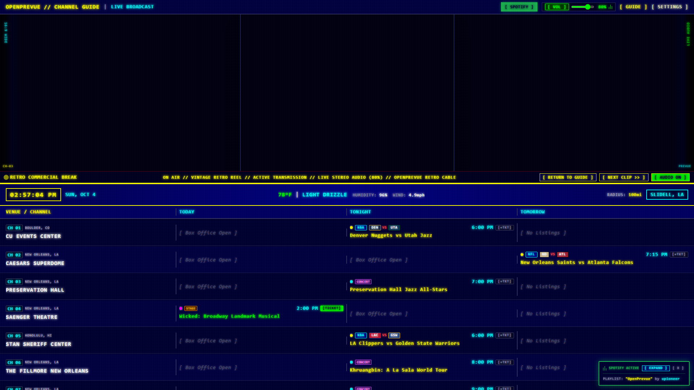
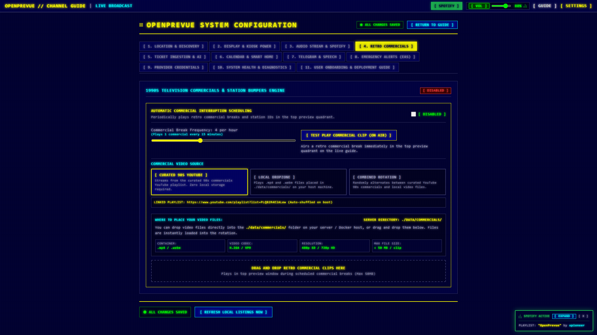
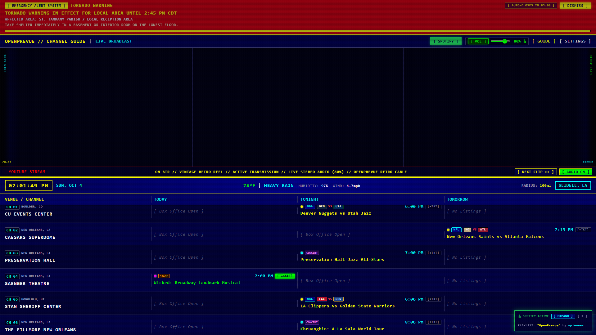
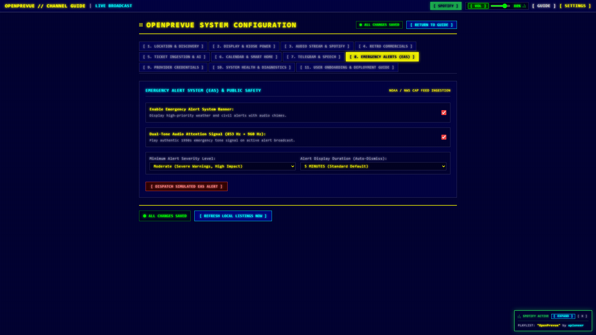
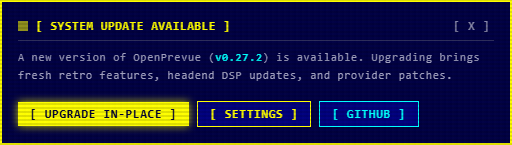
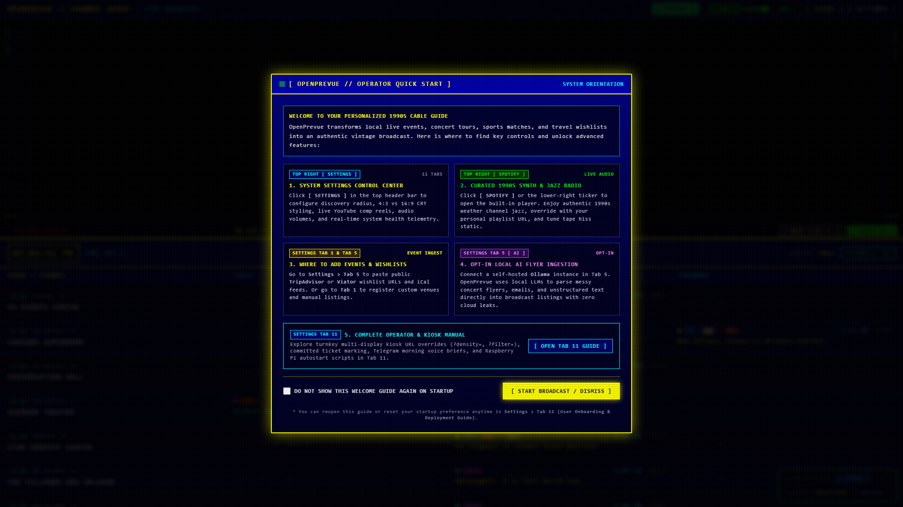
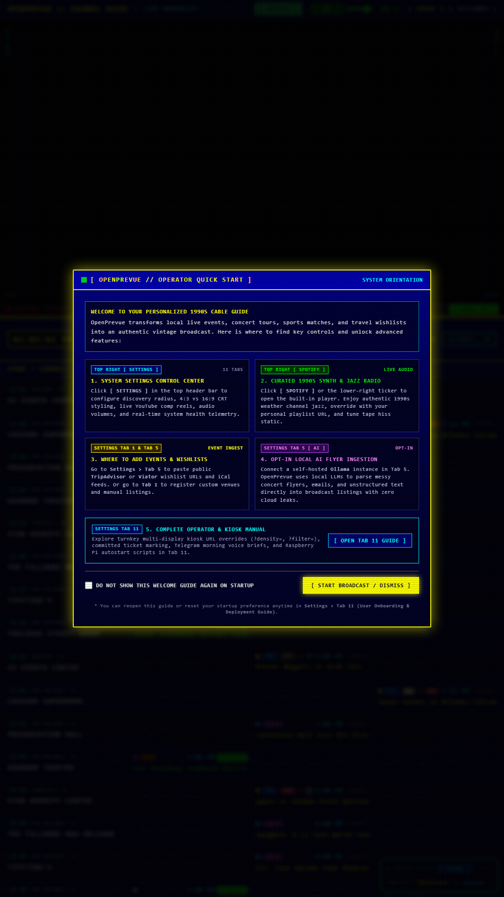
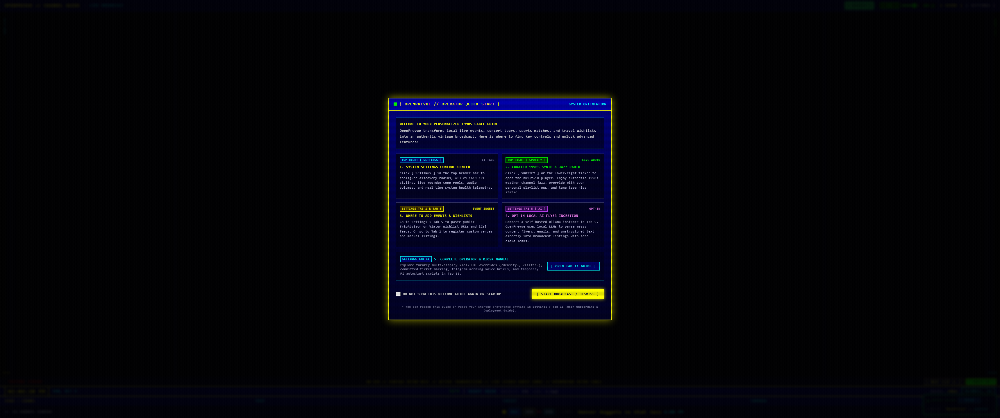
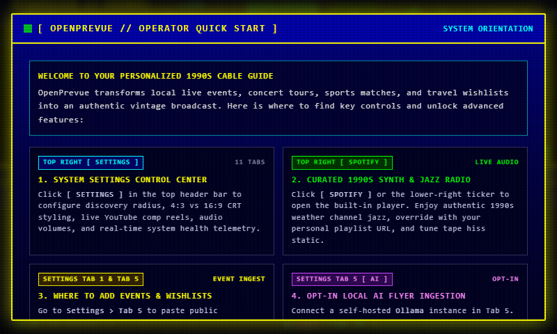
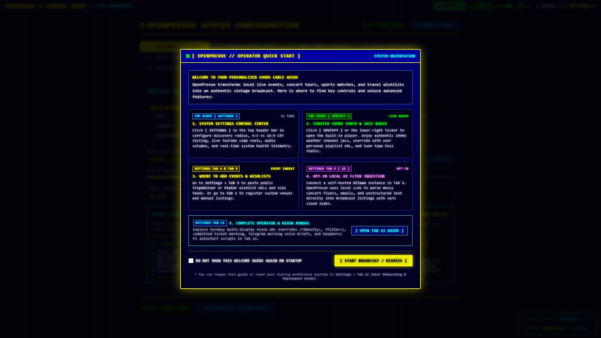

# Release v0.28.0: User-Configurable Emergency Alert System (EAS) Auto-Dismiss Duration, Real-Time Countdown Telemetry, Retro Commercial On-Air Preview & Dropzone Queue Management

## Overview
Release v0.28.0 delivers critical enhancements to the OpenPrevue Emergency Alert System (EAS), the Retro Commercial Interruption Engine, and frontend action button rendering. To ensure public safety bulletins are never missed when operators or viewers step away for lunch or away breaks, this release introduces user-configurable auto-dismiss durations ranging from 1 to 60 minutes with backend persistence, live linear depletion progress bars, and real-time countdown telemetry badges. In addition, it enhances the Retro Commercials system by providing on-air preview navigation, cleaning up ghost zero MB test queue artifacts, adding backend commercial clip deletion, and enforcing atomic button wrapping across notification prompts.

## What is New & Improved in v0.28.0

### 1. User-Configurable EAS Auto-Dismiss Duration Engine
* **Extended Duration Selection:** Replaced the legacy 10 to 120 second slider in [`SettingsView.vue`](file:///C:/Users/hgran/OneDrive/Documents/code/Projects/OpenPrevue/frontend/src/views/SettingsView.vue) (Tab 8: Emergency Alerts) with a dedicated retro styled `<select>` dropdown menu:
  * 1 Minute (`60s`): Quick Inspection
  * 5 Minutes (`300s`): Standard Default (Ensures bulletins persist during short interruptions)
  * 10 Minutes (`600s`): Extended Coverage
  * 15 Minutes (`900s`): Short Break
  * 30 Minutes (`1800s`): Lunch Break Coverage
  * 60 Minutes (`3600s`): Maximum Persistence (1 Hour)
* **Backend Ingestion Duration Integration:** Updated [`eas.py`](file:///C:/Users/hgran/OneDrive/Documents/code/Projects/OpenPrevue/backend/app/services/eas.py) so both live National Weather Service CAP warnings and simulated tests inherit the user-configured `eas_display_duration_seconds` value.
* **Persistent Seeding Default:** Seeded `"eas_display_duration_seconds": "300"` in [`DEFAULT_SETTINGS`](file:///C:/Users/hgran/OneDrive/Documents/code/Projects/OpenPrevue/backend/app/services/seeder.py#L11-L67).

### 2. EAS Live Countdown Telemetry & Depletion Progress Bar
* **Remaining Time Telemetry Badge:** Added a high-visibility countdown badge (`[ AUTO-CLOSES IN MM:SS ]`) to the header of [`EASBanner.vue`](file:///C:/Users/hgran/OneDrive/Documents/code/Projects/OpenPrevue/frontend/src/components/EASBanner.vue) adjacent to the `[ DISMISS ]` control, providing immediate situational awareness.
* **Slick Linear Depletion Bar:** Preserved and refined the yellow progress bar at the bottom of the banner, calculated using high-precision timestamp deltas (`Date.now() - startTime`) for smooth linear depletion across any selected duration.
* **Audio Attention Siren Safeguard:** Preserved the 8 to 10 second cap on the dual-tone emergency attention siren (853 Hz + 960 Hz), ensuring authentic alerts play upon entry without continuously screeching throughout extended 30 to 60 minute displays.
* **Immediate Manual Dismissal:** Operators retain full control to dismiss active emergency broadcasts ahead of schedule via the `[ DISMISS ]` button.

### 3. Retro Commercial Break On-Air Preview & Navigation
* **Instant On-Air Navigation:** Updated `[ TEST PLAY COMMERCIAL CLIP (ON AIR) ]` in [`SettingsView.vue`](file:///C:/Users/hgran/OneDrive/Documents/code/Projects/OpenPrevue/frontend/src/views/SettingsView.vue) and individual `[ PLAY NOW ]` clip controls to immediately route operators to the live broadcast dashboard (`/`). This allows operators to immediately witness the commercial airing in the top preview quadrant with authentic audio ducking and guide overlay controls.
* **Return to Guide Control:** Preserved the interactive `[ RETURN TO GUIDE ]` button overlay inside [`YouTubePane.vue`](file:///C:/Users/hgran/OneDrive/Documents/code/Projects/OpenPrevue/frontend/src/components/YouTubePane.vue) and [`DashboardView.vue`](file:///C:/Users/hgran/OneDrive/Documents/code/Projects/OpenPrevue/frontend/src/views/DashboardView.vue), permitting operators to seamlessly exit commercial breaks and resume the spotlight feed.

### 4. Commercial Dropzone Queue Hygiene & Clip Deletion Engine
* **Artifact Cleanup & Test Isolation:** Eliminated ghost zero MB test clip artifacts (`test_promo.mp4` and `stream_test.mp4`) that previously leaked into `./data/commercials/` during test suite runs. Added an autouse teardown fixture in [`tests/test_commercials.py`](file:///C:/Users/hgran/OneDrive/Documents/code/Projects/OpenPrevue/tests/test_commercials.py) ensuring that test uploads are reliably cleaned up after each test execution.
* **Backend Deletion API:** Added `DELETE /api/v1/commercials/{filename}` in [`commercials.py`](file:///C:/Users/hgran/OneDrive/Documents/code/Projects/OpenPrevue/backend/app/api/v1/endpoints/commercials.py) with path traversal sanitization, enabling operators to remove video clips directly from disk via the Web UI.
* **Ghost File Filter:** Filtered empty or truncated files (< 1 KB) from the commercial rotation list to prevent corrupt video decoders from attempting playback.
* **Dropzone UI Integration:** Integrated clip deletion handlers into [`SettingsView.vue`](file:///C:/Users/hgran/OneDrive/Documents/code/Projects/OpenPrevue/frontend/src/views/SettingsView.vue) and [`commercialsEngine.ts`](file:///C:/Users/hgran/OneDrive/Documents/code/Projects/OpenPrevue/frontend/src/services/commercialsEngine.ts).

### 5. Atomic Button Wrapping & Overflow Protection
* **Indivisible Bracket Labels:** Added `whitespace-nowrap` and `shrink-0` to all action buttons in [`UpdateToast.vue`](file:///C:/Users/hgran/OneDrive/Documents/code/Projects/OpenPrevue/frontend/src/components/UpdateToast.vue), [`UpdateModal.vue`](file:///C:/Users/hgran/OneDrive/Documents/code/Projects/OpenPrevue/frontend/src/components/UpdateModal.vue), and [`SettingsView.vue`](file:///C:/Users/hgran/OneDrive/Documents/code/Projects/OpenPrevue/frontend/src/views/SettingsView.vue). This prevents browser text layout engines from breaking lines before the trailing bracket (`]`).
* **Responsive Flex Containers:** Upgraded action container rows to `flex-wrap gap-2` with expanded toast bounds (`sm:max-w-lg`). On constrained or mobile displays, entire buttons wrap as complete atomic units with clean 8px vertical and horizontal spacing.

## Visual Verification & Layout Showcase

### Active Retro Commercial Break Airing On-Air

### Settings Control Center: Commercials Tab & Queue Management (Tab 4)

### Active EAS Emergency Alert with 5-Minute Countdown Telemetry & Depletion Bar

### Settings Control Center: EAS Auto-Dismiss Duration Dropdown (Tab 8)

### Atomic Update Notification Action Buttons (Zero Broken Brackets)

### Classic TV 4-Row 1990s Broadcast Scale

### Balanced 3x3x3x3 Grid (1080p Landscape)

### High Density 12-Row Overview

### Vertical 9:16 Portrait Kiosk Display

### 1920x480 Panoramic Rack Mount Display (Feature Priority)

### Ultra Wide 3440x1440 Panoramic Display (Calendar Priority)

### Small Form Factor Raspberry Pi Display (800x480)

### Full Settings Control Center

