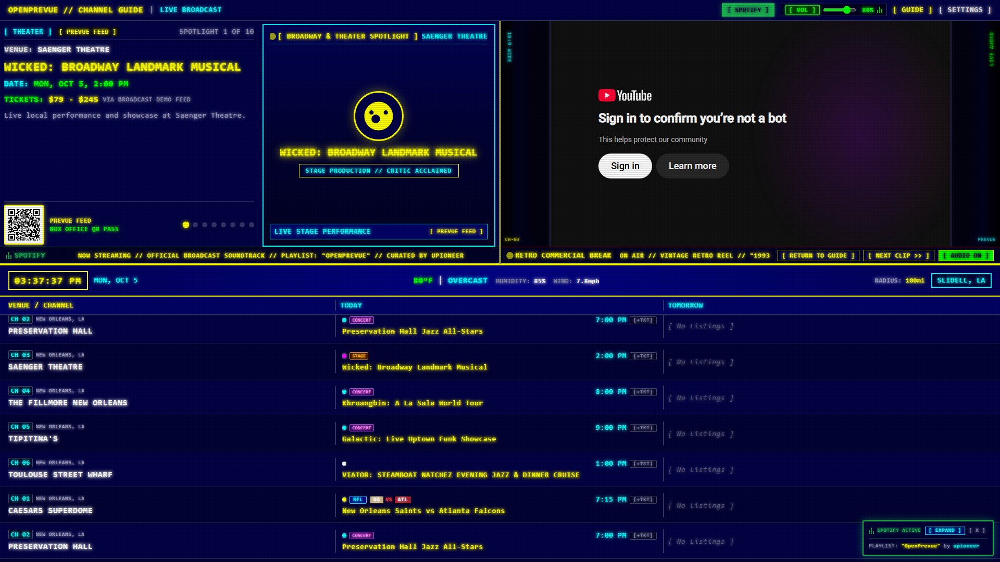
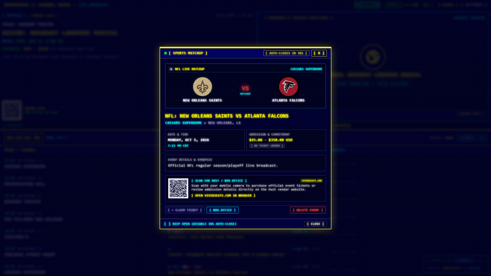
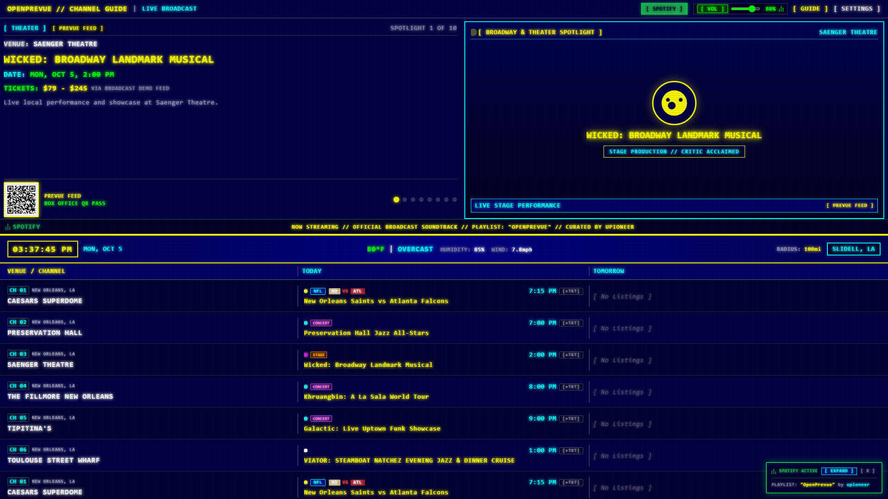
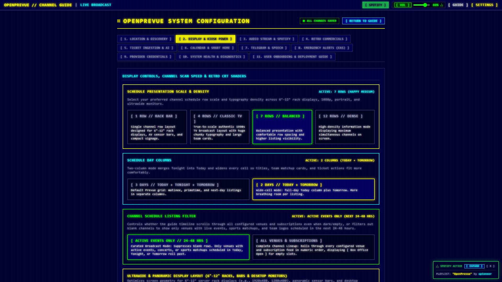
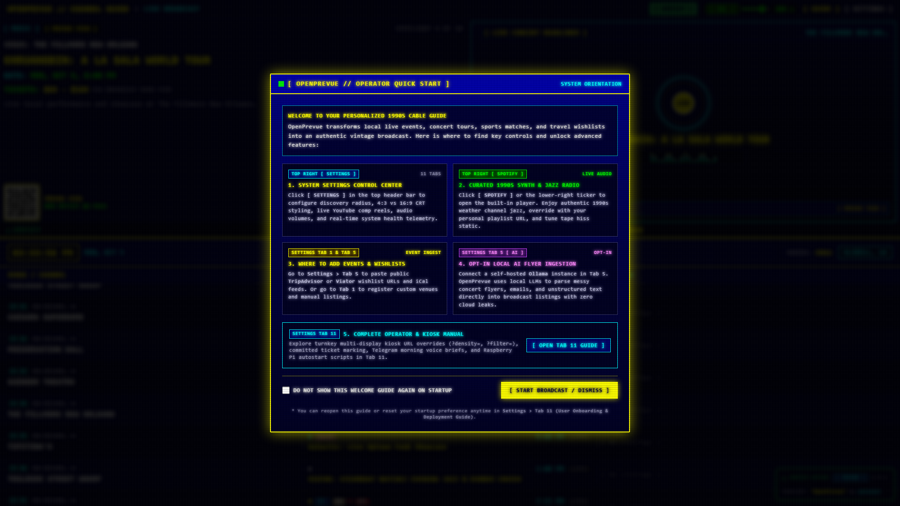
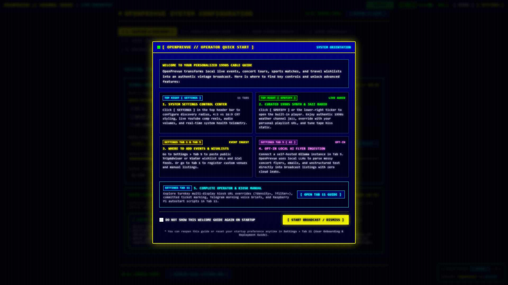

# Release v0.29.0: Retro Ads Split Spotlight, 2-Day Columns, Event Detail Modal & Settings Regroup

## Overview
Release v0.29.0 restores commercial video playback, introduces a split spotlight that keeps the event showcase on screen while retro ads air, adds a wide cell 2-day schedule layout, ships an event detail modal with deletion, and reorganizes all 11 settings tabs into labeled group cards. It also swaps the showcase halves so event copy leads left with artwork right, matching the original Prevue presentation.

## What is New & Improved in v0.29.0

### 1. Commercial Playback Restoration
* **Playlist Player Root Cause Fix:** [`YouTubePane.vue`](../../../frontend/src/components/YouTubePane.vue) always passed an explicit `videoId: undefined` for playlist players, which the YouTube IFrame API rejects with `Invalid video id`, leaving the player div empty. The key is now omitted entirely for playlists, so the curated 90s reel and any playlist URL mount correctly.
* **Local Takeover in Every Mode:** [`DashboardView.vue`](../../../frontend/src/views/DashboardView.vue) now yields the top pane to local file commercials even when spotlight mode is YouTube, so TEST PLAY always airs visibly.
* **Ad Surface Hardening:** The player frame is non interactive (`pointer-events: none`), so click to pause and hover chrome cannot appear over ads. EAS sirens mute instead of pausing during breaks, and captions default off via `cc_load_policy: 0`.

### 2. Showcase Plus Retro Ads Split Spotlight
* **New `featured_ads` Mode:** A third spotlight option in [`SettingsView.vue`](../../../frontend/src/views/SettingsView.vue) (Tab 2: Display) labeled `[ SHOWCASE + RETRO ADS ]`. During breaks the new [`SpotlightSplitPane.vue`](../../../frontend/src/components/SpotlightSplitPane.vue) keeps the showcase rolling on the left while the retro ad airs on the right, separated by a yellow channel divider.
* **Min Width Gate:** Splitting requires a 1024px viewport. Narrower screens fall back to the existing full takeover break, verified in both directions by e2e.
* **Display Tab Bridge:** A Retro Ads status panel under the spotlight picker shows enabled state, breaks per hour, source, and queue count, with a `[ CONFIGURE IN TAB 4 ]` jump so operators stop bouncing between tabs.

### 3. Two Day Schedule Columns
* **New `grid_day_columns` Setting:** [`TimelineGrid.vue`](../../../frontend/src/components/TimelineGrid.vue) supports `3day` (default Today, Tonight, Tomorrow) and `2day` (full day Today plus Tomorrow). Two day mode merges Tonight into Today chronologically and widens the grid from 3x3x3x3 to 4x4x4 spans so titles, matchup cards, and ticket actions fit comfortably.
* **Kiosk Override:** `?columns=2` forces two column layout per display without changing stored settings.
* **Display Tab Picker:** A Schedule Day Columns group with live ACTIVE readout sits beside the density presets.

### 4. Showcase Copy Left Artwork Right Swap
* **Prevue Aligned Halves:** The two [`SpotlightPane.vue`](../../../frontend/src/components/SpotlightPane.vue) columns swapped visual order via flex ordering: event bulletin copy (badges, venue, title, date, tickets, QR pass) now leads left while artwork, VS cards, and visualizers sit right. Applies to full and split showcase alike.

### 5. Settings Regroup Across All 11 Tabs
* **One Group Card Pattern:** Every tab now uses labeled group cards with a title, live status badge, one line purpose statement, and its controls. Orphaned inputs were merged into Broadcast Motion, CRT Shaders, Telemetry, Release, EAS, and Provider groups instead of floating loose.
* **Tab Highlights:** Display grew to 8 coherent groups; commercials split into Scheduling and Dropzone Queue; audio folded the radio preview into its source group; diagnostics merged upgrade, dry run, cadence, notes, and docker help into one Release Management group; integrations gained a proper tab title; guide chapters normalized with the duplicated chapter 5 renumbered to 6.

### 6. Event Detail Modal & Schedule Management
* **Rich Event Modal:** Clicking a grid cell opens [`EventDetailModal.vue`](../../../frontend/src/components/EventDetailModal.vue) with matchup graphics, date and admission cards, ticket QR with vendor domain, claim and box office actions, a 30 second auto close countdown with keep open override, backdrop dismiss, and a guarded delete flow with confirmation dialog.
* **Delete Endpoint:** `DELETE /api/v1/events/{event_id}` in [`events.py`](../../../backend/app/api/v1/endpoints/events.py) removes the event plus its ticket links, broadcasts `events_updated` over the display bus, and writes an activity ledger entry.
* **Real Ticket URLs:** The mock provider now seeds genuine venue box office URLs so QR passes and ticket actions resolve to real vendors in demo data.

### 7. Marquee, Palette & Layout Coverage
* **One Way Repeating Marquee:** [`HeadlineMarquee.vue`](../../../frontend/src/components/HeadlineMarquee.vue) gained a one way repeat mode with proof coverage.
* **Palette & Vertical Layout Proofs:** EGA, C64, amber, and green phosphor presets plus vertical portrait layout captured as proof screenshots alongside rack, ultrawide, portrait, and small Pi density coverage.

### 8. Verification & Regression Tests
* **Backend:** New `grid_day_columns` default and update test in [`test_settings_api.py`](../../../tests/test_settings_api.py) plus event deletion API tests. Suite: 97 passed.
* **End to End:** New `test_spotlight_split.py` (split layout, copy left of artwork, non interactive ad surface, narrow fallback) and `test_grid_day_columns.py` (headers, spans, kiosk override) playbooks. The commercial trigger playbook now asserts the player iframe mounts with no constructor errors.

## Visual Verification & Layout Showcase

### Split Spotlight: Showcase Persists Beside the Retro Ad

Note: automated capture runs in headless Chromium, so YouTube shows its bot confirmation interstitial inside the ad half. The player constructs, loads the playlist, shuffles, and reports live title telemetry; real browsers play normally.

### Event Detail Modal With Matchup Graphics and Ticket QR

### Two Day Wide Cell Schedule Grid

### Regrouped Display Settings With Status Badges

### Dashboard Landscape Overview

### Settings Control Center Overview

