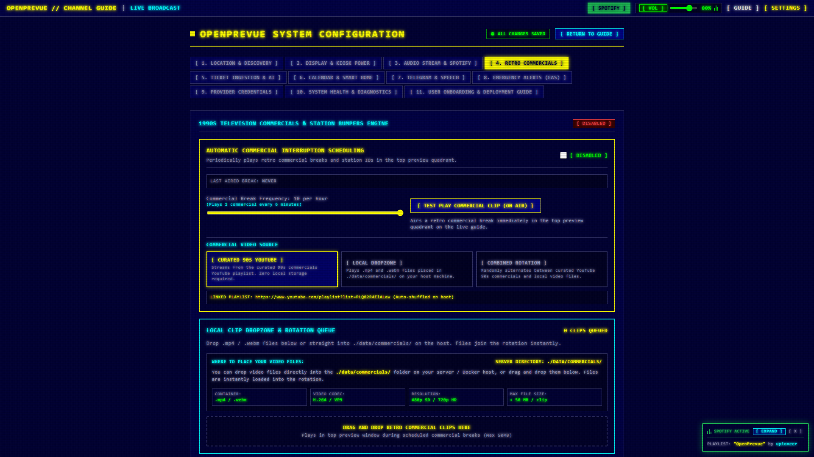
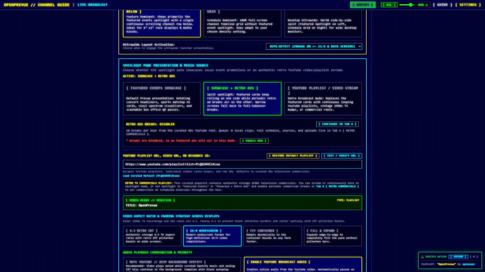
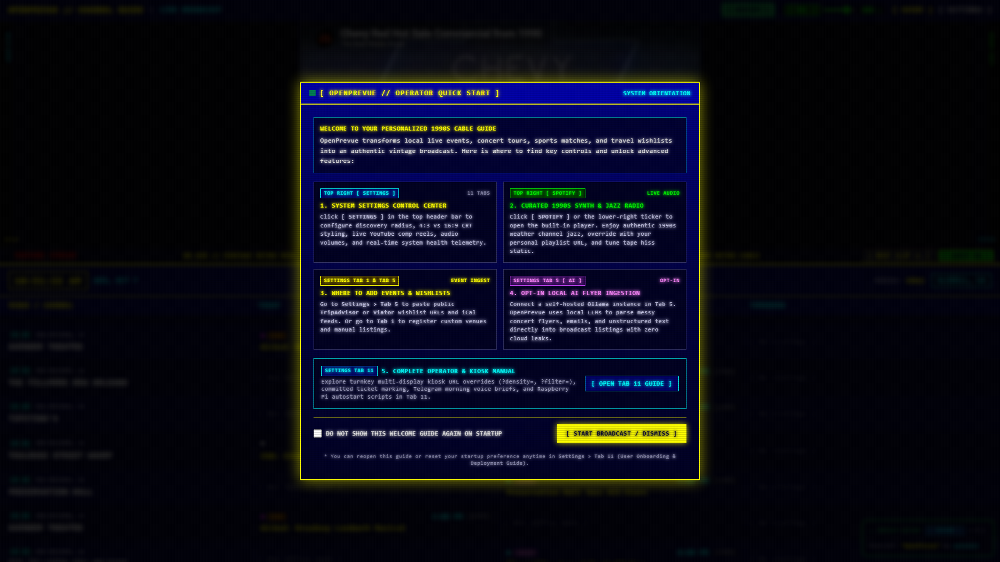
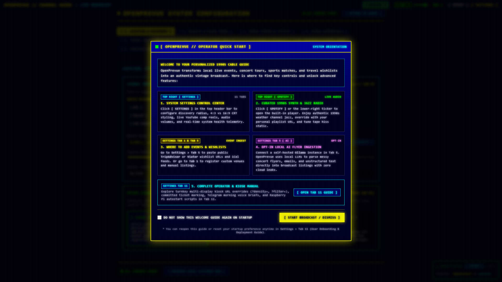

# Release v0.29.1: Scheduled Retro Ad Breaks Air Unaided

## Overview
Release v0.29.1 fixes the commercial break scheduler so periodic retro ad breaks actually fire, hardens break recovery so a failed player can never wedge the guide, and adds last aired telemetry plus a one click enable so operators can prove breaks are airing. It also fixes a touch freeze in the scrolling grid and isolates the pytest suite onto a throwaway database so test runs can never touch the live datastore.

## What is New & Improved in v0.29.1

### 1. Break Scheduler Starvation Fix
* **Root Cause:** [`DashboardView.vue`](../../../frontend/src/views/DashboardView.vue) refreshes data every 60 seconds and called `commercialsEngine.startTimer()` on each pass, while [`commercialsEngine.ts`](../../../frontend/src/services/commercialsEngine.ts) destroyed and recreated the interval on every call. The fastest cadence is one break every 6 minutes, so the countdown reset faster than it could ever elapse and scheduled breaks never fired on any box at any frequency. Manual TEST PLAY always worked because it bypasses the timer, which hid the defect.
* **Idempotent Rearm:** `restartTimer()` now recreates the interval only when the enabled state or the cadence actually changed, so the 60 second refresh and the settings broadcasts become harmless repeats while a countdown is armed. Frequency edits still take effect immediately, and disabling still stops the timer at once.
* **Regression Playbook:** New [`test_commercial_scheduler.py`](../../../project_details/playbooks/test_commercial_scheduler.py) arms 10 breaks per hour, loads the dashboard with zero interaction, and asserts the heartbeat advances within 420 seconds. Observed failing before the fix with no break in 420 seconds, and passing after with an unaided break at about 350 seconds.

### 2. Break Recovery Hardening
* **Timeout Armed First:** `playClip()` now arms the 90 second safety net before anything else, so a throw or a silent player can never trap the guide mid break.
* **Fail Fast On Player Errors:** YouTube player errors conclude an active break immediately in `handleYouTubeError` instead of holding a dead player until the safety net, and every local video break surface in [`DashboardView.vue`](../../../frontend/src/views/DashboardView.vue) and [`SpotlightSplitPane.vue`](../../../frontend/src/components/SpotlightSplitPane.vue) finishes on `error` as well as `ended`.
* **Touch Freeze Fix:** [`TimelineGrid.vue`](../../../frontend/src/components/TimelineGrid.vue) only honors hover pause on hover capable pointers, and touch pauses auto resume after 15 seconds, so tap driven displays can never stick paused. Verified by repro: scroll froze permanently on tap before, resumes after.

### 3. Last Aired Telemetry And One Click Enable
* **Heartbeat:** Every break start writes `last_commercial_break`, added as a seed default in [`seeder.py`](../../../backend/app/services/seeder.py) and typed in [`index.ts`](../../../frontend/src/types/index.ts).
* **Tab 4 Readout:** The scheduling group in [`SettingsView.vue`](../../../frontend/src/views/SettingsView.vue) shows `LAST AIRED BREAK` with the timestamp or `NEVER`, plus the expected cadence while enabled.
* **Display Tab Warning:** The Retro Ads bridge under the spotlight picker shows a red disabled warning with an `[ ENABLE NOW ]` button when breaks are off, so the cause of silent breaks is visible at a glance.

### 4. Pytest Database Isolation
* [`conftest.py`](../../../tests/conftest.py) forces `DATA_DIR` to a throwaway directory before any backend import, since settings bind at import time. Suite result held at 97 passed with the live database byte identical before and after.

## Visual Verification & Layout Showcase

### Tab 4 Last Aired Break Readout

### Display Tab Disabled Warning With One Click Enable

### Dashboard Landscape Overview

### Settings Control Center Overview

