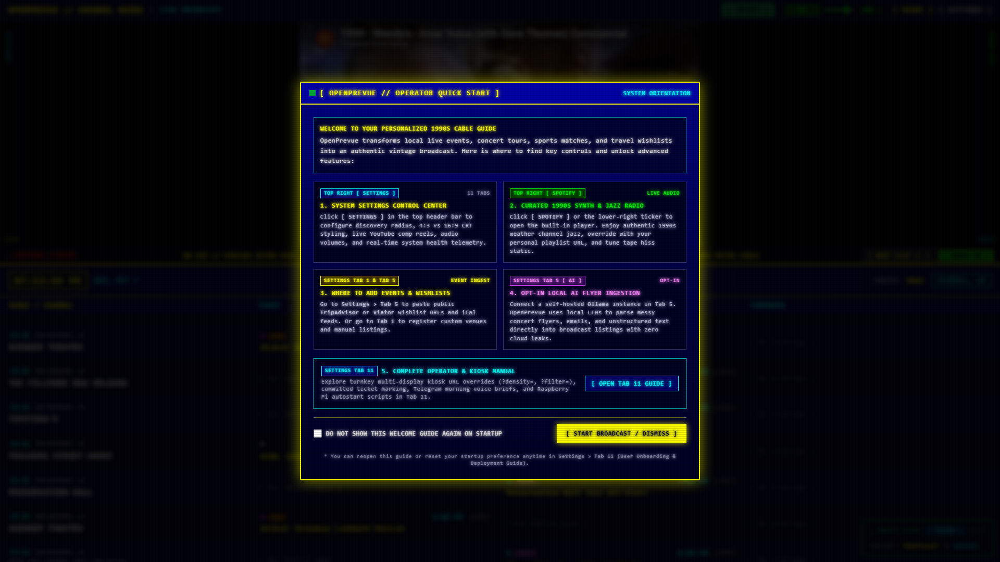
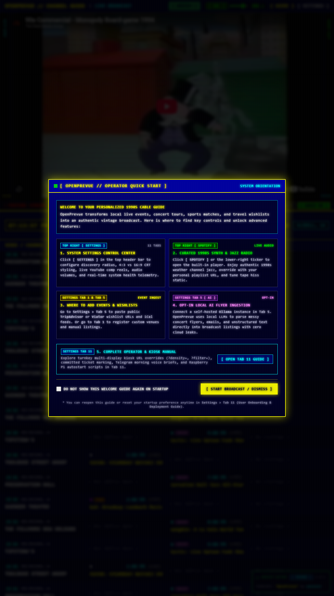
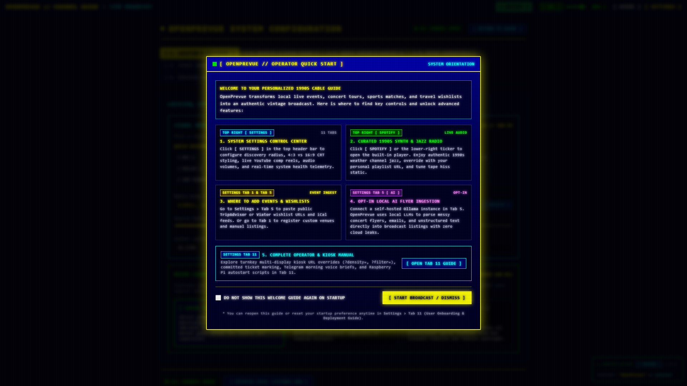

# Release v0.29.2: Expired Event Purge Cadence

## Overview
Release v0.29.2 bakes expired event cleanup into the app so past listings leave the database in the same cycle fresh ones land. Every provider sync now ends with a purge pass, plus one at backend startup for boxes returning from offline stretches. The rule is time based with wide grace margins, so events that can still appear in any listing window are never touched.

## What is New & Improved in v0.29.2

### 1. Purge In Sequence With Listing Updates
* **Shared Choke Point:** New `purge_expired_events()` in [`ingestion.py`](../../../backend/app/services/ingestion.py) runs at the end of every `sync_provider` pass, which covers the scheduled 6 hour sync, manual Sync Now, settings triggered syncs, and the MCP sync tool. Dead listings leave in the same cycle fresh ones are slotted.
* **Startup Pass:** [`main.py`](../../../backend/app/main.py) runs one purge after seeding during lifespan startup, so a box that was offline for days cleans itself on boot instead of waiting for the next sync interval.
* **Guarded:** Purge failures are caught and logged and can never fail a sync or block startup.

### 2. No Premature Purge Rule
* **Time Based Only:** An event is purged only when its end time is more than 12 hours past, or when no end time exists and its start time is more than 24 hours past. Provider outages cannot trigger purges because the rule never uses last seen data.
* **Window Proof:** The 24 hour start grace keeps purged rows at yesterday or earlier in every US timezone, so Today, Tomorrow, and Tonight slots are mathematically unreachable. Future, ongoing, and multi day events can never match.
* **Always Kept:** User ticketed events, rows with unparseable timestamps, and all venues are excluded, so user commitments, odd rows, and custom venue ordering are never lost.
* **Bounded Passes:** Each pass deletes at most 5000 rows so a jumped clock cannot wipe the table at once. Legitimate backlogs drain over subsequent cycles. Ticket links of purged events are removed with them.

### 3. Verification & Regression Tests
* **Backend:** New purge case in [`test_ingestion_service.py`](../../../tests/test_ingestion_service.py) covering future, ongoing, multi day, within grace recent past, ticketed, and unparseable rows (all kept) plus old end and start rows (deleted with their ticket links). Suite: 98 passed.

## Visual Verification & Layout Showcase

### Dashboard Landscape Overview

### Dashboard Portrait Overview

### Settings Control Center Overview

