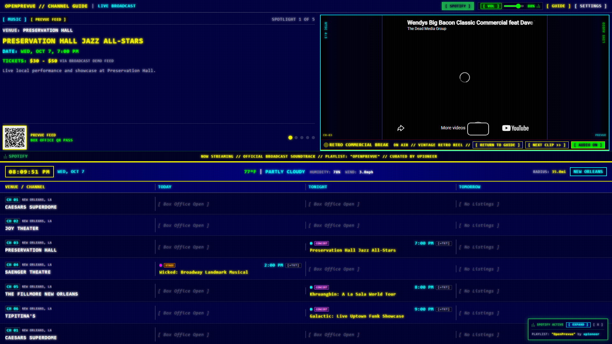
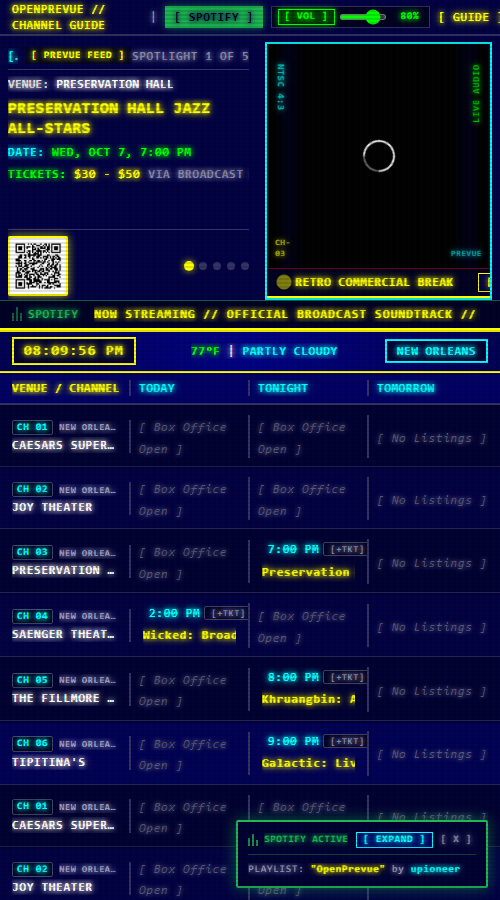
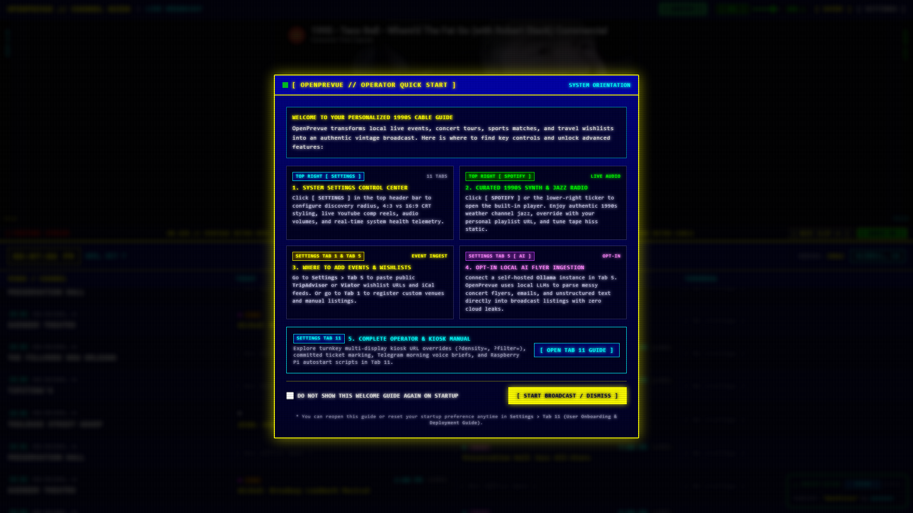
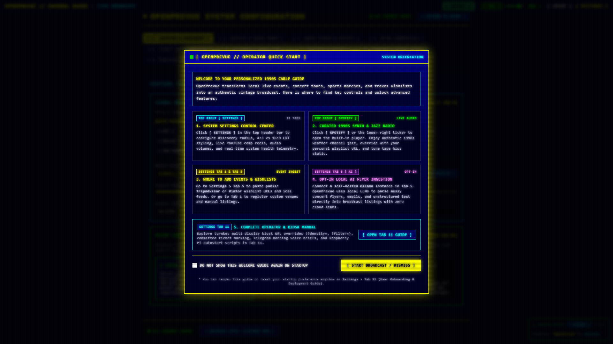

# Release v0.29.3: Ad Pane Takeover Without Resizing

## Overview
Release v0.29.3 reworks the Showcase plus Retro Ads spotlight so the ad takes over the right visuals pane while the left event info pane stays exactly as it is. The panel stays mounted across breaks, so nothing resizes and nothing squeezes when a break starts or ends. The width gate and its full takeover fallback are gone: portrait and narrow screens get the same clean pane swap.

## What is New & Improved in v0.29.3

### 1. Art Pane Takeover
* **Zero Resize Breaks:** [`SpotlightPane.vue`](../../../frontend/src/components/SpotlightPane.vue) takes new `adTakeover`, `adType`, `adUrl`, and `adAspectRatio` props. During a break only the inner content of the art column swaps to the ad player; the column container and the copy column stay mounted with identical geometry, then the artwork resumes.
* **Retired Split Wrapper:** [`DashboardView.vue`](../../../frontend/src/views/DashboardView.vue) renders the panel directly in `featured_ads` mode across all three layouts, with takeover bound to break state. `SpotlightSplitPane.vue` is deleted along with the 1024px gate, so portrait breaks swap the pane instead of replacing the whole spotlight.
* **Preserved Overrides:** The `?video=1` kiosk override still forces the YouTube stream between breaks, and plain featured mode keeps its full takeover breaks. YouTube stream mode is untouched.
* **Settings Copy:** The mode description in [`SettingsView.vue`](../../../frontend/src/views/SettingsView.vue) now states the pane swap behavior at every width.

### 2. Verification & Regression Tests
* **End to End:** [`test_spotlight_split.py`](../../../project_details/playbooks/test_spotlight_split.py) is rewritten for takeover semantics. It asserts no ad mounts before a break, the ad lands inside the art pane, copy width is unchanged to the pixel during the break, the ad surface stays non interactive, copy sits left of art, and the art resumes after dismiss, in wide and portrait viewports.
* **Mode Regression:** YouTube stream, plain featured showcase, and plain featured full takeover breaks verified unchanged with zero page errors. Day column and commercial trigger playbooks re ran green.

## Visual Verification & Layout Showcase

### Wide Break: Copy Steady While The Ad Owns The Art Pane

Note: automated capture runs in headless Chromium, so YouTube shows its bot confirmation interstitial inside the ad pane. The player constructs and reports normally; real browsers play normally.

### Portrait Break: Same Pane Swap, No Full Takeover

### Dashboard Landscape Overview

### Settings Control Center Overview

