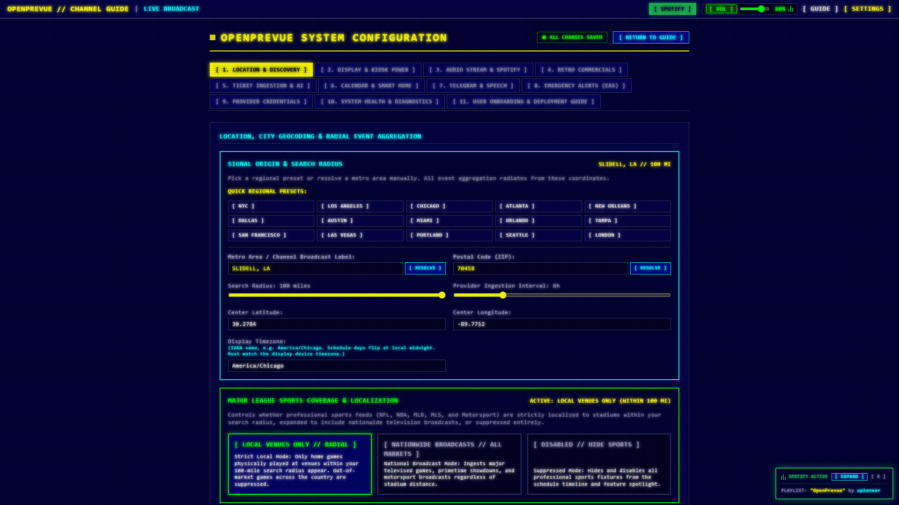
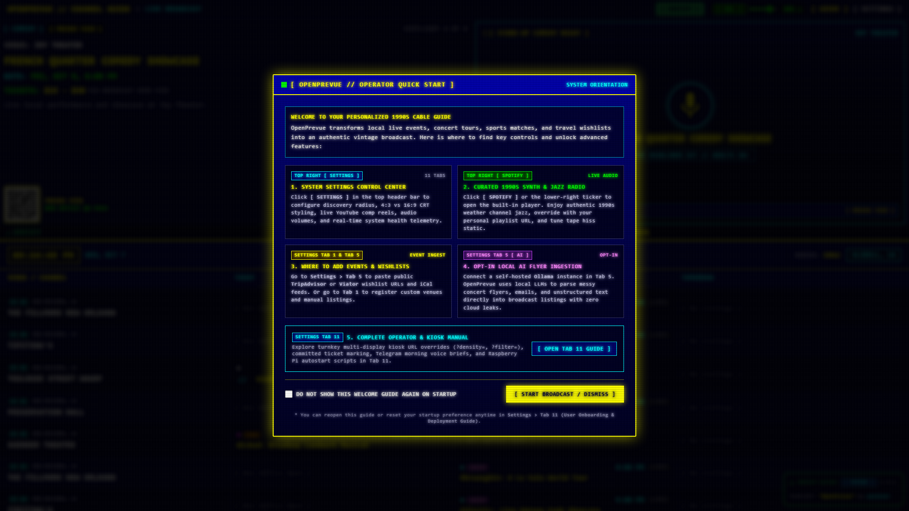
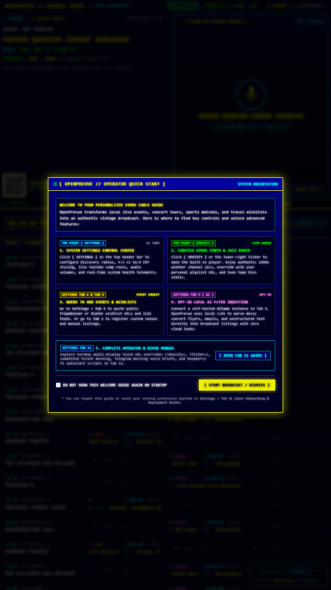

# Release v0.29.4: Local Midnight Schedule Rollover

## Overview
Release v0.29.4 anchors schedule days to a declared local timezone so listings flip at local midnight instead of UTC midnight. Fixture providers slot relative days in the declared zone, and a new daily rollover sync re slots everything within minutes of the flip. UTC stays the storage convention for absolute instants but no longer acts as a day boundary anywhere.

## What is New & Improved in v0.29.4

### 1. Declared Display Timezone
* **New Setting:** `timezone` seed default in [`seeder.py`](../../../backend/app/services/seeder.py) inherits the `TZ` environment value and backfills existing databases on boot. Input lives in the location tab next to lat and lon in [`SettingsView.vue`](../../../frontend/src/views/SettingsView.vue), typed in [`index.ts`](../../../frontend/src/types/index.ts).
* **Resolver:** New [`timezone.py`](../../../backend/app/core/timezone.py) resolves settings value, then `TZ` env, then UTC fallback. Invalid names warn and fall through; the resolver never raises.
* **Display Contract:** The setting must match the display device timezone, since the frontend buckets by browser local midnight. Fixture content and rendered slots then flip together.

### 2. Local Anchored Fixtures Plus Midnight Rollover Job
* **Fixture Anchors:** [`sports.py`](../../../backend/app/providers/sports.py) and [`ticketing.py`](../../../backend/app/providers/ticketing.py) compute relative days from `now` in the declared zone instead of UTC. Live ESPN absolutes are unaffected. Mock was already location anchored and is untouched.
* **Rollover Job:** [`scheduler.py`](../../../backend/app/services/scheduler.py) adds a daily 00:05 full sync in the declared zone next to the unchanged 6 hour interval, so days re slot minutes after midnight instead of up to 6 hours late. The expired event purge rides along through the existing hook.
* **Live Reaim:** Changing the timezone setting calls new `reschedule_midnight_sync` through [`settings.py`](../../../backend/app/api/v1/endpoints/settings.py), mirroring the interval reschedule pattern. Invalid names are ignored with a warning.

### 3. Verification & Regression Tests
* **Backend:** New [`test_app_timezone.py`](../../../tests/test_app_timezone.py) covers resolver precedence plus deterministic ticketing and sports fixture offset assertions against the declared zone. [`test_scheduler.py`](../../../tests/test_scheduler.py) asserts the midnight job registers as a 00:05 cron, follows timezone updates, and rejects invalid ones. Suite: 102 passed.

## Visual Verification & Layout Showcase

### Display Timezone Input In Location Tab

### Dashboard Landscape Overview

### Dashboard Portrait Overview

### Settings Control Center Overview

