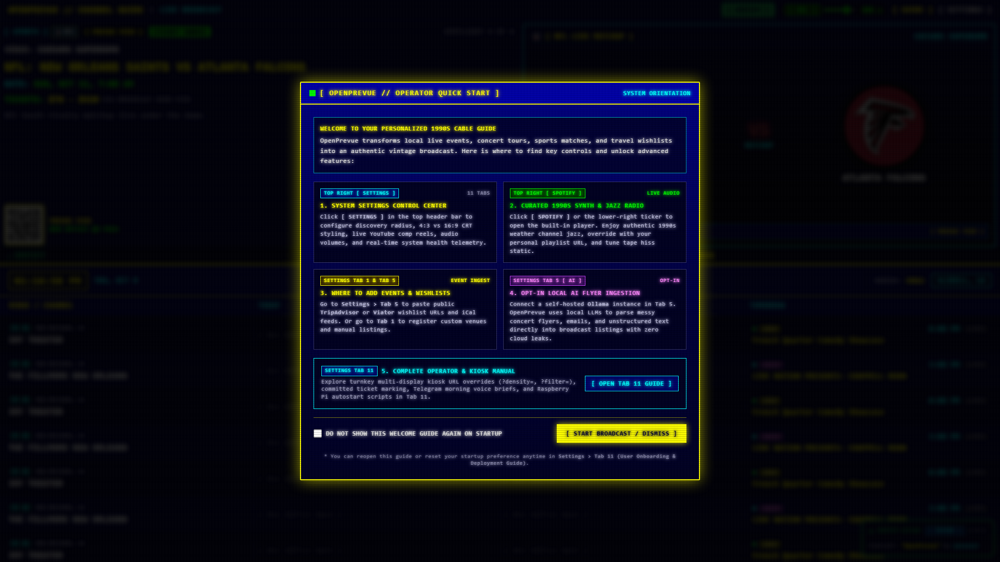
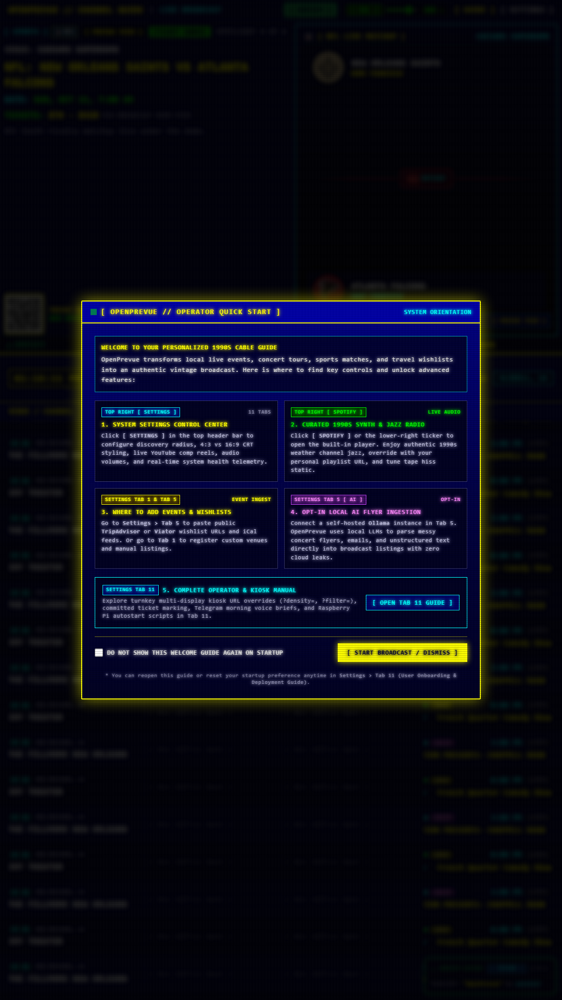
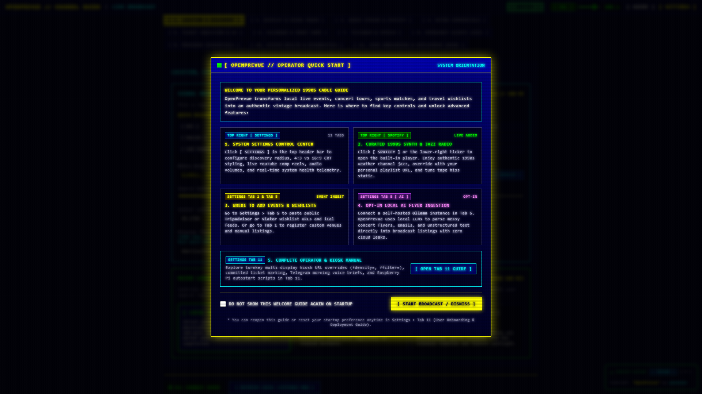

# Release v0.29.5: Single Ad Commercial Break Lifecycle & Natural Resumption

## Overview
Release v0.29.5 resolves commercial break duration and playlist chaining defects. Retro ad breaks now play exactly one commercial clip to completion, regardless of length, and immediately restore event graphics and background audio upon conclusion. The rigid 90 second hardcoded cutoff is eliminated in favor of dynamic duration based safety timers, and YouTube playlist auto progression is intercepted to prevent multiple back to back ads.

## What is New & Improved in v0.29.5

### 1. Anti Chaining YouTube Commercial Playback
* **Single Clip Boundary Locking:** When a YouTube playlist commercial break begins, [`YouTubePane.vue`](../../../frontend/src/components/YouTubePane.vue) captures and locks the initial video ID in `initialTrackedVideoId` and sets `loop: 0`.
* **Auto Advance Interception:** If the YouTube IFrame API attempts to transition or buffer a subsequent video in the playlist (`currentVidId !== initialTrackedVideoId`), the player is immediately paused and `finishCommercialClip()` is invoked to end the break.
* **Dedicated Component Lifecycle:** Added dynamic keys (`:key="isCommercialActive ? 'yt-commercial' : 'yt-ambient'"`) in [`DashboardView.vue`](../../../frontend/src/views/DashboardView.vue) so entering and exiting ad breaks guarantees clean player instantiation and teardown.

### 2. High Frequency Natural Completion Detection
* **Sub Second Progress Monitor:** While an ad break airs, a 200ms progress monitor compares `currentTime` against `duration`. When the active clip reaches within 0.35s of completion, the break cleanly concludes before YouTube has time to auto advance.
* **Native State Handlers:** Verified `ENDED (0)` player state handling terminates the break immediately, stops playback, and restores ambient programming.

### 3. Dynamic Duration Based Safety Fallback
* **Elimination of Rigid 90s Timer:** In [`commercialsEngine.ts`](../../../frontend/src/services/commercialsEngine.ts), the fixed 90000ms timer that was prematurely truncating ads is replaced with `armSafetyTimeout(seconds)`.
* **Dynamic Adjustment:** The safety net starts with a generous 300s (5 minute) ceiling so long retro ads, promos, or infomercials are never cut short mid clip. As soon as the active player reports valid duration, the safety net dynamically refines to `duration + 15` seconds.
* **Dead Player Recovery:** If a stream or browser hangs indefinitely, the guide still recovers automatically once the dynamic ceiling expires.

### 4. Local Video Metadata Integration
* **HTML5 Video Duration Hooks:** In [`SpotlightPane.vue`](../../../frontend/src/components/SpotlightPane.vue) and [`DashboardView.vue`](../../../frontend/src/views/DashboardView.vue), local `<video>` tags now listen to `@loadedmetadata` and call `commercialsEngine.armSafetyTimeout(target.duration + 15)`.

### 5. Automated Verification & Regression Tests
* **Lifecycle Playbook:** New [`test_single_ad_lifecycle.py`](../../../project_details/playbooks/test_single_ad_lifecycle.py) asserts single clip playback, UI takeover state, clean graphics resumption, and audio restoration.
* **Spotlight Takeover Regression:** [`test_spotlight_split.py`](../../../project_details/playbooks/test_spotlight_split.py) confirmed wide and portrait geometry stability during takeover.
* **Scheduler Heartbeat:** [`test_commercial_scheduler.py`](../../../project_details/playbooks/test_commercial_scheduler.py) verified periodic scheduled breaks fire unaided.
* **Test Suite:** 102 pytest unit and integration tests passed cleanly.

## Visual Verification & Layout Showcase

### Dashboard Landscape Overview

### Dashboard Portrait Overview

### Settings Control Center Overview

