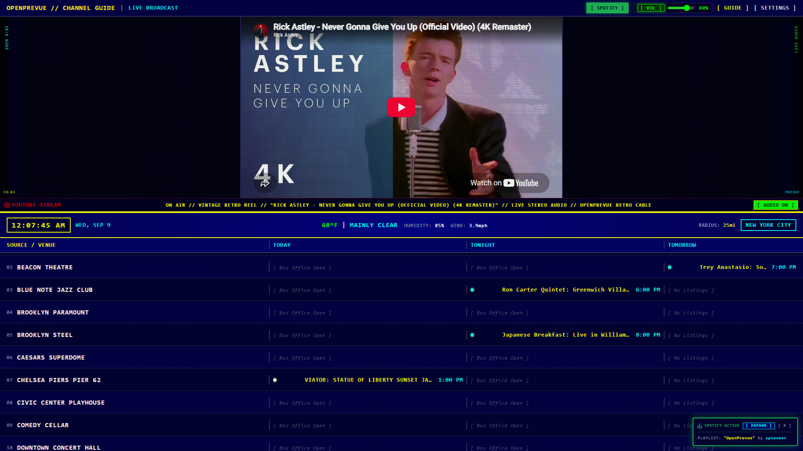
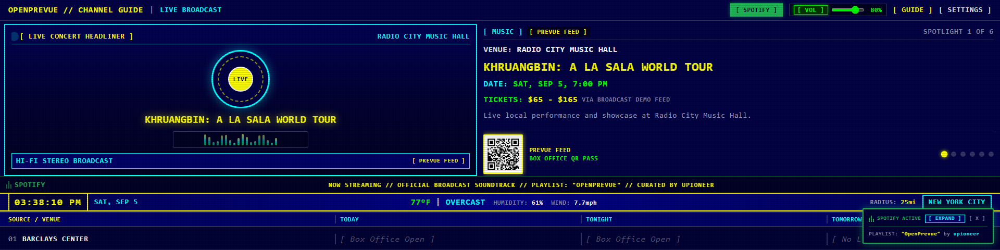
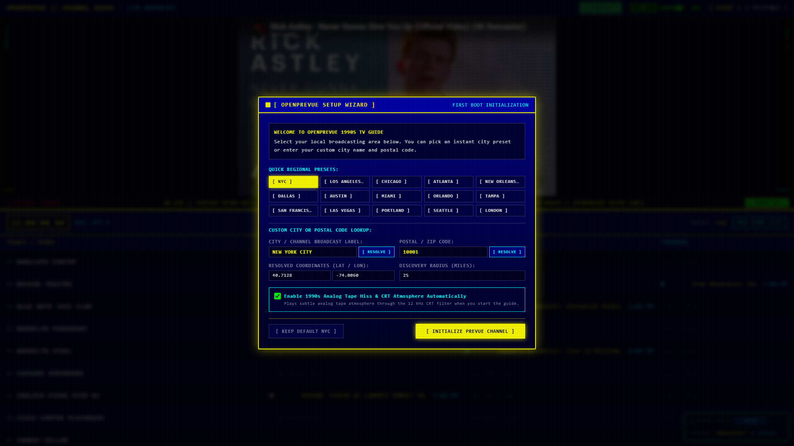
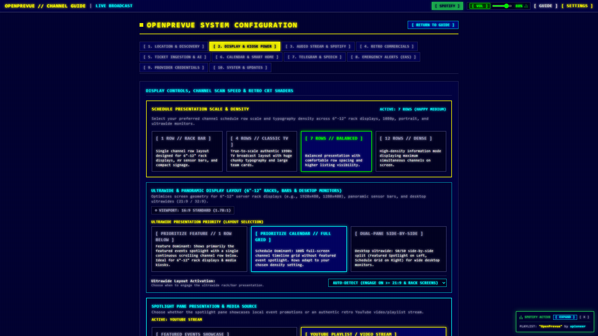

# OpenPrevue

Self-hosted local event aggregator and interactive retro display system styled after 1990s scrolling cable channel guides.



---

## Visual Showcase

### Panoramic, Ultrawide & Server Rack Displays

#### 1. 10" Server / AV Rack Bar Display (1920x480 - Feature Priority)
Engineered for 6"-12" rack consoles, smart home sensor panels, and stretch displays. Prominently showcases headline event promotions, sports matchups, and box office QR passes with a single continuous channel row scrolling beneath.



#### 2. Desktop Ultrawide Monitor (3440x1440 - Calendar Priority)
Wall-to-wall 24-channel schedule grid across 21:9 and 32:9 desktop screens with 100% full-screen listings visibility.


### Channel Schedule Presentation Scales & Density Modes

#### 1. Classic TV Mode (4 Rows - True-to-Scale 1990s Broadcast)
Authentic 1:1 reproduction of the 1990s Prevue Channel on an NTSC CRT television with large chunky typography and team badges.


#### 2. Balanced Mode (7 Rows - Default Standard Layout)
The default presentation balance between vintage broadcast scale and listing visibility, rendering 7 comfortable channel rows.


#### 3. Dense Mode (12 Rows - High Density Information Overview)
Information-dense mode displaying up to 12 simultaneous channels on screen for command-center monitoring.


### Multi-Device & Display Orientation Showcase

#### Vertical 9:16 Portrait Kiosk & Wall Display


#### Small Touchscreen & Raspberry Pi 7" Display


#### First-Boot Regional Setup Wizard


#### Settings Control Center & Audio Synthesizer


---

## Overview

OpenPrevue aggregates local event listings across developer ticketing APIs, sports leagues, secondary marketplaces, municipal iCal feeds, and direct venue sources, normalizes and deduplicates them into an internal SQLite datastore, and renders a split-screen dashboard suitable for wall monitors, smart televisions, tablets, Raspberry Pi touchscreens, and desktop browsers.

---

## Key Features

* **Authentic 1990s Prevue Experience:** CRT scanline shaders, selectable palettes (EGA 16, Commodore 64, Amber, Green phosphor), and Web Audio analog tape hiss with 60 Hz mains hum.
* **YouTube Video & Playlist Streaming:** Swap the top featured event cards for continuous looping YouTube playlists, vintage 1990s commercials, or CRT music video reels with live oEmbed validation.
* **Playlist Shuffle Mode & On-Screen Channel Skipper:** Randomize playlist queues on initial boot and transition seamlessly forward using the dedicated on-screen `[ NEXT CLIP >> ]` button in the broadcast telemetry ribbon.
* **Direct 24/7 Live Stream URLs:** Support for streaming 24/7 YouTube live broadcasts and premieres directly via `youtube.com/live/...` links.
* **Authentic 4:3 CRT Aspect Framing:** Custom multi-aspect ratio engine centers vintage 4:3 TV footage without player pillarbox bars, flanked by retro CRT phosphor side bezels.
* **Ultrawide & 6"-12" Rack Display Architecture:** Dedicated Feature Priority mode (Spotlight + 1 row scrolling below) and Calendar Priority mode (100% full-screen schedule grid) for desktop ultrawides and 10" rack consoles (1920x480, 1280x400).
* **Single Row Schedule Density:** Tailored `[ 1 ROW // RACK BAR ]` presentation scale for compact horizontal sensor panels and AV consoles.
* **Outbound RFC 5545 iCalendar Feeds:** Real-time `.ics` and `webcal://` calendar subscriptions for Apple Calendar, Google Calendar, and Outlook with 2-hour departure notification alarms.
* **Home Assistant Smart Home Integration:** Live REST sensor telemetry (`GET /api/v1/integrations/homeassistant/sensors`) and MQTT discovery for today's events, active spotlights, and EAS alerts.
* **Kiosk Screen Wake Lock & Display Power:** Web Screen Wake Lock API keeps wall monitors awake 24/7 with automatic reacquisition, plus hardware CEC display power controls.
* **Background Audio Stream Selector:** Curated vintage Spotify playlist by default, with selectable live WeatherScan smooth jazz, SomaFM downtempo, Nightwave Plaza vaporwave, and offline synthesizer chimes.
* **Dynamic Sports Matchup Graphics:** Automatically renders vector logos and "VS" broadcast cards for all 32 NFL, 30 NBA, 30 MLB, 32 NHL, 29 MLS, and Premier League teams.
* **1990s Television Commercials & Station Bumpers:** Periodically plays retro TV commercial breaks in the top preview quadrant with audio ducking and custom video drag-and-drop dropzone.
* **Translucent Spotify Divider Ticker:** Overlayed bottom ticker with animated equalizer bars and 1-click launch link to the official Spotify playlist.
* **Turnkey Multi-Format Ingestion:** Ingests events from Ticketmaster, SeatGeek, Eventbrite, TripAdvisor, Viator, iCal (.ics), MIME email (.eml), and Microsoft Outlook (.msg).
* **Emergency Alert System (EAS):** NOAA / NWS CAP feed ingestion with 853 Hz + 960 Hz dual-tone audio attention signal.
* **Telegram Remote Curation & Voice Notes:** Manage pins, watchlists, and queries via retro ASCII Telegram cards and spoken voice notes.
* **Model Context Protocol (MCP):** Embedded JSON-RPC 2.0 MCP server exposing tools and resources to external AI agents.
* **Auto-Update Notification Hub:** Built-in semantic version tracking against GitHub releases with plain-English rate-limit handling and configurable check cadence.
* **Multi-Arch Docker Ready:** Cross-compiled for both `linux/amd64` (standard servers/PCs) and `linux/arm64` (Raspberry Pi 4/5, Apple Silicon).

---

## Feature Deep Dives

### 1. Spotify Integration & Vintage Cable Audio
OpenPrevue recreates the soothing audio aesthetic of vintage cable headends and 1990s local weather radar broadcasts:
* **Official Curated Spotify Playlist:** Directly embedded in the Settings control center and accessible via the 1-click launch button in the UI.
* **Overlayed Translucent Marquee Ticker:** Floating glass ribbon positioned across the bottom of the top preview pane featuring animated graphic equalizer bars and real-time streaming audio telemetry.
* **12 kHz High-Shelf RF Headend Filter:** Built-in Web Audio digital signal processing (DSP) pipeline that passes playback through a 12 kHz high-shelf cut filter, recreating the authentic acoustic baseband frequency response of analog CRT television speakers.
* **Analog Tape Hiss & 60 Hz Mains Hum:** Synthesized background tape noise with user-adjustable volume sliders for full retro immersion.

### 2. Live Weather Telemetry & Environmental Radar
Real-time environmental conditions integrated seamlessly into the broadcast ribbon without requiring external API keys:
* **Zero-Config Open-Meteo Integration:** Automatically fetches live temperature, weather conditions, relative humidity percentage, and wind speed based on configured latitude and longitude coordinates.
* **Broadcast Status Ribbon:** Embedded in the middle divider bar displaying current time, date, local temperature, and condition strings.
* **WebSocket Live Refresh:** Live environmental updates broadcast directly to connected screens without full page reloads.

### 3. Emergency Alert System (EAS) & Public Safety Broadcasts
Authentic public safety alert pipeline inspired by 1990s Emergency Broadcast System cable interruptions:
* **NOAA / NWS CAP Feed Ingestion:** Automatically monitors the National Weather Service Common Alerting Protocol (CAP) feed for severe weather advisories, flash floods, and civil emergency declarations.
* **Dual-Tone Attention Signal:** Generates the iconic 853 Hz + 960 Hz dual-tone emergency sound signal directly in the browser via Web Audio oscillators.
* **High-Visibility Scrolling Banner:** Flashing red emergency marquee banner that overlays active alerts with severity badges (Minor, Moderate, Severe, Extreme) and instruction texts.
* **Spoken Voice Announcements:** Integrated local text-to-speech announcer reads urgent alerts aloud over the display.

### 4. 1990s Television Commercials & Station Bumpers Engine
Experience authentic commercial breaks and local TV station IDs between your scheduled event rotations:
* **Configurable Break Frequency:** Slider controls allow scheduling between 1 and 10 commercial breaks per hour (playing 1 clip every 6 to 60 minutes).
* **Where to Place Video Files:** Place your video files directly in the `./data/commercials/` folder on your server/Docker host (mounted to `/app/data/commercials/`), or drag and drop files into the Settings control center. Files are loaded automatically across all client screens.
* **Recommended Video Codec & Container:** MP4 with H.264 (AVC) video encoding or WebM (VP9). H.264 offers 100% universal hardware-accelerated playback on Raspberry Pi, mobile devices, tablets, and smart TVs.
* **Recommended Audio Codec:** AAC-LC or MP3 stereo (44.1 kHz or 48 kHz, 128 to 192 kbps).
* **Recommended Resolution & Aspect Ratio:** 640x480 (4:3 Standard Definition) or 1280x720 (16:9 High Definition). Standard definition 480p provides instant startup times and low memory usage.
* **File Size & Clip Duration:** Recommended duration is 5 to 30 seconds per clip (maximum file size: 50 MB per clip).
* **Intelligent Audio Ducking:** Automatically mutes and pauses background audio when a commercial begins and resumes playback once the clip concludes.

---

## Tech Stack

| Layer | Technology |
|---|---|
| Frontend | Vue 3 SPA + Vite + Tailwind CSS v4 |
| Backend | Python 3.12+ with FastAPI (Async REST & WebSockets) |
| Database | SQLite 3 with Write-Ahead Logging (WAL) |
| Scheduler | APScheduler (AsyncIOScheduler) |
| Container | Multi-Arch Docker (amd64, arm64) + GitHub Container Registry |
| Testing | pytest + pytest-asyncio (backend), Playwright (screenshots) |

---

## Quick Start (Docker Run)

Run OpenPrevue instantly with a single command:

```bash
docker run -d \
  --name openprevue \
  --restart unless-stopped \
  -p 8080:8080 \
  -v ./data:/app/data \
  ghcr.io/upioneer/openprevue:latest
```

Open `http://localhost:8080` in your browser. On first boot, the interactive Setup Wizard will prompt you to select your local broadcast city.

---

## Docker Compose

```yaml
services:
  openprevue:
    image: ghcr.io/upioneer/openprevue:latest
    container_name: openprevue
    restart: unless-stopped
    # Required for Proxmox and unprivileged LXC environments to prevent sysctl permission errors
    security_opt:
      - apparmor:unconfined
    ports:
      - "8080:8080"
    environment:
      - TZ=America/New_York
      - DEFAULT_POSTAL_CODE=10001
      - DEFAULT_METRO_LABEL=NEW YORK CITY
      - DEFAULT_RADIUS_MILES=25
    volumes:
      - ./data:/app/data
      # Docker socket enables zero-touch 1-click in-place container updates directly from the UI.
      # If you prefer strict isolation without socket access, comment this line out.
      - /var/run/docker.sock:/var/run/docker.sock
```

Launch with:

```bash
docker compose up -d
```

### Proxmox and Unprivileged LXC Considerations

When running Docker inside an unprivileged LXC container (common in Proxmox VE, TrueNAS, and cluster hypervisors), running recent package versions of `containerd.io` (v2.x) paired with `runc` may encounter kernel sysctl permission restrictions during container namespace creation:

```text
Error response from daemon: failed to create task for container: failed to create shim task: OCI runtime create failed: runc create failed: unable to start container process: error during container init: open sysctl net.ipv4.ip_unprivileged_port_start file: reopen fd 8: permission denied
```

This occurs because `containerd.io` 2.x attempts to initialize unprivileged port sysctls inside the container namespace, which unprivileged LXC guest environments disallow by default.

Depending on your security and administrative preferences, you can resolve this through multiple verified paths:

#### Path 1: Downgrade and Pin containerd.io to 1.7.x LTS (Recommended for Unprivileged LXC Guests)

The `containerd.io` 1.7.x Long Term Support (LTS) series does not invoke the restricted sysctl probe, allowing Docker containers to launch without error in unprivileged LXC guests.

1. Inspect available package versions in your repository:
   ```bash
   apt-cache madison containerd.io
   apt-cache madison docker-ce | grep 28
   ```

2. Downgrade `containerd.io` alongside a compatible `docker-ce` package using `--allow-downgrades`:
   ```bash
   sudo apt install -y --allow-downgrades \
     containerd.io=1.7.28-1~ubuntu.24.04~noble \
     docker-ce=5:28.5.2-1~ubuntu.24.04~noble \
     docker-ce-cli=5:28.5.2-1~ubuntu.24.04~noble \
     docker-buildx-plugin \
     docker-compose-plugin
   ```
   *(Note: Adjust the distribution suffix if running Debian 12 Bookworm or another release).*

3. Pin the package to prevent automated `apt upgrade` cycles from re-upgrading to `containerd` 2.x:
   ```bash
   sudo apt-mark hold containerd.io
   ```
   *(To unpin in the future after upgrading the underlying Proxmox kernel: `sudo apt-mark unhold containerd.io`).*

4. Restart Docker and launch OpenPrevue:
   ```bash
   sudo systemctl restart docker
   sudo docker compose up -d
   ```

#### Path 2: Service Level AppArmor Bypass (docker-compose.yml)

Included by default in [`docker-compose.yml`](file:///C:/Users/hgran/OneDrive/Documents/code/Projects/OpenPrevue/docker-compose.yml):
```yaml
security_opt:
  - apparmor:unconfined
```
* *Pros:* Zero host level or system wide package changes required.
* *Cons:* Requires the Compose definition to carry the `security_opt` directive.

#### Path 3: LXC Guest Docker Daemon Global Configuration (/etc/docker/daemon.json)

Disable AppArmor enforcement across all Docker workloads inside the LXC container:
1. Create or edit `/etc/docker/daemon.json`:
   ```json
   {
     "apparmor": false
   }
   ```
2. Restart the Docker daemon:
   ```bash
   sudo systemctl restart docker
   ```
* *Pros:* Resolves AppArmor permission boundaries globally for all containers inside the LXC.
* *Cons:* Disables AppArmor profile enforcement for all containers inside that specific LXC.

#### Path 4: Proxmox Host Hypervisor Profile Configuration (/etc/pve/lxc/CT_ID.conf)

Configure the container on the Proxmox host shell:
1. Open the LXC configuration file on your Proxmox VE host:
   ```bash
   nano /etc/pve/lxc/<CT_ID>.conf
   ```
2. Append the following configuration entries:
   ```ini
   features: nesting=1,keyctl=1
   lxc.apparmor.profile: unconfined
   ```
3. Reboot the container from the host:
   ```bash
   pct reboot <CT_ID>
   ```
* *Pros:* Eliminates nested AppArmor conflicts between the host kernel and LXC guest runtimes.
* *Cons:* Requires root access to the Proxmox hypervisor shell.

#### Path 5: Convert to a Privileged LXC Container or KVM Virtual Machine

* **Privileged Container:** If your security policy permits, converting the LXC container to a privileged container grants the guest root identity matching the host root, bypassing unprivileged namespace sysctl limitations.
* **KVM Virtual Machine:** Running Docker inside a standard Linux KVM virtual machine provides a dedicated virtualized kernel with complete control over sysctls and namespaces without LXC nesting restrictions.

### Turnkey Storage Permissions Architecture (PUID and PGID)

When mounting persistent storage via volumes (`- ./data:/app/data`), OpenPrevue automatically handles ownership and permission synchronization on startup:

* **Automatic Privilege Dropping:** The container initializes a lightweight entrypoint as root, verifies and repairs write permissions on `/app/data` to match the configured user, and immediately drops privileges using `gosu` to run the application securely as non-root user `appuser` (UID 1000).
* **Zero Host Chown Required:** You do not need to manually run `chown` or `chmod` on the host storage directory.
* **Custom PUID and PGID Support:** If your storage volume is mounted across NFS or requires specific host user permissions, specify `PUID` and `PGID` in your `docker-compose.yml`:
  ```yaml
  environment:
    - PUID=1000
    - PGID=1000
  ```
* **Docker Socket Passthrough:** If `/var/run/docker.sock` is mounted into the container for the 1-click in-place update engine, the entrypoint automatically detects the host socket's group ID and grants access to `appuser` without running the container as root.


---

## Local Development Setup

### Prerequisites

* Python >= 3.12
* Node.js >= 22
* Docker (optional)

### Steps

1. Clone repository:

```bash
git clone https://github.com/upioneer/OpenPrevue.git
cd OpenPrevue
```

2. Copy environment template:

```bash
cp .env.example .env
```

3. Install backend dependencies:

```bash
pip install -r backend/requirements.txt
```

4. Install frontend dependencies:

```bash
cd frontend
npm install
cd ..
```

5. Run backend server:

```bash
python -m uvicorn backend.app.main:app --host 0.0.0.0 --port 8080 --reload
```

6. Run frontend dev server:

```bash
cd frontend
npm run dev
```

---

## Running Tests

Execute backend test suite:

```bash
pytest -v
```

Build frontend production bundle:

```bash
cd frontend
npm run build
```

Capture Playwright screenshots:

```bash
python project_details/playbooks/capture_screenshots.py --version v0.22.0
```

---

## License

See [LICENSE.md](./LICENSE.md) for license details.
