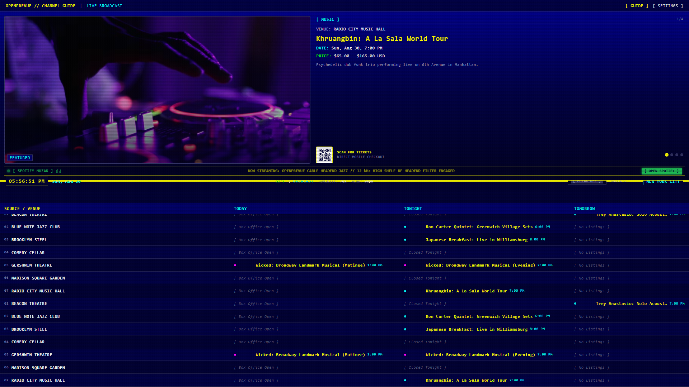
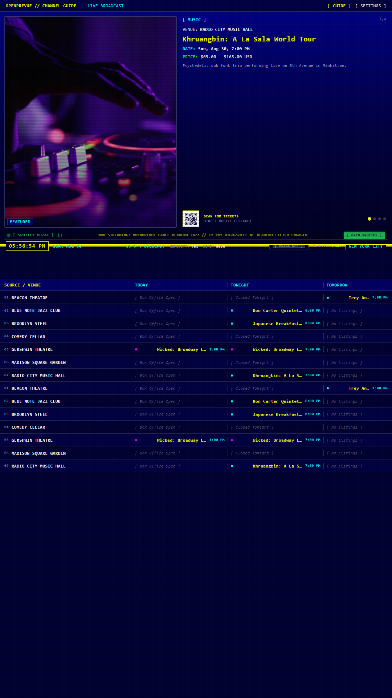
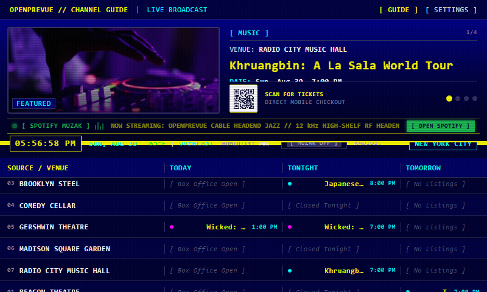
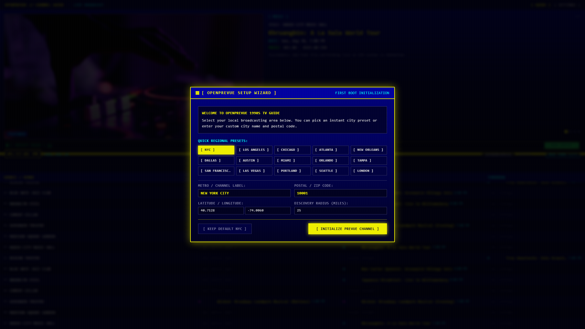

# OpenPrevue

Self-hosted local event aggregator and interactive retro display system styled after 1990s scrolling cable channel guides.



---

## Visual Showcase

### Standard 16:9 Retro Cable Guide Display (Hero View)


### Vertical 9:16 Portrait Kiosk & Wall Display


### Small Touchscreen & Raspberry Pi 7" Display


### First-Boot Regional Setup Wizard


### Settings Control Center & Audio Synthesizer


---

## Overview

OpenPrevue aggregates local event listings across developer ticketing APIs, sports leagues, secondary marketplaces, municipal iCal feeds, and direct venue sources, normalizes and deduplicates them into an internal SQLite datastore, and renders a split-screen dashboard suitable for wall monitors, smart televisions, tablets, Raspberry Pi touchscreens, and desktop browsers.

---

## Key Features

* **Authentic 1990s Prevue Experience:** CRT scanline shaders, selectable palettes (EGA 16, Commodore 64, Amber, Green phosphor), and Web Audio analog tape hiss with 60 Hz mains hum.
* **Dynamic Sports Matchup Graphics:** Automatically renders vector logos and "VS" broadcast cards for all 32 NFL, 30 NBA, 30 MLB, 32 NHL, 29 MLS, and Premier League teams.
* **1990s Television Commercials & Station Bumpers:** Periodically plays retro TV commercial breaks in the top preview quadrant with audio ducking and custom video drag-and-drop dropzone.
* **Translucent Spotify Divider Ticker:** Overlayed bottom ticker with animated equalizer bars and 1-click launch link to the official Spotify playlist.
* **Turnkey Multi-Format Ingestion:** Ingests events from Ticketmaster, SeatGeek, Eventbrite, iCal (.ics), MIME email (.eml), and Microsoft Outlook (.msg).
* **Emergency Alert System (EAS):** NOAA / NWS CAP feed ingestion with 853 Hz + 960 Hz dual-tone audio attention signal.
* **Telegram Remote Curation & Voice Notes:** Manage pins, watchlists, and queries via retro ASCII Telegram cards and spoken voice notes.
* **Model Context Protocol (MCP):** Embedded JSON-RPC 2.0 MCP server exposing tools and resources to external AI agents.
* **Auto-Update Notification Hub:** Built-in semantic version tracking against GitHub releases with plain-English rate-limit handling and configurable check cadence.
* **Multi-Arch Docker Ready:** Cross-compiled for both `linux/amd64` (standard servers/PCs) and `linux/arm64` (Raspberry Pi 4/5, Apple Silicon).

---

## Tech Stack

| Layer | Technology |
|---|---|
| Frontend | Vue 3 SPA + Vite + Tailwind CSS v4 |
| Backend | Python 3.12+ with FastAPI (Async REST & WebSockets) |
| Database | SQLite 3 with Write-Ahead Logging (WAL) |
| Scheduler | APScheduler (AsyncIOScheduler) |
| Container | Multi-Arch Docker (amd64, arm64) + GitHub Container Registry |
| Testing | pytest + pytest-asyncio (backend), Playwright (screenshots) |

---

## Quick Start (Docker Run)

Run OpenPrevue instantly with a single command:

```bash
docker run -d \
  --name openprevue \
  --restart unless-stopped \
  -p 8080:8080 \
  -v ./data:/app/data \
  ghcr.io/upioneer/openprevue:latest
```

Open `http://localhost:8080` in your browser. On first boot, the interactive Setup Wizard will prompt you to select your local broadcast city.

---

## Docker Compose

```yaml
services:
  openprevue:
    image: ghcr.io/upioneer/openprevue:latest
    container_name: openprevue
    restart: unless-stopped
    ports:
      - "8080:8080"
    environment:
      - TZ=America/New_York
      - DEFAULT_POSTAL_CODE=10001
      - DEFAULT_METRO_LABEL=NEW YORK CITY
      - DEFAULT_RADIUS_MILES=25
    volumes:
      - ./data:/app/data
```

Launch with:

```bash
docker compose up -d
```

---

## Local Development Setup

### Prerequisites

* Python >= 3.12
* Node.js >= 22
* Docker (optional)

### Steps

1. Clone repository:

```bash
git clone https://github.com/upioneer/OpenPrevue.git
cd OpenPrevue
```

2. Copy environment template:

```bash
cp .env.example .env
```

3. Install backend dependencies:

```bash
pip install -r backend/requirements.txt
```

4. Install frontend dependencies:

```bash
cd frontend
npm install
cd ..
```

5. Run backend server:

```bash
python -m uvicorn backend.app.main:app --host 0.0.0.0 --port 8080 --reload
```

6. Run frontend dev server:

```bash
cd frontend
npm run dev
```

---

## Running Tests

Execute backend test suite:

```bash
pytest -v
```

Build frontend production bundle:

```bash
cd frontend
npm run build
```

Capture Playwright screenshots:

```bash
python project_details/playbooks/capture_screenshots.py --version v0.16.0
```

---

## License

See [LICENSE.md](./LICENSE.md) for license details.
