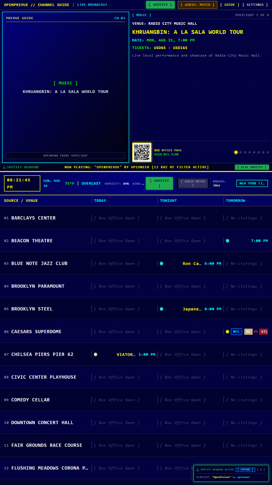
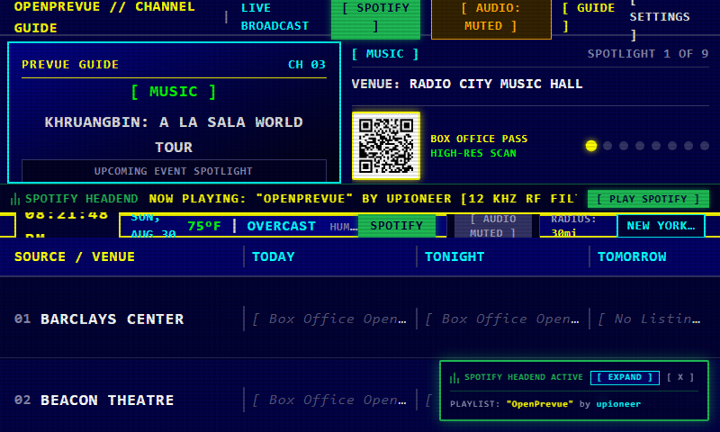
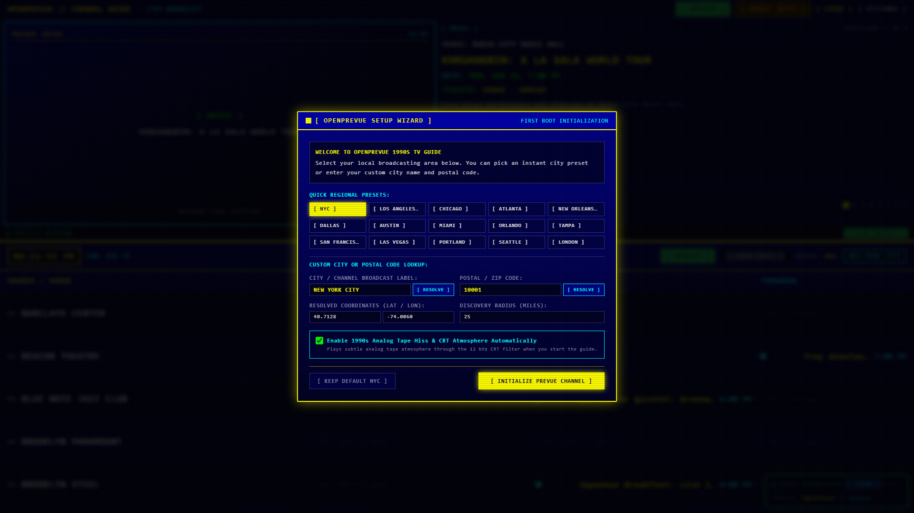
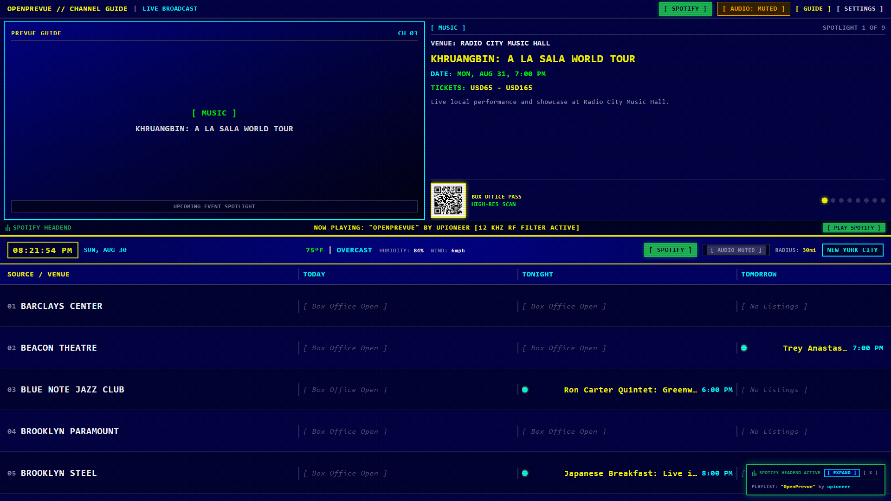

# OpenPrevue

Self-hosted local event aggregator and interactive retro display system styled after 1990s scrolling cable channel guides.


---

## Visual Showcase

### Standard 16:9 Retro Cable Guide Display (Hero View)


### Vertical 9:16 Portrait Kiosk & Wall Display


### Small Touchscreen & Raspberry Pi 7" Display


### First-Boot Regional Setup Wizard


### Settings Control Center & Audio Synthesizer


---

## Overview

OpenPrevue aggregates local event listings across developer ticketing APIs, sports leagues, secondary marketplaces, municipal iCal feeds, and direct venue sources, normalizes and deduplicates them into an internal SQLite datastore, and renders a split-screen dashboard suitable for wall monitors, smart televisions, tablets, Raspberry Pi touchscreens, and desktop browsers.

---

## Key Features

* **Authentic 1990s Prevue Experience:** CRT scanline shaders, selectable palettes (EGA 16, Commodore 64, Amber, Green phosphor), and Web Audio analog tape hiss with 60 Hz mains hum.
* **Dynamic Sports Matchup Graphics:** Automatically renders vector logos and "VS" broadcast cards for all 32 NFL, 30 NBA, 30 MLB, 32 NHL, 29 MLS, and Premier League teams.
* **1990s Television Commercials & Station Bumpers:** Periodically plays retro TV commercial breaks in the top preview quadrant with audio ducking and custom video drag-and-drop dropzone.
* **Translucent Spotify Divider Ticker:** Overlayed bottom ticker with animated equalizer bars and 1-click launch link to the official Spotify playlist.
* **Turnkey Multi-Format Ingestion:** Ingests events from Ticketmaster, SeatGeek, Eventbrite, iCal (.ics), MIME email (.eml), and Microsoft Outlook (.msg).
* **Emergency Alert System (EAS):** NOAA / NWS CAP feed ingestion with 853 Hz + 960 Hz dual-tone audio attention signal.
* **Telegram Remote Curation & Voice Notes:** Manage pins, watchlists, and queries via retro ASCII Telegram cards and spoken voice notes.
* **Model Context Protocol (MCP):** Embedded JSON-RPC 2.0 MCP server exposing tools and resources to external AI agents.
* **Auto-Update Notification Hub:** Built-in semantic version tracking against GitHub releases with plain-English rate-limit handling and configurable check cadence.
* **Multi-Arch Docker Ready:** Cross-compiled for both `linux/amd64` (standard servers/PCs) and `linux/arm64` (Raspberry Pi 4/5, Apple Silicon).

---

## Feature Deep Dives

### 1. Spotify Integration & Vintage Cable Audio
OpenPrevue recreates the soothing audio aesthetic of vintage cable headends and 1990s local weather radar broadcasts:
* **Official Curated Spotify Playlist:** Directly embedded in the Settings control center and accessible via the 1-click launch button in the UI.
* **Overlayed Translucent Marquee Ticker:** Floating glass ribbon positioned across the bottom of the top preview pane featuring animated graphic equalizer bars and real-time streaming audio telemetry.
* **12 kHz High-Shelf RF Headend Filter:** Built-in Web Audio digital signal processing (DSP) pipeline that passes playback through a 12 kHz high-shelf cut filter, recreating the authentic acoustic baseband frequency response of analog CRT television speakers.
* **Analog Tape Hiss & 60 Hz Mains Hum:** Synthesized background tape noise with user-adjustable volume sliders for full retro immersion.

### 2. Live Weather Telemetry & Environmental Radar
Real-time environmental conditions integrated seamlessly into the broadcast ribbon without requiring external API keys:
* **Zero-Config Open-Meteo Integration:** Automatically fetches live temperature, weather conditions, relative humidity percentage, and wind speed based on configured latitude and longitude coordinates.
* **Broadcast Status Ribbon:** Embedded in the middle divider bar displaying current time, date, local temperature, and condition strings.
* **WebSocket Live Refresh:** Live environmental updates broadcast directly to connected screens without full page reloads.

### 3. Emergency Alert System (EAS) & Public Safety Broadcasts
Authentic public safety alert pipeline inspired by 1990s Emergency Broadcast System cable interruptions:
* **NOAA / NWS CAP Feed Ingestion:** Automatically monitors the National Weather Service Common Alerting Protocol (CAP) feed for severe weather advisories, flash floods, and civil emergency declarations.
* **Dual-Tone Attention Signal:** Generates the iconic 853 Hz + 960 Hz dual-tone emergency sound signal directly in the browser via Web Audio oscillators.
* **High-Visibility Scrolling Banner:** Flashing red emergency marquee banner that overlays active alerts with severity badges (Minor, Moderate, Severe, Extreme) and instruction texts.
* **Spoken Voice Announcements:** Integrated local text-to-speech announcer reads urgent alerts aloud over the display.

### 4. 1990s Television Commercials & Station Bumpers Engine
Experience authentic commercial breaks and local TV station IDs between your scheduled event rotations:
* **Configurable Break Frequency:** Slider controls allow scheduling between 1 and 10 commercial breaks per hour (playing 1 clip every 6 to 60 minutes).
* **Where to Place Video Files:** Place your video files directly in the `./data/commercials/` folder on your server/Docker host (mounted to `/app/data/commercials/`), or drag and drop files into the Settings control center. Files are loaded automatically across all client screens.
* **Recommended Video Codec & Container:** MP4 with H.264 (AVC) video encoding or WebM (VP9). H.264 offers 100% universal hardware-accelerated playback on Raspberry Pi, mobile devices, tablets, and smart TVs.
* **Recommended Audio Codec:** AAC-LC or MP3 stereo (44.1 kHz or 48 kHz, 128 to 192 kbps).
* **Recommended Resolution & Aspect Ratio:** 640x480 (4:3 Standard Definition) or 1280x720 (16:9 High Definition). Standard definition 480p provides instant startup times and low memory usage.
* **File Size & Clip Duration:** Recommended duration is 5 to 30 seconds per clip (maximum file size: 50 MB per clip).
* **Intelligent Audio Ducking:** Automatically mutes and pauses background audio when a commercial begins and resumes playback once the clip concludes.

---

## Tech Stack

| Layer | Technology |
|---|---|
| Frontend | Vue 3 SPA + Vite + Tailwind CSS v4 |
| Backend | Python 3.12+ with FastAPI (Async REST & WebSockets) |
| Database | SQLite 3 with Write-Ahead Logging (WAL) |
| Scheduler | APScheduler (AsyncIOScheduler) |
| Container | Multi-Arch Docker (amd64, arm64) + GitHub Container Registry |
| Testing | pytest + pytest-asyncio (backend), Playwright (screenshots) |

---

## Quick Start (Docker Run)

Run OpenPrevue instantly with a single command:

```bash
docker run -d \
  --name openprevue \
  --restart unless-stopped \
  -p 8080:8080 \
  -v ./data:/app/data \
  ghcr.io/upioneer/openprevue:latest
```

Open `http://localhost:8080` in your browser. On first boot, the interactive Setup Wizard will prompt you to select your local broadcast city.

---

## Docker Compose

```yaml
services:
  openprevue:
    image: ghcr.io/upioneer/openprevue:latest
    container_name: openprevue
    restart: unless-stopped
    ports:
      - "8080:8080"
    environment:
      - TZ=America/New_York
      - DEFAULT_POSTAL_CODE=10001
      - DEFAULT_METRO_LABEL=NEW YORK CITY
      - DEFAULT_RADIUS_MILES=25
    volumes:
      - ./data:/app/data
```

Launch with:

```bash
docker compose up -d
```

---

## Local Development Setup

### Prerequisites

* Python >= 3.12
* Node.js >= 22
* Docker (optional)

### Steps

1. Clone repository:

```bash
git clone https://github.com/upioneer/OpenPrevue.git
cd OpenPrevue
```

2. Copy environment template:

```bash
cp .env.example .env
```

3. Install backend dependencies:

```bash
pip install -r backend/requirements.txt
```

4. Install frontend dependencies:

```bash
cd frontend
npm install
cd ..
```

5. Run backend server:

```bash
python -m uvicorn backend.app.main:app --host 0.0.0.0 --port 8080 --reload
```

6. Run frontend dev server:

```bash
cd frontend
npm run dev
```

---

## Running Tests

Execute backend test suite:

```bash
pytest -v
```

Build frontend production bundle:

```bash
cd frontend
npm run build
```

Capture Playwright screenshots:

```bash
python project_details/playbooks/capture_screenshots.py --version v0.16.1
```

---

## License

See [LICENSE.md](./LICENSE.md) for license details.
